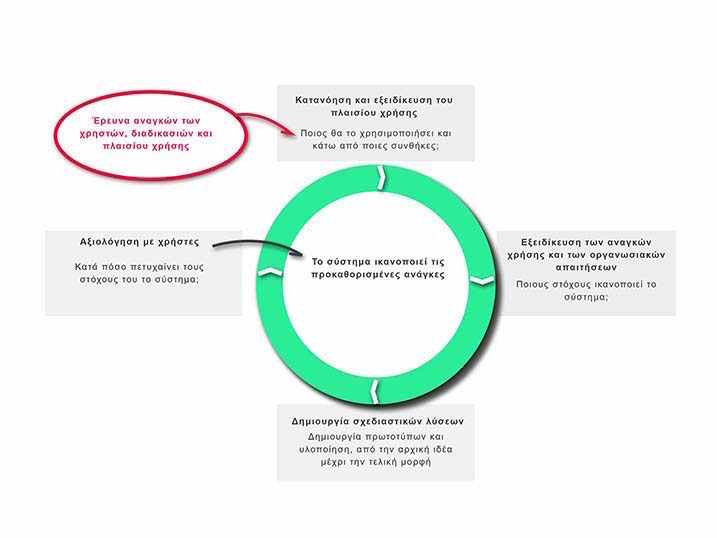
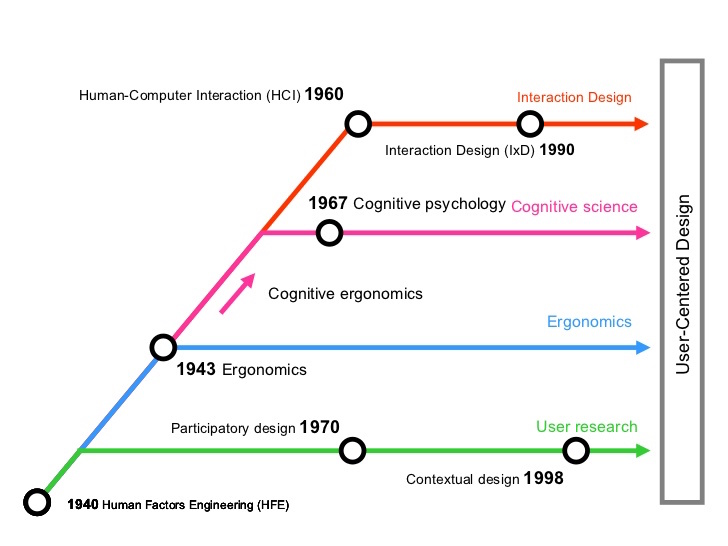

# Εισαγωγή

> Τα πράγματα που πρέπει να κάνεις τα μαθαίνεις κάνοντάς τα.
- Αριστοτέλης

Ο προγραμματισμός της διάδρασης (Programming Interactivity) είναι μια σχετικά νέα γνωστική περιοχή, η οποία δημιουργήθηκε από τη μεγάλη αποδοχή που γνώρισαν τα συστήματα διάδρασης ανθρώπων-συσκευών σε ένα ευρύτατο φάσμα εφαρμογών της καθημερινότητας και της εργασίας. Είναι τόσες πολλές οι ψηφιακές ανάγκες των ανθρώπων σε διαφορετικές πτυχές της ζωής τους (π.χ., ευζωία, ψυχαγωγία, μάθηση, εμπόριο, εργασία, κτλ.) και ταυτόχρονα δημιουργούνται συνέχεια τόσο νέες συσκευές όσο και νέες συνδέσεις μεταξύ τους, ώστε ο προγραμματισμός της διάδρασης αναδεικνύεται οργανικά σε πρωταγωνιστή στη σχεδίαση και κατασκευή νέων ανθρώπινων και κοινωνικών δραστηριοτήτων. Το βιβλίο αυτό βασίζεται στην άποψη ότι ο προγραμματισμός της διάδρασης, εκτός του ότι είναι κάτι περισσότερο από το άθροισμα των επιμέρους τμημάτων, είναι κυρίως ένα νέο τεχνολογικό επίπεδο το οποίο έχει τη δυνατότητα να επαναπροσδιορίσει με θετικό τρόπο όλες τις ανθρώπινες και κοινωνικές δραστηριότητες.

Συνήθως, όταν έχουμε μια νέα γνωστική περιοχή οι επιστήμονες θα προσπαθήσουν να την προσεγγίσουν μεθοδικά, σύμφωνα με τις τεχνικές που έχουν δουλέψει σε παρόμοιες περιοχές στο παρελθόν. Για παράδειγμα, στο παρελθόν η εισαγωγή της τεχνολογίας της τηλεόρασης θεωρήθηκε μια συνέχεια της τεχνολογίας του ραδιοφώνου. Οπότε, η παραγωγή του περιεχομένου που θα φιλοξενούσε το νέο μέσο θα ήταν μια γραμμική βελτίωση του περιεχομένου που υπήρχε στο ραδιόφωνο. Με αυτό το σκεπτικό δεν ήταν καθόλου περίεργο που η τηλεόραση αρχικά ορίστηκε ως "ραδιόφωνο με εικόνα" και με δεδομένο αυτόν τον σχετικά στενό ορισμό, ήταν επόμενο το περιεχόμενο των εκπομπών τηλεόρασης, τα πρώτα χρόνια, να μην είναι κάτι παραπάνω από μια στατική εικόνα με ήχο. Έτσι, δεν είναι περίεργο που και ο προγραμματισμός αντιμετωπίζεται ως υποπερίπτωση της ευρύτερης περιοχής των μηχανικών (π.χ., μηχανολόγοι μηχανικοί), αφού έχει να κάνει με την κατασκευή και λειτουργία μιας μηχανής. Ταυτόχρονα, είναι λογικό η διάδραση να αντιμετωπίζεται ως υποπερίπτωση της ευρύτερης περιοχής της εφαρμοσμένης σχεδίασης (όπως π.χ. η γραφιστική και η εργονομία). Στην ειδική περίπτωση του προγραμματισμού της διάδρασης και με δεδομένο ότι αναφερόμαστε σε μια σύνθετη περιοχή, διαφορετικού επιπέδου από τις επιμέρους, δεν έχουμε την ευχέρεια να κάνουμε τις παραπάνω απλουστεύσεις.

Οι συσκευές διάδρασης με τους υπολογιστές, και αντίστοιχα ο προγραμματισμός της διάδρασής τους, είναι έννοιες φευγαλέες τουλάχιστον για την περίοδο από τη δεκαετία του 1970 μέχρι και τη δεκαετία του 2010, αφού η διάδραση με τους υπολογιστές ξεκινάει από το τραπέζι και περνάει στα κινητά, φορετά, και διάχυτα συστήματα. Tη δεκαετία του 1970, η τυπική μορφή του προσωπικού υπολογιστή ήταν ο επιτραπέζιος υπολογιστής χωρίς γραφικό περιβάλλον εργασίας, το οποίο υπήρξε αντικείμενο έρευνας στα εργαστήρια. Τη δεκαετία του 1980, η γραφική επιφάνεια εργασίας έγινε εμπορικά διαθέσιμη, ενώ παράλληλα, το μεγαλύτερο μέρος του λογισμικού είχε περάσει από τη γραμμή εντολών στα μενού και στις φόρμες, οπότε το πληκτρολόγιο παρέμεινε η πιο δημοφιλής συσκευή εισόδου. Τη δεκαετία του 1990, η γραφική επιφάνεια εργασίας και το ποντίκι έγιναν ο κυρίαρχος τρόπος διάδρασης με τον προσωπικό υπολογιστή, οπότε η συσκευή εισόδου ποντίκι και η έμμεση διάδραση με αντικείμενα στην οθόνη μέσω του δείκτη καθόρισε τα πιο δημοφιλή στυλ διάδρασης. Στα τέλη της δεκαετίας του 2000, ο κινητός υπολογιστής με οθόνη αφής έφερε στο προσκήνιο τις χειρονομίες και την άμεση διάδραση στην οθόνη, ενώ τη δεκαετία του 2010, ο υπολογιστής διαχέεται πέρα από το γραφείο, τόσο στο περιβάλλον όσο και στο ανθρώπινο σώμα, δημιουργώντας έτσι ένα οικοσύστημα συσκευών και εφαρμογών για τον χρήστη. Αντίστοιχα, ο προγραμματισμός της διάδρασης εξελίσσεται έτσι ώστε τα βασικά αρχέτυπα και εργαλεία να διευκολύνουν τον χειρισμό των νέων συσκευών του χρήστη, όπως είναι το πληκτρολόγιο, η οθόνη, το ποντίκι, η οθόνη αφής, κτλ.

Σχεδόν παράλληλα -και πάντα αλληλένδετα- με την εξέλιξη του υλικού και της φυσικής μορφής του υπολογιστή, έχουμε μια εξέλιξη του λογισμικού και του στυλ διάδρασης με τον υπολογιστή, η οποία σχετίζεται περισσότερο με τις εφαρμογές και τις διεργασίες του χρήστη. Οι πρώτες δημοφιλείς εφαρμογές του προσωπικού υπολογιστή ήταν ο επεξεργαστής κειμένου και τα φύλλα εργασίας, τα οποία αποτελούσαν το βασικό κίνητρο αγοράς κατά τις δεκαετίες του 1970 και του 1980. Τη δεκαετία του 1990 είχαμε τη μεγάλη υπόσχεση των εκπαιδευτικών και ψυχαγωγικών πολυμέσων, τα οποία τελικά δεν έφτασαν στον τελικό χρήστη όπως αρχικά είχε σχεδιαστεί (μέσω της καλωδιακής τηλεόρασης), αλλά περισσότερο μέσω του οπτικού δίσκου, των κονσολών για βιντεο-παιχνίδια, και του διαδικτύου. Από το τέλος της δεκαετίας του 2000, έχουμε την επικράτηση των κοινωνικών μέσων δικτύωσης ως κύριαρχο στυλ διάδρασης με τον υπολογιστή. Πλέον, όλες οι εφαρμογές, ανεξάρτητα από το αν έχουν στόχο την παραγωγικότητα, την εκπαίδευση, την ψυχαγωγία, τις εμπορικές συναλλαγές ή την πληροφόρηση, βασίζονται ή τουλάχιστον έχουν μια διάσταση κοινωνικού δικτύου. Αντίστοιχα, ο προγραμματισμός της διάδρασης εξελίσσεται, έτσι ώστε τα βασικά αρχέτυπα και εργαλεία να διευκολύνουν τον χειρισμό των οντοτήτων του χρήστη, όπως είναι τα τοπικά αρχεία, τα πολυμέσα, τα υπερμέσα, το κοινωνικό δίκτυο, κτλ.

Η θέση του ψηφιακού αλφαβητισμού ως κάτι περισσότερο από εκπαίδευση στην απλή χρήση των τεχνολογιών πληροφόρησης και επικοινωνίας έχει διαπιστωθεί από τα μισά της δεκαετίας του 1990, όταν τα γραφικά περιβάλλοντα διεπαφής με τον χρήστη είχαν κλείσει μια δεκαετία εμπορικής ζωής. Οι ερευνητές διαπίστωσαν ότι τα παιδιά που μεγάλωσαν με τη γραφική επιφάνεια εργασίας είχαν μεν μεγαλύτερη εξοικείωση με την παρουσία του υπολογιστή στη ζωή τους, αλλά είχαν πολύ μικρότερες δεξιότητες στη δημιουργική χρήση του. Η διαπίστωση αυτή οδήγησε σε μια σειρά από προσπάθειες τόσο στο λογισμικό όσο και στο υλικό υπολογιστών, έτσι ώστε να κρατήσουμε τη φιλικότητα των σύγχρονων υπολογιστών, χωρίς όμως να χάσουμε τις δεξιότητες που προσφέρει ο προγραμματισμός της διάδρασης. Για παράδειγμα, οι ερευνητές δημιούργησαν λογισμικό όπως τα KidSim, Etoys, και Scratch τα οποία βασίζονται στον οπτικό προγραμματισμό (visual programming) και στον προγραμματισμό με βάση παραδείγματα χρήσης (programming by example). Αντίστοιχα, για την περίπτωση του υλικού υπολογιστή δημιουργήθηκε το RaspberryPi, το οποίο είναι πολύ οικονομικό και συνδέεται με την τηλεόραση, έτσι ώστε να έχει όσο γίνεται μεγαλύτερη διάχυση στους νέους χρήστες υπολογιστών που διαφορετικά θα μεγάλωναν μόνο με οθόνες αφής. Τέλος, δημιουργήθηκαν πολλά απτικά προϊόντα προγραμματισμού, τα οποία δεν έχουν καθόλου οθόνη, και τα οποία βασίζονται στην οργάνωση απτών αντικειμένων, ενώ και το αποτέλεσμά τους μπορεί να είναι η φυσική κίνηση και διάδραση με ένα ρομπότ.

Στα επόμενα κεφάλαια αυτού του βιβλίου μελετάμε εκείνα τα θέματα που ανεξάρτητα από τις τεχνολογικές εξελίξεις των τελευταίων δεκαετιών παραμένουν διαχρονικά και επίκαιρα.

# Ορισμός

> Ο προγραμματισμός είναι ένας τρόπος σκέψης και όχι μια μηχανιστική δεξιότητα. Μαθαίνοντας τους βρόγχους ‘for’ δε σημαίνει πως μαθαίνεις να προγραμματίζεις, όπως δε σημαίνει πως μαθαίνεις να ζωγραφίζεις μαθαίνοντας για τα μολύβια.
- Bret Victor

## Ο ρόλος του προγραμματισμού της διάδρασης

Η διάδραση του ανθρώπου με υπολογιστές έχει καθιερωθεί στις περισσότερες ανθρώπινες δραστηριότητες, από την εργασία μέχρι την εκπαίδευση και τη διασκέδαση. Ο προγραμματισμός της διάδρασης που απαιτείται για την κατασκευή άρτιων συστημάτων είναι μια σύνθετη έννοια και μια διαδικασία που προϋποθέτει δεξιότητες τόσο τεχνολογικές, όσο και ανθρωπιστικές. Για παράδειγμα, δεν αρκεί ένας κατασκευαστής να είναι ικανός προγραμματιστής, θα πρέπει να έχει και άριστη κατανόηση του ανθρώπινου παράγοντα αλλά και της διαδικασίας σχεδίασης (design). Αν και υπάρχουν πολλοί ικανοί κατασκευαστές συστημάτων, όπως και σχεδιαστές με γνώσεις ανθρωπιστικών επιστημών, για να λύσουμε ένα πρόβλημα από δυο οπτικές (μηχανή-άνθρωπος) χρειάζεται ο γόνιμος συνδυασμός τους. Η ενότητα αυτή ορίζει ποιος είναι αυτός ο γόνιμος συνδυασμός και γιατί είναι απαραίτητος στον προγραμματισμό διαδραστικών συστημάτων.

Πηγαίνοντας ένα βήμα ψηλότερα στην ανάλυση της χρησιμότητας του προγραμματισμού της διάδρασης, πέρα από την ανάγκη κατανόησης της λειτουργίας του σύγχρονου ψηφιακού κόσμου, διαπιστώνουμε ότι τόσο οι δεξιότητες που αναπτύσσονται, όσο και τα αποτελέσματα του προγραμματισμού της διάδρασης δημιουργούν νέα προϊόντα και υπηρεσίες που επηρεάζουν τις προσωπικές αντιλήψεις, τις συνήθειες, τους θεσμούς και τις μορφές κοινωνικής οργάνωσης. Στην εποχή μας, που η χρήση του υπολογιστή έχει κατηγορηθεί για την αύξηση της ανεργίας μέσω του αυτοματισμού και της αύξησης της παραγωγικότητας, μπορούμε να δούμε με αισιοδοξία μια αχαρτογράφητη πτυχή του υπολογιστή ως μέσου και εργαλείου δημιουργίας ενός νέου επιπέδου ανθρώπινης δραστηριότητας.

## Ιστορικό και πολιτισμικό πλαίσιο της διάδρασης

Σε αυτό το μέρος θα μελετήσουμε την ιστορική εξέλιξη της σχεδίασης της διάδρασης ανθρώπου-συσκευών (Human-Computer Interaction Design). Το πιο σημαντικό συμπέρασμα που προκύπτει από πολλά ιστορικά παραδείγματα είναι ότι μόνο εκ του αποτελέσματος γίνεται κατανοητό γιατί κάποιες σχεδιάσεις είναι καλύτερες από άλλες. Ταυτόχρονα, παραμένει πάντα δύσκολο να προβλέψουμε και να σχεδιάσουμε με σιγουριά εκείνες τις μελλοντικές διαδράσεις ανθρώπου-υπολογιστών που είναι περισσότερο αποτελεσματικές. Αν και ο στόχος θα είναι πάντα φευγαλέος, στα επόμενα κεφάλαια θα δούμε ότι υπάρχουν θεωρίες, τεχνικές, οργανώσεις, διαδικασίες και εργαλεία κατασκευής που αργά ή γρήγορα μας δίνουν σταδιακά καλύτερες λύσεις. Σε κάθε περίπτωση, είναι σκόπιμο να ξέρουμε τι έχουν δοκιμάσει οι σχεδιαστές της διάδρασης στο παρελθόν και γιατί (α)πέτυχε.

Όπως είδαμε στα προηγούμενα, ο βασικός στόχος του προγραμματισμού της διάδρασης είναι να κατασκευάσει συστήματα και συσκευές που να ανταποκρίνονται στις ανάγκες των χρηστών (user needs) κατά τη διαδικασία επίτευξης των στόχων τους (user goals) σε ένα δεδομένο πλαίσιο χρήσης (context of use). Για αυτόν τον σκοπό, οι σχεδιαστές πρέπει να εξετάσουν παράγοντες όπως η ευχρηστία (usability) και η μέτρησή της (usability evaluation). Αν και η ευχρηστία είναι μια από τις βασικές αξίες της διάδρασης, δεν είναι η μόνη, ενώ η σημασία της μπορεί να είναι πολύ μικρή σε ορισμένες περιπτώσεις. Αν, για παράδειγμα, το σύστημα διάδρασης έχει εφαρμογή στην ψυχαγωγία (π.χ., εκπαιδευτικά βιντεο-παιχνίδια), τότε θέλουμε η διάδραση να προσφέρει, εκτός από απλή ευχρηστία, ψυχαγωγία και μάθηση. Στην περίπτωση βελτίωσης ενός συστήματος που είτε προϋπάρχει είτε είναι παρόμοιο με υπάρχοντα συστήματα, τότε ο πιο απλός τρόπος από πλευράς κόστους, αποτελεσματικότητας (effectiveness) και ταχύτητας είναι να βασιστούμε σε επιτυχημένα ιστορικά παραδείγματα.

Τα ιστορικά παραδείγματα διάδρασης με συσκευές χρήστη έχουν, σε ορισμένες περιπτώσεις, κάποιες επικαλύψεις (χρονικές ή στα χαρακτηριστικά τους), όμως είναι όσο γίνεται περισσότερο ανεξάρτητα. Από τη μία πλευρά, η χρονολογική επισκόπηση είναι μια ενδιαφέρουσα ιστορική αναδρομή στην τεχνολογική εξέλιξη με έμφαση στη διάδραση, αλλά ταυτόχρονα είναι και μια εργαλειοθήκη για τον μελλοντικό σχεδιαστή της διάδρασης. Εστιάζουμε ειδικότερα στην εξέλιξη των διαδραστικών συστημάτων και στο πώς έχουν αυξήσει τη χρησιμότητα και την ευχρηστία των υπολογιστών.

Το πιο χαρακτηριστικό παράδειγμα διάδρασης είναι αυτό του επιτραπέζιου υπολογιστή και της γραφικής επιφάνειας εργασίας (Graphical User Interface - GUI), που ελέγχεται από τον χρήστη με συσκευές εισόδου όπως το πληκτρολόγιο και το ποντίκι. Αυτή η μορφή υπολογιστή και διάδρασης είναι ενδιαφέρουσα, γιατί ήταν η πρώτη μορφή υπολογιστή που ξέφυγε από τις μέχρι τότε πολύ εξειδικευμένες εφαρμογές των υπολογιστών (π.χ., βάσεις δεδομένων) και μπόρεσε να διευκολύνει τις εργασίες και την καθημερινότητα πάρα πολλών χρηστών (π.χ., με την επεξεργασία κειμένου, την ανάκτηση πληροφορίας από τον ιστό, και την επικοινωνία μέσω του ηλεκτρονικού ταχυδρομείου). Αν και το μοντέλο διάδρασης με τον επιτραπέζιο υπολογιστή δεν είναι ούτε τόσο δημοφιλές, ούτε τόσο εύκολο, όσο αυτό του κινητού υπολογισμού (με τα έξυπνα κινητά και τις ταμπλέτες), έχει ιδιαίτερο ενδιαφέρον, γιατί έχει μείνει σχετικά ίδιο από τότε που δημιουργήθηκε, πράγμα που επιβεβαιώνει ότι ανεξάρτητα από τη ραγδαία τεχνολογική εξέλιξη, η ανθρώπινη διάδραση κινείται σε πιο αργούς ρυθμούς.

## Ψηφιακός αλφαβητισμός, παραγωγικότητα και προσωπική έκφραση

Ο ψηφιακός αλφαβητισμός είναι καθολικά αποδεκτός ως μια πολύ βασική δεξιότητα, ανεξάρτητα από τις προσωπικές και επαγγελματικές επιδιώξεις του κάθε ανθρώπου. Στις πρώτες φάσεις διάδοσης της διάδρασης με υπολογιστές, ο ψηφιακός αλφαβητισμός εξαντλήθηκε στην κατανόηση της χρήσης του υπολογιστή, αλλά τελικά έγινε σαφές ότι ο αλφαβητισμός, εκτός από την ανάγνωση, έχει ως αναγκαία προϋπόθεση και ένα βαθμό δεξιότητας στη συγγραφή. Φυσικά, όπως δεν έχουμε την απαίτηση από τον μέσο άνθρωπο να γράφει κείμενο όπως ένας κορυφαίος συγγραφέας, έτσι ακριβώς δεν έχουμε την απαίτηση να μπορεί να δημιουργήσει τα δικά του προγράμματα διάδρασης. Από την άλλη πλευρά, η δυνατότητα να παρέμβει στη δημιουργία και προσαρμογή προγραμμάτων διάδρασης που του ταιριάζουν είναι μια δεξιότητα που αυξάνει τις δυνατότητές του για έκφραση και δημιουργία, τόσο στην προσωπική όσο και στην επαγγελματική του ζωή.

### Ο άνθρωπος, ο υπολογιστής και η διάδρασή τους

O ένας πυλώνας του γνωστικού αντικειμένου του προγραμματισμού της διάδρασης είναι η επικοινωνία ανάμεσα σε έναν τουλάχιστον άνθρωπο και σε μία ή περισσότερες συσκευές. Ο δεύτερος πυλώνας είναι ο προγραμματισμός υπολογιστών. Σε αυτήν την ενότητα θα μελετήσουμε τα είδη της διάδρασης, τα στοιχεία που τη συνθέτουν, καθώς και το φυσικό, το κοινωνικό και το οργανωσιακό πλαίσιο μέσα στο οποίο μπορεί να συντελεστεί. Ακόμη, θα εξετάσουμε πόσο καλά μπορούν να υποστηρίξουν τις ανθρώπινες διαδικασίες τα διαφορετικά είδη της διάδρασης. Με αυτές τις γνώσεις σε αυτήν την ενότητα μπορούμε να μελετήσουμε πώς ο άνθρωπος χρησιμοποιεί τις συσκευές κυρίως ως εργαλεία, αλλά και ως μέσα επικοινωνίας, ψυχαγωγίας και συνεργασίας.

Υπάρχουν πολλοί τρόποι διάδρασης του χρήστη με τη συσκευή. Αρχικά, έχουμε τη γραμμή εντολών και τις εντολές δέσμης (batch processing). Αυτοί ήταν και είναι πολύ αποτελεσματικοί τρόποι διάδρασης, όταν ο χρήστης δίνει επαναλαμβανόμενες και σταθερές οδηγίες προς τη συσκευή. Όταν οι οδηγίες προς το σύστημα πρέπει να αλλάζουν συχνά,τότε έχουμε τον απευθείας χειρισμό (direct manipulation) και την εικονική πραγματικότητα (virtual reality - VR). Στην περίπτωση αυτή, όπου η διάδραση γίνεται δυναμικά, οι χρήστες λαμβάνουν συνέχεια ανάδραση (feedback). Στο ενδιάμεσο αυτών των ακραίων τύπων διάδρασης (γραμμή εντολής και απευθείας χειρισμός) υπάρχει ένα ολόκληρο φάσμα τύπων, μεταξύ των οποίων και τύποι διάδρασης που εμφανίζονται με τις κινητές εφαρμογές και τις συσκευές διάχυτου υπολογισμού (ubiquitous computing smart devices).

### Προσωπικές δεξιότητες

Με δεδομένη την ανάγκη ανάπτυξης δεξιοτήτων που θεμελιώνουν τον ψηφιακό αλφαβητισμό πέρα από την απλή χρήση -προς τη βαθύτερη κατανόηση λειτουργίας και ιδανικά τη δημιουργία νέων διαδράσεων- ένα ερώτημα που προκύπτει αφορά στην επιλογή του εργαλείου, την οργάνωση, αλλά και τη διαδικασία δημιουργίας της διάδρασης. Για να απαντήσουμε σε αυτό το ερώτημα θα πρέπει να ανατρέξουμε στη φύση του προγραμματισμού της διάδρασης. Το βασικό στοιχείο αυτής της περιοχής είναι ότι οι τελικές προδιαγραφές του συστήματος μάς είναι άγνωστες κατά το αρχικό στάδιο, ενώ είναι σίγουρο ότι ακόμη και αν έχουμε τις πρώτες εκδόσεις σε λειτουργικό επίπεδο, οι προδιαγραφές θα συνεχίζουν να προσαρμόζονται με τη χρήση και τη διαδικασία της επαναληπτικής αξιολόγησης (iterative evaluation process). Επομένως, τα κατάλληλα εργαλεία, οι διαδικασίες και οι δομές θα πρέπει να μπορούν να αλλάζουν γρήγορα, τόσο τα ίδια όσο και τα δημιουργήματά τους.

Σε πρώτη ανάγνωση, ο προγραμματισμός της διάδρασης φαίνεται το άθροισμα (ή ίσως η τομή) των επιμέρους περιοχών του προγραμματισμού υπολογιστή και της διάδρασης ανθρώπου-υπολογιστή. Στην πράξη όμως, η πρόσθεση των γνώσεων προγραμματισμού σε εκείνες της διάδρασης ανθρώπου-υπολογιστή δεν είναι ικανή συνθήκη για τη δημιουργία νέων επινοήσεων ικανών να επαναπροσδιορίσουν ανθρώπινες και κοινωνικές δραστηριότητες. Αν και είναι σίγουρα αναγκαία συνθήκη να υπάρχουν οι βασικές επιμέρους γνώσεις, είτε στον ίδιο τον κατασκευαστή είτε στα μέλη μιας ομάδας συνεργασίας, υπάρχει επιπλέον η ανάγκη για γνώσεις σε ένα υψηλότερο επίπεδο - στο επίπεδο του προγραμματισμού της διάδρασης. Σε αυτό το υψηλότερο επίπεδο αφαίρεσης των επιμέρους λεπτομερειών εστιάζουμε στα εργαλεία, στις δομές και στις διαδικασίες που θα δώσουν δημιουργικές λύσεις σε υπάρχοντα προβλήματα, και θα επαυξήσουν τις δυνατότητές μας.

Όπως οι οπτικές γλώσσες προγραμματισμού υψηλού επιπέδου (π.χ., Scratch) έχουν μικρή μόνο σχέση με τις αντίστοιχες γλώσσες προγραμματισμού που είναι κοντά στη μηχανή (π.χ., Assembly, C), έτσι και ο προγραμματισμός της διάδρασης έχει μικρή μόνο σχέση με τις βασικές επιμέρους περιοχές του, όπως εκείνη του προγραμματισμού ΗΥ. Στην πράξη, ο προγραμματιστής της διάδρασης είναι χρήσιμο να ξέρει τις βασικές έννοιες του προγραμματισμού, όπως είναι η μεταβλητή και οι συνθήκες, αλλά από εκεί και πέρα η δεξιότητά του θα αυξηθεί περισσότερο αν μάθει να χρησιμοποιεί νέες βιβλιοθήκες και εργαλεία, παρά αν μάθει όλες τις αλγοριθμικές λεπτομέρειες που κάνουν ένα πρόγραμμα υπολογιστή αποδοτικό (π.χ., ταχύτητα, μνήμη). Επομένως, αν και μιλάμε για προγραμματισμό της διάδρασης, στην πράξη ο προγραμματισμός αυτός, όπου υπάρχει, αφορά περισσότερο τη δημιουργική σύνθεση και χρήση έτοιμων βιβλιοθηκών και εργαλείων με απλές δομές ελέγχου, με τελικό σκοπό την επαύξηση των ανθρώπινων και κοινωνικών δραστηριοτήτων.

Οι βασικές τεχνολογίες και ο αντίστοιχος προγραμματισμός της δικτύωσης, της αποθήκευσης και της επεξεργασίας δεδομένων, και κυρίως της εισόδου και εξόδου πληροφορίας σε σχέση με τον άνθρωπο, είναι δομικά στοιχεία του συστήματος. Επομένως, θέλουμε άμεση και εύκολη πρόσβαση σε όλα αυτά μαζί, χωρίς να πρέπει να ανησυχούμε για τις λεπτομέρειες της υλοποίησης (implementation). Αν και οι λεπτομέρειες της υλοποίησης θα έχουν μεγάλη σημασία όταν το σύστημά μας θα βρίσκεται στις ζωές πολλών ανθρώπων, σε αυτήν τη φάση της ανάπτυξης (κατά την οποία δεχόμαστε ότι δεν ξέρουμε τι ακριβώς ετοιμάζουμε, ούτε το πώς θα επηρεάσει την καθημερινότητα των ανθρώπων) είναι σκόπιμο να μην ασχοληθούμε με αυτές. Με αυτό το δεδομένο, η επιλογή των εργαλείων ανάπτυξης (ειδικά της γλώσσας προγραμματισμού και των βιβλιοθηκών) απλουστεύεται, αλλά σε καμία περίπτωση δεν μπορεί να χαρακτηριστεί εύκολη, πράγμα που θα δούμε στο αντίστοιχο κεφάλαιο των εργαλείων του προγραμματισμού της διάδρασης.

## Κατασκευή πρωτοτύπου και επανάληψη

Αν και υπάρχουν πάρα πολλές τεχνικές και μεθοδολογίες -και ακόμη περισσότερα εργαλεία και δομές- για τον προγραμματισμό της διάδρασης, αν έπρεπε να τα συνοψίσουμε όλα σε μια πρόταση, θα λέγαμε ότι: ο προγραμματισμός της διάδρασης είναι η επαναληπτική κατασκευή ενός πρωτοτύπου. Αυτή η επανατοποθέτηση του προβλήματος της κατασκευής μας επιτρέπει να στρέψουμε την προσοχή μας στη φύση και στον ρόλο του πρωτοτύπου ως ένα είδος ζωντανών και ευμετάβλητων προδιαγραφών ενός νέου συστήματος. Η διαδικασία κατασκευής του πρωτοτύπου είναι χρήσιμη ως μηχανισμός κατανόησης της διάδρασης που θέλουμε να υλοποιήσουμε, ενώ όταν το πρωτότυπο είναι σε μια πρώτη ικανοποιητική μορφή τότε μπορεί να χρησιμοποιηθεί για δοκιμές με τους τελικούς χρήστες ή ακόμη και να δημοσιευτεί ως αρχική έκδοση (π.χ., έκδοση άλφα, βήτα, από την ορολογία της τεχνολογίας λογισμικού). Αυτή η προσέγγιση είναι γνωστή στη βιβλιογραφία και ως “το πρωτότυπο ως προδιαγραφές”. Δηλαδή, αντί να ετοιμάσουμε ένα λεπτομερές συμβόλαιο που θα περιγράφει με λέξεις και διαγράμματα το αποτέλεσμα, έχουμε το ίδιο το αποτέλεσμα (εν τη γενέσει του) να δηλώνει τις ίδιες τις προδιαγραφές του. Αυτό είναι μια σχετικά απλή ιδέα που όμως φέρνει σε μεγάλη αντίθεση την περιοχή του προγραμματισμού της διάδρασης με τις συγγενείς περιοχές της επιστήμης των μηχανικών -ακόμη και με τη γονική περιοχή της τεχνολογίας λογισμικού- και αποδεικνύει την κεντρική θέση αυτού του βιβλίου, ότι ο προγραμματισμός της διάδρασης είναι μια νέα περιοχή που, ναι μεν έχει αρκετές ομοιότητες με άλλες, αλλά τελικά έχει τόσες διαφορές που απαιτούν ουσιαστικά διαφορετική αντιμετώπιση.

Το πρωτότυπο θα πρέπει να είναι διαδραστικό, διαφορετικά είναι σκόπιμο να το χαρακτηρίσουμε απλώς ένα αρχικό προσχέδιο. Τα αρχικά προσχέδια είναι και αυτά πολύ χρήσιμα, για την καλύτερη κατανόηση της διάδρασης, και κυρίως για την επικοινωνία μεταξύ των μελών της ομάδας ανάπτυξης. Τα αρχικά προσχέδια συνήθως έχουν τη μορφή του αφηγηματικού σεναρίου και των ενδεικτικών οθονών, αλλά υπάρχουν και άλλες επιλογές όπως το κόμικ (storyboard), το βίντεο, οι διαδραστικές διαφάνειες, και πολλά άλλα εξειδικευμένα εργαλεία κατασκευής προσχεδίου για το πρωτότυπο. Τα προσχέδια και τα πρωτότυπα κάθε άλλο παρά νέα είναι στην περιοχή των μηχανικών. Οι αρχιτέκτονες μηχανικοί ξεκινάνε τη σχεδίαση στο χαρτί, γιατί αυτός είναι παραδοσιακά ο πιο γρήγορος τρόπος αναπαράστασης μια ιδέας και βοηθάει τη σχεδιαστική σκέψη. Αντίστοιχα, ο προγραμματισμός της διάδρασης είναι σκόπιμο να ξεκινήσει από ένα σύντομο αφηγηματικό σενάριο, το οποίο θα συνοδεύεται από μερικές ενδεικτικές οθόνες. Παρά τις ομοιότητες με τους αρχιτέκτονες μηχανικούς, σημαντικές διαφορές στη μέθοδο προκύπτουν επειδή το αποτέλεσμα του προγραμματισμού της διάδρασης δεν είναι κάτι στέρεο και σταθερό, αλλά κάτι πολύ ρευστό, ευμετάβλητο, και φευγαλέο, που αλλάζει ανάλογα με τη χρήση. Επιπλέον, τόσο τα προσχέδια όσο και τα πρωτότυπα θα πρέπει να αντικατοπτρίζουν την κίνηση που υπάρχει εκ των πραγμάτων σε μια διάδραση, κάτι που δύσκολα γίνεται στο χαρτί ή με απλές εικόνες. Για τον λόγο αυτό, στα προσχέδια του προγραμματισμού της διάδρασης θέλουμε να δημιουργήσουμε τουλάχιστον ένα σενάριο χρήσης και ενδεικτικές οθόνες, ώστε να μπορεί ο σχεδιαστής και οι άλλοι συμμετέχοντες της ομάδας να φανταστούν το τελικό προϊόν.

Οι διαφορές από τους αρχιτέκτονες μηχανικούς στην κατασκευή του πρωτοτύπου συνεχίζονται στην περίπτωση της μακέτας. Ενώ η μακέτα είναι για τους αρχιτέκτονες ένα προχωρημένο πρωτότυπο που αναπαριστά υπό κλίμακα σε τρεις διαστάσεις το μελλοντικό προϊόν, στον προγραμματισμό της διάδρασης ένα διαδραστικό πρωτότυπο είναι σχεδόν το ίδιο με το τελικό προϊόν. Η σημαντικότερη όμως διαφορά σε σχέση με τους αρχιτέκτονες και τις άλλες συγγενείς επιστήμες του μηχανικού είναι ότι ένα διαδραστικό πρωτότυπο, και φυσικά το τελικό προϊόν, δεν ακολουθούν καθόλου διακριτά στάδια κατά τις φάσεις της σχεδίασης, της παραγωγής και της βελτίωσης. Για παράδειγμα, η πρώτη εμπορική έκδοση του δημοφιλούς Apple iPhone δεν είχε εφαρμογές άλλων κατασκευαστών λογισμικού, παρά μόνο τις επίσημες εφαρμογές της εταιρείας. Ήταν αυτό το 'τελικό προϊόν'ή μήπως ένα πολύ προχωρημένο 'πρωτότυπο'; Μπορεί από την πλευρά του υλικού η συσκευή να βελτιώθηκε σταδιακά, όμως από την πλευρά του λογισμικού, η νέα δυνατότητα του συστήματος να δέχεται πρόσθετες εφαρμογές δημιούργησε ουσιαστικά ένα καινούργιο προϊόν. Επομένως, θα μπορούσαμε να χαρακτηρίσουμε το πρώτο εμπορικό iPhone ως ένα προχωρημένο διαδραστικό πρωτότυπο των σύγχρονων iPhone, τα οποία δεν έχουν πάψει να εξελίσσονται. Σε συνδυασμό με το λογισμικό που διατίθεται από την ίδια την εταιρεία (στο οποίο συχνά συνεισφέρουν ανεξάρτητοι προγραμματιστές), νέο, εξωτερικό υλικό προστίθεται και διευκολύνει σημαντικές ανθρώπινες δραστηριότητες που έχουν να κάνουν με τις συναλλαγές, την υγεία, τη δημιουργία και τη διασκέδαση, παράγοντας ουσιαστικά ένα οικοσύστημα διάδρασης.

Συνοπτικά, η κεντρική διαφορά του προγραμματισμού της διάδρασης από άλλες επιστήμες του μηχανικού είναι ότι τόσο η διαδικασία ανάπτυξης όσο και η τελική κατασκευή αποτελούν στάδια ενός συνεχώς ανατροφοδοτούμενου κύκλου. Για παράδειγμα, η δημοφιλής υπηρεσία Google Mail για πολλά χρόνια είχε την ετικέτα βήτα (beta) ενώ ήταν πλήρως λειτουργική. Βλέπουμε λοιπόν, ότι στην περίπτωση του λογισμικού, οι επίσημες 'τελικές' εκδόσεις είναι απλώς προφορικές ή γραπτές δηλώσεις και συμβάσεις του κατασκευαστή· σε αντίθεση με ένα σπίτι, το οποίο μετά την παράδοσή του στον χρήστη δέχεται ελάχιστες μετατροπές, ακόμη κι έπειτα από πολλά χρόνια. Το συμπέρασμα που αξίζει να μείνει είναι ότι η διαδικασία της κατασκευής στην περιοχή του προγραμματισμού της διάδρασης είναι ένας κύκλος επανάληψης στον οποίο δύσκολα θα προσδιορίσουμε πού αρχίζει και πού τελειώνει. Ειδικά για τα προϊόντα ευρείας χρήσης, είναι η ίδια η χρήση τους που επαναπροσδιορίζει τη φύση τους σε έναν αέναο κύκλο. Κάποιος θα μπορούσε να υποστηρίξει ότι όλα αυτά δεν είναι καθόλου νέα, και ότι όλες οι παραδοσιακές βιομηχανίες (κτήρια, αυτοκίνητα) σταδιακά μεταλλάσσονται για να εξυπηρετήσουν τους χρήστες τους. Αυτό είναι αλήθεια, αλλά οι αλλαγές που συνήθως συμβαίνουν σε όλες τις παραπάνω βιομηχανίες είναι τόσο σταδιακές χρονικά και τόσο προσθετικές δομικά, που και πάλι αναδεικνύεται αυτή η ιδιαιτερότητα του προγραμματισμού της διάδρασης ως προς τη διαδικασία κατασκευής, σε σχέση με τις πολύ συγγενείς του περιοχές.

## Η διάδραση ανθρώπου-υπολογιστή σε μεγαλύτερη κλίμακα

### Εργασία σε ομάδες

Μια πολύ σημαντική εφαρμογή των υπολογιστών έχει να κάνει με τη διευκόλυνση της επικοινωνίας και της συνεργασίας μικρών ομάδων ανθρώπων. Για να κατασκευάσουμε ένα σύστημα που θα υποστηρίζει την εργασία σε ομάδες, θα πρέπει να κατανοήσουμε τον ρόλο του κάθε μέλους της ομάδας στις κοινές διεργασίες. Αν και η σημασία της κοινωνικής διάστασης της συνεργασίας ήταν ήδη γνωστή σε συναφείς ερευνητικές περιοχές όπως τα πληροφοριακά συστήματα διοίκησης (Management Information Systems) και η οργανωσιακή συμπεριφορά, η εξειδικευμένη περιοχή των κοινωνικών και συνεργατικών συστημάτων (Social & Collaborative Systems) δημιουργήθηκε στα τέλη της δεκαετίας του 1980. Αρχικά, οι ερευνητές ασχολήθηκαν με τις ανάγκες που προκύπτουν κατά τη συνεργασία στον χώρο της εργασίας με επιτραπέζιους υπολογιστές και ενσύρματα δίκτυα. Στη συνέχεια, το ενδιαφέρον τους στράφηκε προς τον κινητό υπολογισμό, τα κοινωνικά δίκτυα, και τα δικτυακά βιντεο-παιχνίδια ρόλων. Τέλος, πρέπει να τονιστεί ότι οι εφαρμογές αυτής της περιοχής δεν περιορίζονται πλέον στο πεδίο της εργασίας, αλλά έχουν επεκταθεί σε πολλά ακόμη σημαντικά πεδία κοινωνικής δραστηριότητας, όπως αυτό της εκπαίδευσης.

Η θεωρία για τη διάδραση ανθρώπου-υπολογιστή εμφανίζεται με διαφορετικές μορφές σε πολλές διαφορετικές περιοχές, οι οποίες έχουν σχετικά διαφορετικούς στόχους (goals, objectives). Για παράδειγμα, η Εργονομία έχει εστιάσει κυρίως στις σωματικές εργασίες των ανθρώπων που δουλεύουν με βιομηχανικές μηχανές ή ρομπότ, στην είσοδο δεδομένων και στον χειρισμό εξοπλισμού ασφαλείας (π.χ., σε αεροσκάφη και πλοία, σε συστήματα ενέργειας, κτλ.). Από την άλλη πλευρά, η περιοχή των Πληροφοριακών Συστημάτων Διοίκησης λειτουργεί σε μεγαλύτερη κλίμακα, εκεί όπου πολλοί άνθρωποι συνεργάζονται ως μέλη επιμέρους ομάδων για να πάρουν αποφάσεις και να πετύχουν κοινούς στόχους, στα πλαίσια ενός ή περισσότερων διασυνδεδεμένων οργανισμών και ιεραρχικών δομών αποφάσεων. Ανάμεσα στα δύο άκρα της κλίμακας της διάδρασης (άνθρωπος-υπολογιστής και οργανισμός που συντονίζει ομάδες ανθρώπων) βρίσκεται η σχετικά νεότερη περιοχή των Κοινωνικών και Συνεργατικών Συστημάτων. Εκεί η διάδραση συμβαίνει ανάμεσα στα μέλη μιας μικρής ομάδας ανθρώπων, η οποία συντονίζεται με τη βοήθεια υπολογιστών. Φυσικά, ο διαχωρισμός ανάμεσα στις παραπάνω περιοχές δεν είναι στεγανός και παρατηρούνται αρκετές επικαλύψεις, όπως για παράδειγμα σε θέματα ιδιωτικότητας.

### Το λογισμικό διάδρασης ως υπηρεσία και αγαθό

Το λειτουργικό σύστημα των επιτραπέζιων υπολογιστών αρχικά ήταν προς πώληση ως προϊόν, συσκευασμένο σε κουτί. Στη συνέχεια, έγινε αντιληπτό ότι το περιεχόμενο του κουτιού ποτέ δεν ήταν το τελικό, αφού λίγες μέρες μετά τη συσκευασία και διανομή του, γίνονταν ήδη βελτιώσεις στον πηγαίο κώδικα. Η ανάπτυξη του διαδικτύου ως καναλιού διανομής επέτρεψε στο λογισμικό να βρει τον χαρακτήρα που του ταιριάζει περισσότερο, ως υπηρεσία (αν και υπάρχει μια υβριδική ισορροπία ανάμεσα στα δύο όταν το λογισμικό συνοδεύει κάποια συσκευή). Διαπιστώνουμε ότι το λογισμικό είναι αρκετά διαφορετικό από άλλα προϊόντα και υπηρεσίες αναφορικά με τις παρακάτω ιδιότητες: α) την πνευματική ιδιοκτησία, β) την εμπορευσιμότητα, ιδιότητες τις οποίες οποίες μελετάμε στα επόμενα.

Υπάρχουν πολλά είδη δικαιωμάτων πνευματικής ιδιοκτησίας, όπως το εμπορικό σήμα (trademark), η πατέντα (patent), η πνευματική ιδιοκτησία (copyright). Τα περισσότερα έργα λογισμικού αντιμετωπίζονται όπως τα λογοτεχνικά βιβλία και έχουν πνευματική ιδιοκτησία, αν και υπάρχουν περιπτώσεις στο λογισμικό της διεπαφής ανθρώπου-υπολογιστή όπου έχει γίνει προσπάθεια για πατέντα. Για παράδειγμα, στα τέλη της δεκαετίας του 1980 η Apple προσπάθησε να προστατεύσει το Γραφικό Περιβάλλον Εργασίας (Graphical User Interface - GUI) απέναντι στον ανταγωνισμό της Microsoft. Επειδή το λογισμικό δεν είναι ούτε βιβλίο αλλά ούτε και βιομηχανικό αντικείμενο, τα υπάρχοντα είδη πνευματικής ιδιοκτησίας ίσως να μην του ταιριάζουν. Άλλωστε, αυξάνονται οι περιπτώσεις όπου το λογισμικό δίνεται με άδεια ανοικτού κώδικα (open source license) ή παρέχει κάποια Διεπαφή Προγραμματισμού Εφαρμογών (API, από το Application Programming Interface) και στη συνέχεια ο δημιουργός αναζητεί αμοιβή μέσα από την πώληση της τεχνογνωσίας του. Όσο χαρακτηριστική είναι η περίπτωση αυτοδημιούργητων τύπου 'κλειστού κώδικα' όπως ο Bill Gates της Microsoft, άλλο τόσο ενδιαφέρουσα είναι η περίπτωση του Linus Torvalds, με τα ανοικτού κώδικα Linux, ο οποίος επέλεξε να δώσει δωρεάν τον καρπό της προσπάθειάς του. Και στις δύο περιπτώσεις είχαμε τη δημιουργία μιας πολύ μεγάλης βιομηχανίας και πολλών θέσεων εργασίας, παρόλο που η προσέγγιση του καθενός ήταν διαμετρικά αντίθετη.

Η εμπορευσιμότητα ενός αγαθού ή υπηρεσίας εξαρτάται από πολλούς παράγοντες, αλλά ο σημαντικότερος είναι η δυνατότητα που υπάρχει για εύκολη γεωγραφική διανομή. Το λογισμικό, που ξεκίνησε ως μέρος του υλικού και στη συνέχεια έγινε δίσκος που αγοραζόταν από τα ράφια του λιανεμπορίου, τον τελευταίο καιρό έχει μετατραπεί σε υπηρεσία διαθέσιμη στο διαδίκτυο. Στην ίδια συζήτηση έχει ενδιαφέρον να αναφερθούμε και στη δουλειά του προγραμματιστή λογισμικού, στις δυνατότητες καθώς και στους κινδύνους από την εμπορευσιμότητα αυτής της εργασίας. Για παράδειγμα, μια υπηρεσία στο Web είναι διαθέσιμη παντού, πράγμα που σημαίνει ότι τελικά θα πρέπει να ανταγωνιστεί αντίστοιχες προσπάθειες από όπου και αν προέρχονται, είτε από τις τεχνολογικά ανεπτυγμένες χώρες είτε από τις χώρες με το εξειδικευμένο εργατικό δυναμικού χαμηλού κόστους. Πέρα από τις ευκαιρίες για μια διευρυμένη αγορά, μέσα σε αυτό το παγκοσμιοποιημένο πλαίσιο επαγγελματικής δραστηριότητας είναι μάλλον αφελές να κρατάμε κλειστή τη διεπαφή με ένα λογισμικό, αφού μέσα σε μικρό σχετικά χρονικό διάστημα κάποιος μπορεί να φτιάξει κάτι παρόμοιο ή κάτι καλύτερο. Μια περισσότερο αποτελεσματική στρατηγική είναι να κάνουμε διαθέσιμο τον πηγαίο κώδικα (ελπίζοντας σε συνεισφορές για τη βελτίωσή του) και ταυτόχρονα να μαθαίνουμε από τις διαδράσεις που κάνουν οι χρήστες. Έτσι, θα βελτιώνουμε την υπηρεσία, και κυρίως θα αυξάνουμε τη γνώση που έχουμε για το τι συνιστά ανά πάσα στιγμή μια χρήσιμη και επιθυμητή υπηρεσία, που είναι και το ζητούμενο για ένα σχετικά βιώσιμο ανταγωνιστικό πλεονέκτημα.

Από την άλλη πλευρά, το λογισμικό λειτουργεί παρόμοια με τη μηχανή εσωτερικής καύσης και τη βιομηχανική ρομποτική αναφορικά με την αυτοματοποίηση της ανθρώπινης δραστηριότητας. Η αυτοματοποίηση συνήθως θεωρείται αρετή, αφού επιτρέπει στον άνθρωπο να ασχοληθεί με κάτι άλλο από τις μηχανικές, επίπονες και επαναλαμβανόμενες διεργασίες. Στην πράξη επέτρεψε τη μετάβαση από την αγροτική στη βιομηχανική εποχή και έπειτα στην εποχή των υπηρεσιών. Η άλλη όψη του νομίσματος, όμως, περιγράφει μια επίπονη περίοδο μετάβασης από τη μια εποχή στην επόμενη. Όπως οι μηχανές εσωτερικής καύσης διευκόλυναν την εργασία και αύξησαν την παραγωγικότητα κατά τη μετάβαση από την αγροτική στη βιομηχανική εποχή, όπως η ρομποτική και ο αυτοματισμός μείωσαν στη συνέχεια την ανάγκη για ανθρώπινη εργασία στα εργοστάσια, με τον ίδιο τρόπο το λογισμικό διάδρασης έρχεται να αυτοματοποιήσει πάρα πολλές εργασίες που γίνονταν με τη μεσολάβηση ανθρώπων στη βιομηχανία των υπηρεσιών (π.χ., τράπεζες, ασφάλειες, ταξίδια, κτλ.). Αν η ιστορία είναι σωστός οδηγός, τότε θα πρέπει να αναζητήσουμε την επόμενη βιομηχανική επανάσταση ανάμεσα στις δυνατότητες που μας προσφέρει ο προγραμματισμός της διάδρασης για νέες υπηρεσίες και αγαθά, τα οποία με τη σειρά τους θα ορίσουν μια νέα αγορά.

## Ψηφιακή οικονομία

Σε αυτήν την ενότητα περιγράφουμε τις ιδιότητες που παρουσιάζει μια γενιά επιχειρήσεων και οργανισμών που προσπαθούν να μεγιστοποιήσουν τους δεσμούς τους με άλλους συγγενείς οργανισμούς. Το όραμά τους στηρίζεται σε μια διαφορετική φιλοσοφία για την ιδιοκτησία και την αξία, ενώ ο ακρογωνιαίος λίθος για αυτό το οικοδόμημα είναι ο προγραμματισμός της διεπαφής του προγραμματιστή, ο οποίος αποτελεί ειδική περίπτωση του προγραμματισμού της διάδρασης με αποδέκτη έναν χρήστη -τον προγραμματιστή.

Στη βιομηχανική εποχή (19ος αιώνας), όταν οι μηχανές αντικατέστησαν το μεγαλύτερο μέρος της ανθρώπινης χειρωνακτικής εργασίας, σε πρώτη φάση δημιούργησαν στρατιές ανέργων, σε δεύτερη φάση όμως, τα προϊόντα ορισμένων δημιουργικών ανθρώπων που βασίστηκαν στις μηχανές (π.χ., αεροπλάνο, αυτοκίνητο κ.ά.) δημιούργησαν νέους κλάδους εργασίας και ανθρώπινης δραστηριότητας αθροιστικά πολύ μεγαλύτερους από αυτούς που αρχικά κατέστρεψαν. Για παράδειγμα, τόσο η βιομηχανία του τουρισμού, όσο και η αύξηση της οικονομικής δραστηριότητας με τη συγκέντρωση των ανθρώπων στις πόλεις, ήταν παράπλευρες ωφέλειες του αεροπλάνου και του αυτοκινήτου, αντίστοιχα.

Είναι αλήθεια ότι το πρώτο κύμα διάχυσης του ΗΥ, με πρωταγωνιστή τον επιτραπέζιο ΗΥ, κατάφερε να αυτοματοποιήσει πολύ μεγάλο μέρος της εργασίας γραφείου, με αποτέλεσμα την απώλεια θέσεων εργασίας στον πυρήνα της οικονομίας των υπηρεσιών. Σε αναλογία με τη βιομηχανική εποχή, η ενσωμάτωση και η διάχυση του ΗΥ στην καθημερινότητα με νέα προϊόντα και υπηρεσίες ενδέχεται να δημιουργήσει αθροιστικά περισσότερες θέσεις εργασίας από εκείνες που χάθηκαν, αρκεί να βρεθούν οι δημιουργικοί και καταρτισμένοι προγραμματιστές της διάδρασης που θα φανταστούν και θα υλοποιήσουν αυτούς τους νέους κλάδους ανθρώπινης δραστηριότητας.

Ο προγραμματισμός της διάδρασης δεν είναι πανάκεια και σίγουρα δεν είναι λύση σε σημαντικά προβλήματα που έχουν να κάνουν με τη φτώχεια, την υγεία, και την εκπαίδευση. Από την άλλη πλευρά, ο προγραμματισμός της διάδρασης είναι σίγουρα μια λύση συμβατή με την πολύ σημαντική ανάγκη που αφορά στη δυνατότητά μας να φανταστούμε και να δημιουργήσουμε ένα διαφορετικό και νέο επίπεδο ανθρώπινης δραστηριότητας σε σημαντικούς τομείς όπως η εργασία, η ψυχαγωγία, η ευζωία ή η εκπαίδευση. Τέλος, είναι σίγουρα μία από τις λίγες λύσεις που έχουμε για να θέσουμε σε λειτουργία τον εκδημοκρατισμό των ψηφιακών μέσων σχεδίασης και παραγωγής, τα οποία έχουν τη δυνατότητα να περάσουν την οικονομία στο επόμενο στάδιο, στην εποχή μετά τη βιομηχανία των υπηρεσιών γραφείου.
# Μέθοδος

> Κάνοντας σωστά τη σωστή σχεδίαση.
- Bill Buxton

## Ανθρωποκεντρική σχεδίαση

Η ανθρωποκεντρική σχεδίαση έχει στόχο τη σχεδίαση και τη βελτίωση των συστημάτων διάδρασης ανθρώπου-υπολογιστή. Οι περισσότερες τεχνικές, κυρίως στην πρακτική εφαρμογή τους, δίνουν έμφαση στη βελτίωση συστημάτων που υπάρχουν ή συστημάτων που βρίσκονται στο στάδιο της σχεδίασης. Η βελτιστοποίηση ενός συστήματος είναι ένα σημαντικό θέμα, αλλά ακόμη σημαντικότερο είναι το να αποκτήσουμε την αυτοπεποίθηση της καταλληλότητας των προδιαγραφών του. Για αυτόν τον σκοπό, τόσο αυτό το κεφάλαιο όσο και τα υπόλοιπα κεφάλαια του βιβλίου εστιάζουν περισσότερο στην επανάληψη των βημάτων, παρά σε αυτά καθαυτά τα βήματα που συνιστούν τον κύκλο της ανθρωποκεντρικής σχεδίασης.

Ίσως έχετε συναντήσει ξανά τον όρο της ανθρωποκεντρικής σχεδίασης της διάδρασης ανθρώπου-υπολογιστή με έμφαση στη μοντελοποίηση του χρήστη και με σκοπό την αυτοματοποίηση των διεργασιών του. Σε αυτήν την ενότητα η έμφαση δε δίνεται στη μοντελοποίηση των δεξιοτήτων και της συμπεριφοράς του χρήστη, ούτε στην αυτοματοποίηση των δραστηριοτήτων του (έμμεση διάδραση). Η έμφαση της ανθρωποκεντρικής σχεδίασης στην παρούσα ενότητα δίνεται στη σχεδίαση και υλοποίηση της διάδρασης με συσκευές χρήστη για τις περιπτώσεις όπου απαιτείται η ενεργή συμβολή του χρήστη (άμεση διάδραση).

Στην προηγούμενη ενότητα είδαμε τι είναι η διάδραση με συσκευές και ποιες μορφές έχει πάρει τα τελευταία χρόνια. Εδώ θα μελετήσουμε το πώς θα σχεδιάσουμε τη διάδραση. Αν και μας ενδιαφέρει η σχεδίαση των συστημάτων διάδρασης, θα εστιάσουμε περισσότερο στη σχεδίαση της διάδρασης μεταξύ ανθρώπου και συσκευής, με την έννοια ότι αυτή η διάδραση εξαρτάται εξίσου από την αντίληψη που έχει ο άνθρωπος για τη συσκευή, όσο και από τις λειτουργίες και την εμφάνιση της αντίστοιχης συσκευής. Είναι σημαντικό να κατανοήσουμε ότι η λεπτομερής σχεδίαση της διάδρασης πριν την υλοποίηση των αντίστοιχων λειτουργιών του συστήματος μπορεί να προσφέρει αποτελεσματικότερη διάδραση και επιπλέον μειωμένο κόστος και χρόνο ανάπτυξης. Η επαναληπτική σχεδίαση, η κατασκευή και η αξιολόγηση πρωτοτύπων επιτρέπει την οικονομική και γρήγορη απόρριψη ιδεών που δεν είναι αποτελεσματικές. Η ανάπτυξη αυτής της δεξιότητας, της σχεδίασης της διάδρασης, αν και φαίνεται κοινή λογική δεν είναι πάντα εύκολη στην πράξη. Μαθαίνεται μόνο με την εμπειρία, ειδικά μέσα από τη δοκιμή και την επανάληψη, όπως για παράδειγμα μαθαίνει κάποιος να γράφει κείμενα ή να ζωγραφίζει.

H διαδικασία της κατασκευής της διάδρασης είναι ένας κύκλος επανάληψης που πολύ δύσκολα προσδιορίζουμε πότε ακριβώς αρχίζει και πότε τελειώνει, ακόμα και για προϊόντα που είναι σε ευρεία χρήση, αφού αυτή η ίδια η χρήση τους επαναπροσδιορίζει τη φύση τους σε έναν αέναο κύκλο. Κάποιος θα μπορούσε να υποστηρίξει ότι όλα αυτά δεν είναι καθόλου νέα, και ότι όλες οι παραδοσιακές βιομηχανίες (π.χ., κτήρια, αυτοκίνητα) σταδιακά μετασχηματίζονται για να εξυπηρετήσουν τους χρήστες τους. Αυτό είναι αλήθεια, αλλά οι αλλαγές που συνήθως συμβαίνουν σε όλες τις παραπάνω βιομηχανίες είναι τόσο αργές και σταδιακές χρονικά· και τόσο προσθετικές (ή απλά εξελικτικές) δομικά, που πάλι αναδεικνύεται η ιδιαιτερότητα της κατασκευής της διάδρασης σε σχέση με την διαδικασία κατασκευής σε πολύ συγγενείς περιοχές.

Τα τρία βασικά στάδια της ανθρωποκεντρικής σχεδίασης (κατανόηση των αναγκών του χρήστη, εναλλακτικά σχέδια και κατασκευή πρωτοτύπου, αξιολόγηση πρωτοτύπων με χρήστες) εκτελούνται κυκλικά και άρα η επανάληψη βρίσκεται στον πυρήνα της ανθρωποκεντρικής σχεδίασης της διάδρασης.

## Ιστορικό και πολιτισμικό πλαίσιο της ανθρωποκεντρικής σχεδίασης

Η ανθρωποκεντρική σχεδίαση της διάδρασης ανθρώπου-υπολογιστή δεν είναι κάτι νέο. Αν μάλιστα θεωρήσουμε και τις δράσεις που έχουν συμβεί έξω από την επιστημονική κοινότητα, μπορούμε να δούμε ότι είναι τόσο παλιά όσο η προσπάθεια κάποιων κατασκευαστών να φτιάξουν μηχανές και εργαλεία που βασίζονται στις δυνατότητες και τις δεξιότητες του ανθρώπου. Ίσως το πιο ενδιαφέρον παράδειγμα από το μακρινό παρελθόν είναι το σφυρί, ένα ξύλο δεμένο σε μια πέτρα, το οποίο βελτίωσε πάρα πολύ την ευχρηστία της πέτρας, που μέχρι τότε έπρεπε οι άνθρωποι να την χρησιμοποιήσουν κρατώντας την. Αντίστοιχα, μπορούμε να θεωρήσουμε ότι και η διαδικασία της ανθρωποκεντρικής σχεδίασης δεν είναι κάτι καινούριο αφού η δοκιμή και το σφάλμα είναι μια σχεδόν διαισθητική δραστηριότητα που συμβαίνει σε κάθε διαδικασία ανάπτυξης προϊόντος. Η διαφορά είναι ότι η περιοχή της διάδρασης ανθρώπου-υπολογιστή έχει καταγράψει μια περισσότερο συστηματική μεθοδολογία για την παραπάνω διαδικασία, που μέχρι τότε συνέβαινε πιο πολύ ως αυτοσχεδιασμός παρά συστηματικά.

Στο πρόσφατο παρελθόν, η αρχή της ανθρωποκεντρικής σχεδίασης εντοπίζεται στην περιοχή της Εργονομίας (Ergonomics and Human factors), η οποία μελετά τις σωματικές δυνατότητες του ανθρώπου για κίνηση. Στην περίπτωση της εργονομίας η ανθρωποκεντρική σχεδίαση έχει σημαντικό σύμμαχο τη σχετικά καλώς ορισμένη διακύμανση των μετρικών που περιγράφουν το ανθρώπινο σώμα και τις κινήσεις του. Στην πορεία ήρθε να προστεθεί και η περιοχή της γνωστικής επιστήμης (Cognitive Science) που δίνει έμφαση στις γνωστικές δυνατότητες του ανθρώπου για αντίληψη και επεξεργασία πληροφορίας. Στην περίπτωση της γνωστικής επιστήμης, αν και γίνονται επαναληπτικά πειράματα επιβεβαίωσης, είναι σίγουρα πιο δύσκολο να θεμελιωθεί μια θεωρία με βεβαιότητα, αφού τις λειτουργίες της σκέψης τις αντιλαμβανόμαστε έμμεσα και όχι άμεσα. Στους παραπάνω βασικούς πυλώνες (γνωστική επιστήμη και εργονομία) ήρθε να προστεθεί προσφάτως η συναισθηματική και η αισθητική διάσταση της σχεδίασης για τον άνθρωπο, η οποία έχει τις ρίζες της στις περιοχές της γραφιστικής και των εφαρμοσμένων τεχνών. Επίσης, η καλύτερη κατανόηση της διάδρασης του χρήστη με συσκευές επεκτείνεται και στην ανθρώπινη ψυχολογία, αφού στην πράξη είναι αδύνατο να διαχωρίσουμε τη λογική από το συναίσθημα. Φαίνεται ότι οι χρήστες θεωρούμε μια όμορφη διάδραση πιο εύχρηστη, αν και μετρώντας την εν λόγω ευχρηστία με αντικειμενικά κριτήρια (π.χ. χρόνος ολοκλήρωσης μιας λειτουργίας), μπορεί να αποδειχθεί πως δεν είναι.

Ο στόχος της ανθρωποκεντρικής σχεδίασης δεν είναι απλά η βελτιστοποίηση μιας σχεδίασης, αλλά πρωτίστως, η εύρεση των ιδιοτήτων της. Αρχικά, οι περισσότερες μελέτες έδιναν έμφαση στην ακρίβεια χρήσης ποσοτικών μεθόδων έρευνας και αξιολόγησης (π.χ. χρονομέτρηση ολοκλήρωσης μιας λειτουργίας) με στόχο τη βελτιστοποίηση μιας μεμονωμένης λειτουργίας ή ολόκληρης της σχεδίασης. Τη δεκαετία του 1990, οι δοκιμές ευχρηστίας και οι ποσοτικές μέθοδοι ήταν πολύ δημοφιλείς και είχαν στόχο να βελτιστοποιήσουν τον τρόπο που λειτουργούσαν οι προδιαγραφές σχεδίασης. Σε πολλές περιπτώσεις, οι κατασκευαστές -αν και όντως βελτίωναν μια σχεδίαση- δε δούλευαν πάνω σε εκείνη που θα γινόταν αποδεκτή από τους χρήστες. Τη δεκαετία του 2000, σταδιακά οι κατασκευαστές της διάδρασης άρχισαν να διερευνούν με ποιoν τρόπο θα σχεδιάσουν προϊόντα με μεγαλύτερη αποδοχή από το κοινό τους και έτσι άρχισαν να πειραματίζονται με ποιοτικές μεθόδους έρευνας, κάνοντάς τες πιο δημοφιλείς και πιο αποδεκτές από την επιχειρηματική κοινότητα. Στην πράξη, για την κατασκευή της διάδρασης χρησιμοποιούνται διερευνητικές τεχνικές με πρωτότυπα χαμηλής πιστότητας κατά το πρώτο στάδιο της κατανόησης των αναγκών, και σταδιακά με την κατασκευή του πρωτοτύπου υψηλής πιστότητας εφαρμόζονται περισσότερο ποσοτικές μέθοδοι, κατά τη φάση της αξιολόγησης με χρήστες.

Υπάρχουν διάφορες τεχνικές κατασκευής πρωτοτύπου ανάλογα με το στάδιο ανάπτυξης και το είδος ενός νέου προϊόντος. Τα τμήματα έρευνας και ανάπτυξης μιας εταιρείας εντοπίζουν νέες ανάγκες, κατασκευάζουν πρωτότυπα, και κάνουν δοκιμές με χρήστες πριν καταλήξουν στο τελικό προϊόν. Η κατασκευή πρωτοτύπου είναι μια διαδικασία που κάνουν όλες οι εταιρείες αλλά διαφέρει ανάλογα με το είδος του προϊόντος και την οργάνωση της εταιρείας. Για παράδειγμα, μια μεγάλη εταιρεία συνήθως έχει σαφώς ορισμένες διαδικασίες κατασκευής πρωτοτύπων που καθορίζουν τον αριθμό των πρωτοτύπων που φτιάχνονται για κάθε έκδοση του προϊόντος καθώς και τις προδιαγραφές του. Αντίθετα, οι μικρές καινοτομικές εταιρείες χρησιμοποιούν το ίδιο το πρωτότυπο ως προδιαγραφές. Ακόμη, μπορεί να υπάρχουν διαφορές στα εργαλεία και τα υλικά που χρησιμοποιούνται για την κατασκευή του πρωτοτύπου ανάλογα με το είδος του προϊόντος. Για παράδειγμα, στην αυτοκινητοβιομηχανία ξεκινούν με σχεδιαγράμματα, συνεχίζουν με μοντέλα 3Δ στον υπολογιστή και καταλήγουν στην κατασκευή απτών πρωτοτύπων. Στην κατασκευή έξυπνων κινητών τηλεφώνων χρησιμοποιούνται όλες αυτές οι τεχνικές ανάλογα με το στάδιο ανάπτυξης του προϊόντος. Ειδικά στην περίπτωση της κατασκευής λογισμικού διάδρασης, η διάκριση ανάμεσα στο πρωτότυπο και στο τελικό προϊόν είναι πολλές φορές δυσδιάκριτη, αφού πολλά από τα πρωτότυπα γίνονται προϊόντα, ενώ τα προϊόντα με τη σειρά τους αποτελούν πρωτότυπα για την επόμενη έκδοση του προϊόντος.

## Εντοπισμός των αναγκών

Για να μπορέσουμε να κατανοήσουμε τη διάδραση ανθρώπου-υπολογιστή θα πρέπει να καταλάβουμε πρώτα τις ιδιότητες του ανθρώπου καθώς και εκείνες του υπολογιστή. Η κατασκευή ενός διαδραστικού συστήματος υπολογισμού βασίζεται σε προδιαγραφές που εκφράζουν τις ανάγκες που αυτό θα εξυπηρετεί. Με τη σειρά τους αυτές οι ανάγκες καταγράφονται αναφορικά με τις δεξιότητες του ανθρώπου, του υπολογιστή, καθώς και με τις ιδιότητες της μεταξύ τους διάδρασης.

Η σχεδίαση της διάδρασης δεν είναι μόνο η σχεδίαση της εμφάνισης και των λειτουργιών μιας συσκευής ή ενός συστήματος συσκευών και υπηρεσιών αλλά κάτι συνολικότερο, το οποίο λαμβάνει υπόψη του τον τρόπο που οι άνθρωποι σκέφτονται και επιτελούν τις εργασίες τους. Επίσης, οι συσκευές που χρησιμοποιούν οι άνθρωποι είναι κάτι περισσότερο από τα συστήματα εισόδου και εξόδου, οπότε η σχεδίαση πρέπει να εξετάσει ένα ολόκληρο οικοσύστημα το οποίο αποτελείται από τεκμηρίωση, υποστήριξη, εκπαίδευση, και διαδικασίες. Επομένως, υπάρχουν περιπτώσεις όπου η μελέτη της συνολικής υπάρχουσας κατάστασης μπορεί να δείξει ότι δεν απαιτείται κάποιο νέο τεχνολογικό σύστημα, αλλά απλώς μια αναδιάταξη ή βελτίωση των επιμέρους τμημάτων αυτού του οικοσυστήματος. Για αυτόν τον λόγο, κρίνεται σκόπιμο να θεωρήσουμε ότι δε σχεδιάζουμε απλά τη διάδραση με μια συσκευή ή με ένα σύστημα, αλλά κάτι ευρύτερο· μια παρέμβαση στον τρόπο που ένας ή περισσότεροι άνθρωποι εκτελούν διαδικασίες, είτε αυτές είναι εργασιακές, είτε ψυχαγωγικές. Σε αυτό το πλαίσιο, η ερώτηση που θα μας απασχολήσει στο παρόν κεφάλαιο είναι: «τι είναι η σχεδίαση της διάδρασης ως διαδικασία;»

### Σχεδιαστικές οδηγίες και κανόνες

Στόχος της σχεδίασης διαδραστικών συστημάτων είναι η μεγιστοποίηση της ευχρηστίας τους. Σε αυτήν την ενότητα θα μελετήσουμε κανόνες σχεδίασης που βασίζονται σε προηγούμενη θεωρία ή/και εμπειρία. Υπάρχει μια σειρά κανόνων σχεδίασης οι οποίοι μπορούν να μας βοηθήσουν στον καθορισμό εύχρηστων διαδραστικών συστημάτων, συμπεριλαμβανομένων αφηρημένων βασικών αρχών, οδηγιών και άλλων ζητημάτων σχεδίασης.

Οι σχεδιαστικές οδηγίες (design guidelines) είναι συλλογές συμβουλών για τους σχεδιαστές διεπαφών χρήστη οι οποίες είναι απαραίτητες, προκειμένου να εξασφαλιστεί ότι το τελικό προϊόν θα είναι φιλικό προς τον χρήστη. Αρκετά βιβλία και τεχνικές αναφορές περιέχουν μεγάλους καταλόγους από σχεδιαστικές οδηγίες. Αυτές διαιρούνται σε υποκατηγορίες με πιο εξειδικευμένες οδηγίες σχεδίασης. Οι περισσότερες έρευνες και προτάσεις που έχουν γίνει πάνω στις σχεδιαστικές οδηγίες αφορούν τα 'κλασικά' συστήματα υπολογιστών (επιτραπέζιος, κινητός υπολογιστής) που χρησιμοποιούνται σε ευρεία κλίμακα. Όμως, η ραγδαία ανάπτυξη του διάχυτου υπολογισμού τα τελευταία χρόνια, προκάλεσε μια έκρηξη στη ζήτηση αντίστοιχων συσκευών.

Όπως αναφέρθηκε και παραπάνω οι σχεδιαστικές οδηγίες για τις συσκευές διάχυτου υπολογισμού βρίσκονται σε πρώιμο στάδιο. Η πρότασή μας για να αναπτύξουμε ένα ολοκληρωμένο σύνολο σχεδιαστικών οδηγιών για μια νέα διάδραση είναι να ακολουθείται μια διαδικασία τριών βημάτων: Καταρχάς, αξιολόγηση μιας πολύ απλής αρχικής σχεδίασης ενός τέτοιου συστήματος, έτσι ώστε να εντοπιστούν τα προβλήματα που υπάρχουν. Στη συνέχεια, ορισμός συγκεκριμένων σχεδιαστικών οδηγιών που θα βοηθήσουν να ξεπεράσουμε τα προβλήματα που εντοπίστηκαν προηγουμένως. Τέλος, επανασχεδιασμός του συστήματος βασισμένος στο προηγούμενο σύνολο οδηγιών. Ιδανικά θα πρέπει να ακολουθήσει έλεγχος με πραγματικούς χρήστες, για να καθοριστεί πόσο χρήσιμες ήταν εν τέλει οι σχεδιαστικές οδηγίες στην επίλυση των αρχικών προβλημάτων.

### Τεχνικές κατανόησης των αναγκών

Ανάμεσα στις πιο δημοφιλείς τεχνικές κατανόησης του χρήστη μπορούμε να ξεχωρίσουμε την εθνογραφία, η οποία ξεκίνησε από τις μελέτες των ανθρωπολόγων και προσαρμόστηκε στη σχεδίαση της διάδρασης. Εν συντομία, όπως οι ανθρωπολόγοι ενσωματώνουν τους εαυτούς τους στην καθημερινότητα πολύ διαφορετικών πολιτισμών, έτσι και οι σχεδιαστές των νέων διάχυτων ΗΥ, θα πρέπει είτε οι ίδιοι είτε μέσω άλλων ειδικευμένων για αυτόν τον σκοπό ερευνητών, να μπουν στη ρευστή καθημερινότητα των ανθρώπων για τους οποίους καλούνται να σχεδιάσουν νέα συστήματα διάδρασης, τα οποία μπορεί απλά να διευκολύνουν, να επαυξάνουν ακόμη και να αλλάζουν ριζικά τον τρόπο που ένας χρήστης ή ακόμη δυσκολότερα μια ομάδα ανθρώπων, σκέφτονται, αποφασίζουν και δρουν σε έναν κόσμο που γίνεται αντιληπτός αλλά και επηρεάζεται από διάχυτους υπολογιστές. Αν και η εθνογραφική μέθοδος είναι μια δημοφιλής επιλογή στη σχεδίαση νέων συστημάτων, μοιράζεται αρκετές τεχνικές (π.χ. παρατήρηση) με άλλες μεθόδους, οπότε η βέλτιστη κατανόηση και χρήση της προϋποθέτει και τη γνώση των συμπληρωματικών και πολλές φορές επικαλυπτόμενων μεθόδων (π.χ., συνεντεύξεις, ομάδες εστίασης, πολιτισμική διερεύνηση, κτλ.).

Η πολιτισμική διερεύνηση (cultural probes) είναι από τις πιο απλές και δημοφιλείς τεχνικές για την καταγραφή της συμπεριφοράς που έχουν οι χρήστες και την έμμεση αποκάλυψη των αναγκών τους. Η πολιτισμική διερεύνηση βασίζεται στην αποστολή ενός φακέλου με αντικείμενα καθημερινής χρήσης, τα οποία έχουν απλές οδηγίες για τους χρήστες. Για παράδειγμα, ένας φάκελος πολιτισμικής διερεύνησης στα τέλη της δεκαετίας του 1990 συνήθως περιείχε μια φωτογραφική μηχανή μιας χρήσης, καθώς και την παρότρυνση να βγάλουν φωτογραφία κάποιο αγαπημένο αντικείμενο ή δραστηριότητα. Εκτός από τη φωτογραφική μηχανή, ένα ακόμη δημοφιλές αντικείμενο είναι το ημερολόγιο, το οποίο ο χρήστης συμπληρώνει αναφορικά με τις δραστηριότητές του, όπως εκπομπές στην τηλεόραση και συναντήσεις με φίλους. Στο τέλος της χρονικής περιόδου, ο φάκελος της πολιτισμικής διερεύνησης αποστέλλεται στους ερευνητές, οι οποίοι χρησιμοποιούν τα περιεχόμενα του φακέλου (φωτογραφίες, αυτοκόλλητα post-it, κτλ.) στον χώρο σχεδίασης ώστε να μπουν καλύτερα στο κόσμο του χρήστη. Αν και τα περιεχόμενα του συμπληρωμένου φακέλου πολιτισμικής διερεύνησης δε δείχνουν μονοσήμαντα τις προδιαγραφές, το νόημα βρίσκεται περισσότερο στην καλύτερη εμβύθιση της ομάδας σχεδίασης στο περιβάλλον του χρήστη, έτσι ώστε τελικά οι προδιαγραφές που θα καθοριστούν να είναι συμβατές με το αντίστοιχο πλαίσιο χρήσης του προϊόντος.

Εκτός από την τεχνική της πολιτισμικής διερεύνησης (cultural probes) που μελετήσαμε παραπάνω, άλλη μια τεχνική που είναι απλή, αποτελεσματική, και δημοφιλής για την κατανόηση των ανθρώπινων αναγκών είναι ο καθορισμός αντιπροσωπευτικών χρηστών (personas). Η τεχνική αυτή βασίζεται στην περιγραφή των ιδιοτήτων ενός χρήστη, όπως είναι τα δημογραφικά, οι προτιμήσεις, και οι συνήθειές του. Οι αντιπροσωπευτικοί χρήστες που παρουσιάζονται στις personas μπορεί να είναι υπαρκτά πρόσωπα, αλλά μπορεί να είναι και φανταστικά πρόσωπα, τα οποία ομοίως ανταποκρίνονται σε κάποιες κατηγορίες χρήστη της εφαρμογής που αναπτύσσουμε. Οι personas κατασκευάζονται σε συνεργασία με τους τελικούς χρήστες της εφαρμογής και με δεδομένα που μαζεύονται από ερωτηματολόγια και συνεντεύξεις. Οι personas χρησιμοποιούνται από την ομάδα ανάπτυξης σε συνδυασμό με την τεχνική του αφηγηματικού σεναρίου, το οποίο θα δούμε στην επόμενη ενότητα της κατασκευής πρωτοτύπου χαμηλής πιστότητας. Για την ακρίβεια, οι personas είναι συνήθως οι πρωταγωνιστές ή σημαντικοί ρόλοι στα σενάρια που περιγράφουν τη διάδραση ανάμεσα στους χρήστες και στους υπολογιστές.

Πέρα από τις παραπάνω συστηματικές προσεγγίσεις για την κατανόηση των αναγκών του χρήστη, υπάρχουν και περισσότερο δημιουργικές απόψεις, οι οποίες βασίζονται στον αυτοσχεδιασμό και στην έμπνευση. Για παράδειγμα, για αρκετές από της συσκευές διάδρασης της Apple δεν έχει γίνει συστηματική έρευνα των αναγκών του χρήστη, αλλά έχει χρησιμοποιηθεί η έμπνευση, η διαίσθηση, και η δημιουργικότητα της ομάδας σχεδίασης και της διοίκησης. Τόσο ο σχεδιασμός του iPod, όσο και ο σχεδιασμός του iPhone, έχουν στοιχεία διάδρασης που μέχρι τότε δεν είχαν εμφανιστεί σε κάποιο άλλο εμπορικό προϊόν, αλλά μπήκαν σε αυτά τα προϊόντα γιατί ο κατασκευαστής πίστευε ότι αυτό είναι που έχουν ανάγκη οι χρήστες. Είναι φανερό ότι μια τέτοια προσέγγιση έχει πολύ μεγάλο ρίσκο αποτυχίας, ενώ απαιτεί και μεγάλα αποθέματα αυτοπεποίθησης, αλλά αν πετύχει, τότε το αποτέλεσμα είναι ο νικητής να βρίσκεται πολύ μπροστά από τους ανταγωνιστές, οι οποίοι είναι αναγκασμένοι να επαναπροσδιορίσουν τις κατηγορίες προϊόντων που προσφέρουν, αφού οι ανάγκες των χρηστών δεν θα είναι πλέον ίδιες. Είναι χαρακτηριστικό ότι ο αρχικός σχεδιαστής γραφικών στην εταιρεία Google, ανέφερε ότι ένας από τους λόγους της παραίτησής του ήταν ότι η κυρίαρχη κουλτούρα τεχνοκρατικής αντίληψης της εταιρείας είχε φτάσει στο σημείο να κάνουν δοκιμές για το αν το πάχος γραμμής θα έπρεπε να είναι δύο ή τέσσερα εικονοστοιχεία. Επομένως, εκτός από την μελέτη των χρηστών, μια ακόμη τεχνική κατανόησης των αναγκών είναι η διαίσθηση ενός έμπειρου και ταλαντούχου σχεδιαστή.

## Κατασκευή πρωτοτύπου

Σε αυτό το μέρος περιγράφουμε με περισσότερη λεπτομέρεια τη διαδικασία, τις τεχνικές και τα εργαλεία για την κατασκευή πρωτοτύπων διάδρασης με συσκευές χρήστη. Κάθε τεχνική παράγει ένα πρωτότυπο διαφορετικής πιστότητας και όσο μεγαλύτερη είναι η απαιτούμενη λειτουργικότητα του πρωτοτύπου τόσο περισσότερο χρόνο θέλουμε για να το φτιάξουμε ή για να το αλλάξουμε. Επομένως, η επιλογή του αναγκαίου βαθμού πιστότητας του πρωτοτύπου και ο καθορισμός της κατάλληλης τεχνικής κατασκευής του είναι πολύ σημαντικές παράμετροι και περιγράφονται σε αυτήν την ενότητα.

### Χαμηλή και υψηλή πιστότητα, τεχνικές και εργαλεία, σενάριο, ενδεικτικές οθόνες

Αν και υπάρχουν πάρα πολλές τεχνικές και μεθοδολογίες, και ακόμη περισσότερα εργαλεία και δομές για τον σχεδιασμό της διάδρασης με συσκευές χρήστη, αν έπρεπε να τα συνοψίσουμε όλα σε μια πρόταση θα λέγαμε ότι αυτή είναι η επαναληπτική κατασκευή ενός πρωτοτύπου σταδιακά μεγαλύτερης πιστότητας μέχρι να φτάσουμε στις εκδόσεις άλφα του τελικού προϊόντος. Αυτή η επανατοποθέτηση του προβλήματος της διαδικασίας κατασκευής μας επιτρέπει να στρέψουμε την προσοχή μας στη φύση και στον ρόλο του πρωτοτύπου. Η διαδικασία κατασκευής του πρωτοτύπου είναι χρήσιμη ως μηχανισμός κατανόησης της διάδρασης που θέλουμε να υλοποιήσουμε, ενώ όταν το πρωτότυπο είναι σε μια πρώτη ικανοποιητική μορφή τότε το ίδιο το πρωτότυπο μπορεί να χρησιμοποιηθεί για δοκιμές με τους τελικούς χρήστες ή ακόμη και να χρησιμοποιηθεί ως αρχική έκδοση (π.χ., έκδοση άλφα, βήτα, από την ορολογία της τεχνολογίας λογισμικού). Αυτή η προσέγγιση είναι γνωστή στη βιβλιογραφία και ως ‘το πρωτότυπο ως προδιαγραφές’, δηλαδή αντί να ετοιμάσουμε ένα λεπτομερές συμβόλαιο που θα περιγράφει με λέξεις και διαγράμματα το αποτέλεσμα, έχουμε το ίδιο το αποτέλεσμα (εν τη γενέσει του) ως προδιαγραφές. Αυτό είναι μια σχετικά απλή ιδέα που φέρνει σε μεγάλη αντίθεση την περιοχή του σχεδιασμού της διάδρασης με συσκευές χρήστη με άλλες συγγενείς περιοχές της επιστήμης του μηχανικού, ακόμη και με τις γονικές περιοχές της τεχνολογίας λογισμικού, και επιβεβαιώνει τον κεντρικό ισχυρισμό αυτού του βιβλίου ότι ο σχεδιασμός της διάδρασης με συσκευές χρήστη είναι μια νέα περιοχή που, ναι μεν έχει αρκετές ομοιότητες με άλλες συγγενείς, αλλά τελικά έχει και τόσες πολλές διαφορές που απαιτούν ουσιαστικά διαφορετική αντιμετώπιση.

Το πρωτότυπο θα πρέπει να είναι σε διαδραστική μορφή για να είναι πραγματικά χρήσιμο σε δοκιμές από τους χρήστες, διαφορετικά είναι σκόπιμο να το χαρακτηρίσουμε απλά ως ένα αρχικό προσχέδιο. Τα αρχικά προσχέδια είναι και αυτά πολύ χρήσιμα για την καλύτερη κατανόηση της διάδρασης και κυρίως για την επικοινωνία με άλλα μέλη της ομάδας σχεδίασης και ανάπτυξης. Τα αρχικά προσχέδια συνήθως μπορούν να έχουν τη μορφή του αφηγηματικού σεναρίου, των σχεδιαγραμμάτων, και των ενδεικτικών οθονών, αλλά υπάρχουν και άλλες επιλογές όπως το κόμικ (storyboard), το βίντεο, οι διαδραστικές διαφάνειες, και πολλά άλλα εξειδικευμένα εργαλεία κατασκευής προσχεδίου για το πρωτότυπο. Τα προσχέδια και τα πρωτότυπα κάθε άλλο παρά καινούρια είναι στην περιοχή των μηχανικών. Για παράδειγμα, οι αρχιτέκτονες μηχανικοί ξεκινούν τη σχεδίαση στο χαρτί, γιατί αυτός είναι ο πιο γρήγορος τρόπος αναπαράστασης μια ιδέας που επίσης βοηθάει και στη σχεδιαστική σκέψη. Αντίστοιχα, ο σχεδιασμός της διάδρασης είναι σκόπιμο να ξεκινήσει από ένα σύντομο αφηγηματικό σενάριο, το οποίο θα πρέπει να συνοδεύεται και από μερικά σχεδιαγράμματα ή ενδεικτικές οθόνες. Αν και υπάρχουν ομοιότητες με τους αρχιτέκτονες μηχανικούς, υπάρχουν και σημαντικές διαφορές, γιατί το αποτέλεσμα της σχεδίασης της διάδρασης δεν είναι κάτι στέρεο και σταθερό, αλλά κάτι ρευστό, που αλλάζει συνέχεια ανάλογα με τη χρήση. Επομένως, τόσο τα προσχέδια όσο και τα πρωτότυπα θα πρέπει να αντικατοπτρίζουν αυτήν την κίνηση, κάτι που δύσκολα μπορεί να γίνει με το χαρτί ή τις απλές εικόνες, παρά μόνο με αφήγηση σε εικόνες (storyboard) ή βίντεο. Για αυτό στα προσχέδια της σχεδίασης της διάδρασης θέλουμε να έχουμε τουλάχιστον ένα σενάριο και ενδεικτικές οθόνες, ώστε να μπορεί ο σχεδιαστής και οι άλλοι ρόλοι να φανταστούν το τελικό προϊόν. Ιδανικά όμως στα πρωτότυπα χαμηλής πιστότητας θέλουμε να φτάσουμε μέχρι την αφήγηση με εικόνες ή/και βίντεο, πριν περάσουμε στο επόμενο στάδιο που είναι η συγγραφή κώδικα και η προσομοίωση της διάδρασης με τη συσκευή χρήστη στην οθόνη του επιτραπέζιου ΗΥ ανάπτυξης.

Οι διαφορές με τους αρχιτέκτονες στην κατασκευή του πρωτοτύπου συνεχίζονται στην περίπτωση της μακέτας. Ενώ η μακέτα είναι για τους αρχιτέκτονες μηχανικούς ένα προχωρημένο πρωτότυπο που αναπαριστά στον πραγματικό χώρο, έστω και σε μικρό μέγεθος, το τελικό προϊόν, στην περίπτωση της σχεδίασης της διάδρασης, ένα διαδραστικό πρωτότυπο είναι πολλές φορές το ίδιο το τελικό το προϊόν. Η μεγαλύτερη διαφορά όμως σε σχέση με τους αρχιτέκτονες και με τις συγγενείς επιστήμες του μηχανικού είναι ότι για τον προγραμματισμό της διάδρασης, ένα διαδραστικό πρωτότυπο -αλλά ακόμα και το τελικό προϊόν- δεν είναι καθόλου διακριτά στάδια στη διαδικασία σχεδίασης, παραγωγής, και βελτίωσης. Για παράδειγμα, η πρώτη εμπορική έκδοση του δημοφιλούς Apple iPhone δεν είχε εφαρμογές από εξωτερικούς παραγωγούς, αλλά μόνο τις επίσημες εφαρμογές της εταιρείας. Ήταν αυτό το τελικό προϊόν ή ένα προχωρημένο πρωτότυπο; Από την πλευρά του υλικού η συσκευή μπορεί να βελτιώθηκε σταδιακά, όμως από την πλευρά του λογισμικού η δυνατότητα να μπαίνουν νέες εφαρμογές ήταν ουσιαστικά ένα νέο προϊόν. Άρα,  θα μπορούσαμε να κατατάξουμε το πρώτο εμπορικό iPhone ως ένα προχωρημένο διαδραστικό πρωτότυπο των σύγχρονων iPhone, τα οποία δεν έχουν πάψει να εξελίσσονται, σε σχέση τόσο με το λογισμικό που προστίθεται αλλά κυρίως με νέο εξωτερικό υλικό, όπως αυτό που διευκολύνει σημαντικές ανθρώπινες δραστηριότητες που έχουν να κάνουν με τις οικονομικές συναλλαγές, την υγεία, τη δημιουργία, και τη διασκέδαση.

### Κατασκευή πρωτότυπου υψηλής πιστότητας

Η κατασκευή πρωτοτύπων για τον προγραμματισμό της διάδρασης σε συσκευές πέρα από τον επιτραπέζιο υπολογιστή είναι μια πρόκληση, η οποία είναι περισσότερο πολύπλοκη από την κατασκευή πρωτοτύπου για άλλες περιπτώσεις. Για παράδειγμα, η κατασκευή του πρωτοτύπου για μια εφαρμογή που θα εκτελεστεί σε έναν επιτραπέζιο ΗΥ δεν απαιτεί τίποτα περισσότερο από τον ίδιο τον επιτραπέζιο ΗΥ ανάπτυξης, γιατί και ο τελικός προορισμός της εφαρμογής θα είναι σε ένα παρόμοιο υλικό, και η διάδραση με τον χρήστη θα γίνεται με τις ίδιες συσκευές εισόδου, δηλαδή το πληκτρολόγιο και το ποντίκι. Το ίδιο ισχύει και για την κατασκευή ενός πρωτοτύπου για ένα νέο ποντίκι για τον επιτραπέζιο ΗΥ. Με δεδομένη την εργονομία του χεριού και το πλαίσιο χρήσης του ποντικιού, που είναι η μετακίνηση του δείκτη στην οθόνη και η επιλογή με ένα κουμπί, ο σχεδιαστής έχει αρκετά σημεία αναφοράς στα οποία μπορεί να βασιστεί.

Αντίθετα, η κατασκευή του πρωτοτύπου για μια συσκευή διάδρασης χρήστη με κινητό ή διάχυτο ΗΥ είναι μια πρόκληση, γιατί απαιτεί τη συνεργασία λογισμικού με την κατασκευή ειδικού υλικού διάδρασης με τον χρήστη. Καθώς ο διάχυτος υπολογισμός θα φέρνει περισσότερες συσκευές χρήστη σε περισσότερες πτυχές της ζωής μας, αυξάνεται η ανάγκη για κατασκευή (και αξιολόγηση από τους χρήστες) πρωτοτύπων υψηλής πιστότητας που συνδυάζουν υλικό με λογισμικό. Για αυτόν τον σκοπό οι σχεδιαστές της διάδρασης έχουν αναπτύξει μια τεχνική που συνδυάζει ειδικά φτιαγμένο υλικό διάδρασης με τον χρήστη, με λογισμικό που εκτελείται σε επιτραπέζιο ή κινητό ΗΥ, για τους οποίους οι προγραμματιστές μπορούν να χρησιμοποιήσουν τα διαθέσιμα εργαλεία ανάπτυξης. Η τεχνική αυτή δεν έρχεται να αντικαταστήσει τις τεχνικές κατασκευής πρωτοτύπου χαμηλής πιστότητας που μελετήσαμε προηγουμένως, αλλά έρχεται να προστεθεί, ως ένα ακόμη βήμα, στον επαναληπτικό κύκλο του προγραμματισμού της διάδρασης.

Ο σκοπός της κατασκευής πρωτοτύπου υψηλής πιστότητας είναι να το αξιολογήσουμε με χρήστες σε εργαστηριακό περιβάλλον ή ακόμη και σε μελέτη στο πεδίο (field research). Τα πρωτότυπα χαμηλής πιστότητας (π.χ., σενάριο, σχεδιάγραμμα, ενδεικτικές οθόνες) είναι κατάλληλα περισσότερο για την οπτικοποίηση και επεξεργασία αρχικών ιδεών από τους σχεδιαστές και τους συνεργάτες τους. Πράγματι, τα πρωτότυπα χαμηλής πιστότητας είναι χρήσιμα για τη γρήγορη και ανεπίσημη επικοινωνία μεταξύ των μελών μιας ομάδας σχεδίασης και ανάπτυξης, αφού οι λέξεις δεν είναι σχεδόν ποτέ αρκετές για να περιγράψουν το φαινόμενο της διάδρασης. Όταν, όμως, ο σκοπός είναι να κατανοήσουμε καλύτερα και κυρίως να αξιολογήσουμε ένα πρωτότυπο διάδρασης με χρήστες, τότε θα πρέπει να έχουμε μεγαλύτερη πιστότητα στη λειτουργία, ώστε να έχουν νόημα και οι αντιδράσεις των χρηστών που θα καταγραφούν και θα αναλυθούν. Για αυτόν τον σκοπό, γίνεται η κατασκευή του Buck, το οποίο αποτελείται από δύο βασικά τμήματα: 1) το λογισμικό που εκτελείται σε έναν επιτραπέζιο ΗΥ και 2) το υλικό διάδρασης της συσκευής με τον χρήστη, το οποίο είναι συνδεδεμένο ενσύρματα με τον επιτραπέζιο υπολογιστή, ώστε να μεταφέρει σε αυτόν για επεξεργασία την είσοδο από τον χρήστη.

Η κατασκευή πρωτοτύπου υψηλής πιστότητας τύπου Buck έχει επίσης χρησιμοποιηθεί και από άλλες εταιρείες για προϊόντα που συνδυάζουν το υλικό με το λογισμικό. Για παράδειγμα, η Kodak το χρησιμοποίησε για να φτιάξει το πρωτότυπο για ψηφιακές κάμερες. Σε αυτήν την περίπτωση εκτός από την κατασκευή του υλικού διάδρασης με τον χρήστη είχαμε και την ενσωμάτωση μιας μικρής οθόνης μέσα στο υλικό. Πάντως, το λογισμικό δεν εκτελείται στην ίδια τη συσκευή, αλλά στον επιτραπέζιο ΗΥ, με τον οποίο επικοινωνεί μέσω καλωδίου και διεπαφής που φροντίζει για τη μετατροπή των ενεργειών στη συσκευή του χρήστη σε μορφή κατανοητή από το λογισμικό του επιτραπέζιου ΗΥ. Και στις δύο περιπτώσεις έχουμε ένα πρωτότυπο διάδρασης που λίγο μοιάζει με το τελικό προϊόν, όμως εξυπηρετεί τον σκοπό της αξιολόγησης βασικών λειτουργιών από τους χρήστες. Τέλος, αξίζει να παρατηρήσουμε ότι ακόμη και στην κατηγορία των πρωτοτύπων υψηλής πιστότητας υπάρχει μια επιμέρους κλίμακα πιστότητας με κάποια πρωτότυπα να είναι περισσότερο κοντά στο τελικό προϊόν από κάποια άλλα.

## Δοκιμές με χρήστες και επανάληψη

Σε αυτό το μέρος θα εξετάσουμε το κρισιμότερο χαρακτηριστικό ενός διαδραστικού συστήματος, τη χρήση του από την πλευρά του ανθρώπου. Η κατασκευή της διάδρασης αφορά στη δημιουργία επεμβάσεων σε συχνά πολύπλοκες καταστάσεις, όπου εμπλέκονται τόσο άνθρωποι όσο και ετερόκλητες τεχνολογίες, συμπεριλαμβανομένου του λογισμικού για επιτραπέζιο ΗΥ, του Web, των κινητών, και των διάχυτων συσκευών. Η πολυπλοκότητα συνήθως σημαίνει ότι κάτι μπορεί να μη γίνει σωστά στην πρώτη προσπάθεια, αφού η εισαγωγή μιας νέας διάδρασης θα δημιουργήσει αλλαγές σε ένα ευρύτερο τεχνολογικό και κοινωνικό σύστημα. Συνεπώς, χρειαζόμαστε επαναληπτικές διαδικασίες και πρωτότυπα για δοκιμή και αξιολόγηση. Η θεωρία (π.χ., οι δυνατότητες του ανθρώπου και οι ιδιότητες των συσκευών) και τα μοντέλα από τη βιβλιογραφία (π.χ., κανόνες και πρότυπα σχεδίασης) μπορούν να βοηθήσουν παρέχοντας ένα καλό σημείο εκκίνησης, αλλά η σχεδίαση δε θα είναι ολοκληρωμένη αν δε γίνει και αξιολόγηση, η οποία είναι το αντικείμενο αυτής της ενότητας.

Το τμήμα αυτό είναι ένα από τα σημαντικότερα από πρακτικής άποψης, καθώς δίνει συγκεκριμένες κατευθύνσεις για το πώς τελικά αξιολογείται συστηματικά ένα προϊόν προγραμματισμού της διάδρασης που απευθύνεται σε ανθρώπους. Το πρώτο και σημαντικότερο βήμα στην αξιολόγηση με χρήστες -με την προϋπόθεση ότι έχουμε ήδη ένα λειτουργικό πρωτότυπο υψηλής πιστότητας- είναι η πιλοτική δοκιμή. Επίσης, οι κανόνες σχεδίασης μπορούν να χρησιμοποιηθούν από ειδικούς, εκτός από τη δημιουργία πρωτοτύπου, στην αξιολόγηση ενός συστήματος διάδρασης και στη βελτίωσή του. Ακόμη, υπάρχουν οι πειραματικές και εργαστηριακές μεθοδολογίες αξιολόγησης διαδραστικών εφαρμογών. Ιδιαίτερο ενδιαφέρον παρουσιάζουν οι μέθοδοι αξιολόγησης στο πεδίο, καθώς χρησιμοποιούνται ευρύτατα από ερευνητές και επαγγελματίες του χώρου. Τέλος, σε κάθε περίπτωση αξιολόγησης, το πιο σημαντικό είναι να συλλέγουμε δεδομένα διαφορετικού είδους (π.χ., φυσιομετρικά, συμπεριφοράς, απόψεις), καθώς και να γίνονται επαναληπτικές πιλοτικές αξιολογήσεις με λίγους χρήστες, πριν προχωρήσουμε στην τελική αξιολόγηση με περισσότερους χρήστες.

### Πείραμα, μελέτη στο πεδίο και συλλογή δεδομένων

Η αξιολόγηση της διάδρασης με μια μικρή ομάδα χρηστών είναι η πιο δημοφιλής τεχνική αξιολόγησης. Κατά τη φάση της ανάπτυξης, ακόμη και πέντε χρήστες είναι αρκετοί για να γίνει μια αξιολόγηση της διάδρασης. Ειδικά στα πρώτα στάδια της ανάπτυξης, όταν η ομάδα κατασκευής προσπαθεί να κατανοήσει τις ανάγκες των χρηστών και τους τρόπους που μια νέα διάδραση επηρεάζει τις δραστηριότητές τους, η έμφαση της αξιολόγησης βρίσκεται περισσότερο στις ποιοτικές διαστάσεις της, παρά στις ποσοτικές. Σε αυτές τις περιπτώσεις, ο μικρός αριθμός χρηστών συνοδεύεται και από περισσότερα ερωτήματα που έχουμε και θέλουμε να εξερευνήσουμε με τη συμμετοχή τους. Έτσι, η συλλογή των δεδομένων βασίζεται περισσότερο στην παρατήρηση και τις ημιδομημένες συνεντεύξεις με τους χρήστες.

Όταν βρισκόμαστε στα τελικά στάδια της ανάπτυξης, ή όταν κάνουμε μόνο μικρές μετατροπές σε ένα σύστημα διάδρασης που υπάρχει ήδη, τότε είναι περισσότερο σκόπιμο να χρησιμοποιήσουμε ένα εργαστηριακό πείραμα ή ακόμη και μια μελέτη στο πεδίο με περισσότερους χρήστες. Σε αυτές τις περιπτώσεις, εκτός από περισσότερους χρήστες (τουλάχιστον είκοσι), θα έχουμε και περισσότερο συγκεκριμένα ζητήματα και εναλλακτικές σχεδιάσεις για τις οποίες θα θέλουμε να εντοπίσουμε με μεγάλη ακρίβεια τις διαφορές. Αντίστοιχα, για τη συλλογή δεδομένων στην αξιολόγηση με μεγάλο αριθμό χρηστών ή με μεγάλο αριθμό διαδράσεων, είναι σκόπιμο να έχουμε περισσότερα είδη δεδομένων. Εκτός από τη βασική παρατήρηση των χρηστών που εκτελούν διεργασίες με ένα σύστημα διάδρασης μπορούμε να συλλέξουμε δεδομένα αυτόματα, καταγράφοντας τις λεπτομέρειες των διαδράσεων ή των βιομετρικών στοιχείων (π.χ., παρακολούθηση της ίριδας του ματιού, καταγραφή του σφυγμού) σε αρχεία στον υπολογιστή, καθώς και να έχουμε δομημένα ερωτηματολόγια.

Υπάρχουν κάποιες περιπτώσεις στην αξιολόγηση της διάδρασης, όπου ο αριθμός των χρηστών δεν είναι η σημαντικότερη παράμετρος. Για παράδειγμα, στην αρχική αξιολόγηση της συσκευής εισόδου ‘ποντίκι’ οι ερευνητές είχαν μόνο πέντε χρήστες και παρά τον μικρό (σχετικά) αριθμό τους κατέληξαν σε ισχυρά συμπεράσματα αναφορικά με τη συγκριτική απόδοση των συσκευών εισόδου, που δεν έχουν αλλάξει πολλές δεκαετίες μετά. Αντί για τον αριθμό των χρηστών, αυτό που έχει σημασία είναι ο αριθμός των διαδράσεων που θα αναλύσουμε για να καταλήξουμε σε συμπεράσματα. Στην περίπτωση της αξιολόγησης της συσκευής εισόδου ‘ποντίκι’, οι ερευνητές έκαναν πολλές προκαταρκτικές δοκιμές με τους χρήστες μέχρι να διαπιστώσουν ότι η απόδοση τους δεν αλλάζει, και τότε μόνο έκαναν συλλογή ακόμη περισσότερων διαδράσεων, αρκετών για οδηγηθούν σε ασφαλή συμπεράσματα. Το συμπέρασμα είναι ότι για τον καθορισμό του αριθμού των χρηστών θα πρέπει πρώτα να κάνουμε έναν διαχωρισμό: αν μας ενδιαφέρει η άποψή τους ή μόνο η απόδοσή τους.
# Αρχέτυπα

> O Leonardo [da Vinci] δεν μπορούσε να εφεύρει ούτε έναν κινητήρα για κάποιο από τα οχήματά του. Μπορεί να ήταν ο εξυπνότερος άνθρωπος στην εποχή του, αλλά γεννήθηκε στη λάθος εποχή. Το IQ του δεν μπορούσε να υπερβεί την εποχή του.
- Alan Kay

## Δομικά στοιχεία

Σε αυτό το τμήμα μελετάμε τις ιδιότητες του υπολογιστή που επιτρέπουν τη διάδραση με τον άνθρωπο. Εδώ εστιάζουμε την προσοχή μας στις ιδιότητες του υπολογιστή και ειδικά στα συστήματα εισόδου και εξόδου. Θα μελετήσουμε τα παραδοσιακά συστήματα εισόδου και εξόδου, όπως είναι το πληκτρολόγιο και το ποντίκι, καθώς και τα κινητά και διάχυτα συστήματα εισόδου και εξόδου, που έχουν πολύ περισσότερες σε αριθμό και είδος συσκευές διάδρασης με τον χρήστη, όπως τον εντοπισμό γεωγραφικής θέσης, την αφή, την κάμερα, κτλ.

Οι περισσότεροι είμαστε πολύ καλοί ή ακόμη και άριστοι χρήστες του επιτραπέζιου ΗΥ. Η κατεύθυνση του κινητού και του διάχυτου υπολογισμού αποτελεί μια πρόκληση για όλους τους χρήστες αλλά και για τους προγραμματιστές επιτραπέζιων ΗΥ, επειδή τα οικεία συστήματα εισόδου/εξόδου αλλάζουν δραστικά προς την κατεύθυνση της φυσικής διάδρασης (π.χ., αφή, φυσική γλώσσα, αναγνώριση εικόνας). Επιπλέον, ο κινητός και διάχυτος υπολογισμός σε κάποιες περιπτώσεις δεν έχει όλους του υπολογιστικούς πόρους (π.χ., επεξεργαστή, μνήμη, αποθήκευση) στα οποία έχουμε συνηθίσει από τους μοντέρνους ΗΥ γραφείου.

O σχεδιασμός του υπολογιστή και ειδικά των συσκευών εισόδου και εξόδου μπορεί να επιφέρει συγκεκριμένη ανάδραση από τους χρήστες. Το αν οι χρήστες θα αγοράσουν, θα μάθουν, θα χρησιμοποιήσουν ένα προϊόν ή αν θα συνεργαστούν με άλλους, εξαρτάται σε μεγάλο βαθμό από το πόσο άνετα νιώθουν όταν βλέπουν και κρατάνε το αντίστοιχο σύστημα, καθώς και από το πόσο το εμπιστεύονται. Εάν ο υπολογιστής αργεί και είναι ενοχλητικός, τότε είναι πιθανό οι χρήστες να αποφύγουν τη διάδραση. Εάν όμως το σύστημα εισόδου και εξόδου είναι ευχάριστο και γρήγορο τότε η χρήση του γίνεται περισσότερο επιθυμητή και άνετη, οπότε οι χρήστες είναι πιθανό να το αγοράσουν και να το χρησιμοποιήσουν.

## Ιστορικό και πολιτισμικό πλαίσιο

Ένα μεγάλο μέρος της προόδου στα πρώτα βήματα της διάδρασης έγινε στις συσκευές εξόδου, όπως είναι η οθόνη και ο τρόπος που απεικονίζεται η πληροφορία πάνω σε αυτή. Από την πλευρά των συσκευών εισόδου, εκτός από το κλασικό πληκτρολόγιο, η μεγαλύτερη επιτυχία ήταν το ποντίκι, το οποίο ανήκει στην ομάδα των συσκευών έμμεσης εισόδου. Με βάση τις δυνατότητες που έχουν οι αρχικά διαθέσιμες συσκευές εισόδου, εξόδου και επεξεργασίας δεδομένων, μια σειρά από μορφές διάδρασης έγιναν διαθέσιμες και αποδεκτές από τους χρήστες: 1) γλώσσα εντολών, 2) μενού και φόρμες, 3) φυσική γλώσσα, 4) απευθείας χειρισμός, 5) επαυξημένη και εικονική πραγματικότητα.

Τα πρώτα βήματα της διάδρασης έγιναν στον χώρο της εργασίας και ειδικά στις εκδόσεις έντυπου υλικού, και όπως ήταν επόμενο, ένα μεγάλο μέρος από αυτό που αργότερα έγινε γνωστό ως επιτραπέζιο γραφικό περιβάλλον εργασίας βασίζεται στις αντίστοιχες ανάγκες. Το πληκτρολόγιο ήταν απαραίτητο για την εισαγωγή και την επεξεργασία του κειμένου, ενώ το καινοτόμο ποντίκι επέτρεψε την εύκολη πλοήγηση ανάμεσα σε πολλές επιλογές υπολογισμού, που αλλιώς θα έπρεπε να απομνημονεύσει ο χρήστης.

Το ποντίκι στα πρώτα συστήματα διάδρασης ήταν απλώς μια συσκευή επιλογής κειμένου. Στην πορεία, και καθώς η οθόνη εμπλουτίστηκε με περισσότερα στοιχεία γραφικών όπως τα παράθυρα και τα εικονίδια, το ποντίκι κράτησε τον ρόλο του ως η πιο αποδοτική συσκευή επιλογής στόχου και μετακίνησης αντικειμένων πάνω στην οθόνη. Από τα πρώτα εμπορικά βήματα, το ποντίκι είχε διαφορετικό αριθμό πλήκτρων ανάλογα με τις ανάγκες του χρήστη. Για παράδειγμα, οι υπολογιστές της Apple συνοδεύονταν από ποντίκι με ένα κουμπί, ενώ οι περισσότερες από τις άλλες εμπορικές προτάσεις είχαν δύο ή τρία κουμπιά. Στο πέρασμα των χρόνων και καθώς το ποντίκι κέρδιζε τη θέση του σε περισσότερες και πιο πολύπλοκες εφαρμογές, ο σχεδιασμός του επαυξήθηκε, τόσο με επιπλέον κουμπιά όσο και με νέες λειτουργίες που γεφύρωσαν το χάσμα με τις πολύ δημοφιλείς οθόνες αφής.

Ο αριθμός των κουμπιών σε ένα ποντίκι δεν είναι από μόνος του ικανός να καθορίσει την αποτελεσματικότητά του, αν δεν γνωρίζουμε τις ανάγκες και τις διεργασίες του χρήστη. Έτσι, το ποντίκι με ένα κουμπί είναι ιδιαιτέρως κατάλληλο για αρχάριους χρήστες, καθώς δεν επιτρέπει το λάθος, αφού υπάρχει μόνο μία λειτουργία. Καθώς ο υπολογιστής απέκτησε μεγαλύτερη ισχύ και δικτύωση, και κυρίως, καθώς οι ανθρώπινες ανάγκες και χρήσεις του υπολογιστή επεκτάθηκαν και σε άλλους τομείς πέρα από την εργασία, νέες συσκευές εισόδου και εξόδου, όπως η κάμερα, το μικρόφωνο, τα ηχεία, απέκτησαν σημασία. Η πρώτη περίοδος των υπερμέσων και πολυμέσων ήταν περιορισμένη σε στατικά αποθηκευτικά μέσα όπως οι οπτικοί δίσκοι, αλλά η εξάπλωση της δικτύωσης μετέφερε την αποθήκευση, την επεξεργασία, και τη διανομή τους μέσω του δικτύου των υπολογιστών με τη συμμετοχή των χρηστών.

## Είσοδος, έξοδος, και μοντέλα διάδρασης

Αν και η τεχνολογία των υπολογιστών έχει κάνει πολύ μεγάλη ποσοτική πρόοδο αναφορικά με την ταχύτητα και το μέγεθος των δεδομένων που μπορούν να επεξεργαστούν, την ίδια στιγμή, η πρόοδος αυτή δεν έχει μεγάλο αντίκρισμα στην ποιότητα της διάδρασης ανθρώπου-υπολογιστή. Η ποιότητα της διάδρασης εξαρτάται, τόσο από τον υπολογιστή, όσο και από τον άνθρωπο. Μπορούμε να σκεφτούμε και να δημιουργήσουμε πολλές διαφορετικές συσκευές εισόδου και εξόδου για την επικοινωνία με τον άνθρωπο, όμως αν αυτές δεν είναι συμβατές με τις ανάγκες του, ή αν δεν γίνουν αποδεκτές, τότε δεν έχουμε πετύχει κάποια πρόοδο. Επομένως, η πρόκληση που παραμένει ανοικτή είναι να κατασκευάσουμε εκείνες τις συσκευές εισόδου και εξόδου που είναι κατάλληλες για τις ανάγκες του ανθρώπου και των δραστηριοτήτων του.

Η διάκριση ανάμεσα σε συσκευές εισόδου και εξόδου είναι περισσότερο τεχνητή παρά πραγματική και γίνεται χάριν ανάλυσης, αφού τελικά αυτό που μας ενδιαφέρει, δηλαδή το μοντέλο της διάδρασης είναι πάντα ένας συνδυασμός αυτών των δύο. Ο χρήστης μέσω της συσκευής εισόδου θα μεταδώσει την πρόθεσή του στον υπολογιστή, ο οποίος θα επικοινωνήσει την κατάστασή του μέσω μιας συσκευής εξόδου. Έχοντας προσεγγίσει τη διάδραση τόσο από την πλευρά του ανθρώπου όσο και από την πλευρά του υπολογιστή, θα στρέψουμε την προσοχή μας στον μεταξύ τους διάλογο, όπου θα εξετάσουμε διάφορα μοντέλα διάδρασης.

Η μεγάλη πρόκληση στη σχεδίαση των μοντέλων διάδρασης βρίσκεται στο γεφύρωμα των διαφορών που υπάρχουν ανάμεσα στην εικόνα που έχει ο τελικός χρήστης για το σύστημα και σε εκείνη που έχουν οι κατασκευαστές του για το πώς λειτουργεί το σύστημα εσωτερικά. Το χάσμα αυτό αποτελεί πρόκληση, κυρίως γιατί οι ανάγκες των χρηστών είναι ένας κινούμενος στόχος, αφού οι χρήστες έχουν μεγάλες διαφορές μεταξύ τους και επιπλέον, ο ίδιος χρήστης έχει διαφορετικές ανάγκες και προτιμήσεις ανάλογα με τη χρονική στιγμή και την περίσταση, καθώς και διαχρονικά. Τέλος, η κάθε τεχνολογική παρέμβαση επηρεάζει (ή τουλάχιστον επαναπροσδιορίζει) τις ανάγκες των χρηστών, και δημιουργεί μια αυτοτροφοδοτούμενη ανάγκη για νέα μοντέλα διάδρασης.

Οι σχεδιαστές προσπαθούν να γεφυρώσουν το χάσμα με γενικά μοντέλα διάδρασης. Τα μοντέλα διάδρασης μας βοηθούν να κατανοήσουμε τι συμβαίνει κατά την επικοινωνία μεταξύ του χρήση και του συστήματος. Η εργονομία ασχολείται με τα φυσικά χαρακτηριστικά της διάδρασης, και πώς αυτά επηρεάζουν την αποτελεσματικότητά της. Ο διάλογος μεταξύ του χρήστη και του συστήματος επηρεάζεται από το στυλ της διεπαφής ανθρώπου-υπολογιστή, και το στυλ αυτό είναι το βασικό αντικείμενο της σχεδίασης, όπως τουλάχιστον θα φανεί στον τελικό χρήστη. Η διάδραση λαμβάνει χώρα μέσα σε ένα κοινωνικό και οργανωτικό πλαίσιο, το οποίο επηρεάζει τόσο τον χρήστη, όσο και το σύστημα. Τα υποδείγματα διάδρασης παρέχουν μια καλή θεώρηση του ιστορικού των διαδραστικών συστημάτων υπολογιστών.

### Είσοδος

Υπάρχει μια πολύ μεγάλη ποικιλία από συσκευές εισόδου για τον υπολογιστή και η επιλογή της κατάλληλης συσκευής εξαρτάται λιγότερο από την τεχνολογία και περισσότερο από τον χρήστη, το πλαίσιο χρήσης, καθώς και από τις διεργασίες του χρήστη. Αρχικά, στους πρώτους κεντρικούς υπολογιστές η είσοδος βασιζόταν στο χαρτί, αφού το χαρτί ήταν από πολύ παλιά ένα μέσο οικείο για τον άνθρωπο. Καθώς, όμως, οι υπολογιστές μετασχηματίζονται, με νέες φόρμες και χρήσεις, σε επιτραπέζιους, κινητούς και διάχυτους, δημιουργούνται νέοι τρόποι ελέγχου και νέες συσκευές εισόδου. Μερικές από τις πιο δημοφιλείς συσκευές εισόδου στους επιτραπέζιους υπολογιστές είναι το πληκτρολόγιο, το ποντίκι, η πένα, το χειριστήριο (παιχνιδιών), το trackpad, η κάμερα, κ.ά. Στον κινητό υπολογισμό έχουμε επιπλέον συστήματα εισόδου όπως η γεωγραφική θέση, ο προσανατολισμός, το επιταγχυσιόμετρο, ενώ στον διάχυτο υπολογισμό (π.χ., φορετοί υπολογιστές, έξυπνα ρολόγια) έχουμε επιπλέον συστήματα εισόδου όπως οι αισθητήρες περιβαλλοντικών και βιολογικών σημάτων. Η επιλογή συσκευών εισόδου γίνεται περισσότερο ενδιαφέρουσα (και περίπλοκη) όταν θέλουμε να συνδυάσουμε διαφορετικές συσκευές εισόδου.

Ένας δημοφιλής και απλός τρόπος για να ταξινομήσουμε τις συσκευές εισόδου είναι με δύο παραμέτρους που αντιστοιχούν στον αριθμό των διαστάσεων και στην ιδιότητα που παρακολουθεί η συσκευή εισόδου. Για παράδειγμα, το ποντίκι μπορεί να έχει μια ροδέλα κύλισης η οποία επιτρέπει την εύκολη κατακόρυφη ροή των σελίδων κειμένου στην οθόνη, ενώ ταυτόχρονα παρακολουθεί τη θέση της συσκευής πάνω στις δύο διαστάσεις του τραπεζιού για να μετακινήσει αντίστοιχα τον δείκτη στην οθόνη. Με τη χρήση μιας κάμερας βάθους πεδίου μπορούμε να παρακολουθήσουμε την κίνηση των δακτύλων ή όλου του σώματος σε τρεις διαστάσεις. Βλέπουμε λοιπόν ότι για την ίδια παράμετρο (αριθμός διαστάσεων) μπορούμε να έχουμε την ίδια ή διαφορετικές συσκευές εισόδου, καθώς και ένα μεγάλο εύρος από αισθητήρες, που μπορεί να αποτελούνται από μηχανικά, ηλεκτρονικά, και οπτικά μέρη. Εκτός από την παράμετρο του αριθμού των διαστάσεων που καταγράφει μια συσκευή εισόδου, η δεύτερη παράμετρος είναι το είδος της κίνησης που καταγράφεται. Το είδος της κίνησης μπορεί να είναι η θέση (π.χ., ποντίκι πάνω σε τραπέζι), η κίνηση (π.χ., ροδέλα κύλισης), και η πίεση (π.χ., πλήκτρο). Η αποτύπωση των παραμέτρων και η συμπλήρωση των αντίστοιχων συσκευών εισόδου, μας επιτρέπει να δημιουργήσουμε έναν σχεδιαστικό χώρο όπου φαίνονται άμεσα οι ευκαιρίες για νέες συσκευές εισόδου.

Η κατασκευή νέων συσκευών εισόδου είναι μια πολύ ενδιαφέρουσα αλλά και σύνθετη εργασία. Από τη μια πλευρά, η κατασκευή νέων συσκευών εισόδου δίνει στον άνθρωπο νέες επαυξημένες δυνατότητες για να ενεργήσει στον κόσμο της πληροφορίας, ο οποίος αντιπροσωπεύει ή ακόμη και ελέγχει τον πραγματικό κόσμο. Από την άλλη πλευρά, η κατασκευή νέων συσκευών εισόδου επηρεάζεται από ένα μεγάλο εύρος παραμέτρων, των οποίων η σύνθεση δύσκολα γίνεται γνωστή σε βάθος από τους σχεδιαστές. Για παράδειγμα, η σχεδίαση της συσκευής εισόδου 'ποντίκι' υλοποίησε στο ακέραιο το όραμα του σχεδιαστή της για την επαύξηση της ανθρώπινης σκέψης, αφού έδωσε πρόσβαση στους υπολογιστές και στην πληροφορία σε ένα μεγάλο εύρος χρηστών πέρα από τους ειδικούς. Ταυτόχρονα, η κατασκευή της συσκευής εισόδου 'ποντίκι' δεν ήταν άμεσα προφανής, αφού υπάρχουν πάντα πολλές εναλλακτικές συσκευές εισόδου για τον ίδιο σκοπό. Ακόμη, η συσκευή εισόδου 'ποντίκι' βρίσκεται σε έναν συνεχή μετασχηματισμό, καθώς επηρεάζεται από πολλούς παράγοντες όπως το πλαίσιο χρήσης, οι προτιμήσεις, και η κατανόηση που έχουν οι σχεδιαστές της. Για παράδειγμα, τα δημοφιλή δικτυακά βίντεο-παιχνίδια δράσης τρίτου προσώπου δημιούργησαν την ανάγκη για ποντίκια με πολλά πλήκτρα. Αντίστοιχα, η κατασκευή κάθε νέας συσκευής εισόδου θα πρέπει να ισορροπήσει ανάμεσα σε όλες τις παραπάνω δυνάμεις.

### Έξοδος

Οι υπολογιστές έχουν τη δυνατότητα να επεξεργάζονται πληροφορία που τελικά αναπαριστούν μέσα από πολλά διαφορετικά κανάλια. Οι πρώτοι κεντρικοί υπολογιστές είχαν ως έξοδο το χαρτί, ακριβώς όπως είχαν το χαρτί ως είσοδο, γιατί αυτός ήταν ο πιο αποτελεσματικός τρόπος διάδρασης με τους ανθρώπους, οι οποίοι από πολύ παλιά έχουν μια οικειότητα με το χαρτί. Καθώς ο υπολογιστής απέκτησε νέες μορφές (όπως είναι ο επιτραπέζιος, ο κινητός, και ο διάχυτος), αναπτύχθηκαν νέοι τρόποι αναπαράστασης της πληροφορίας. Η οθόνη του υπολογιστή είναι με μεγάλη διαφορά η πιο δημοφιλής συσκευή εξόδου, επειδή μπορεί να έχει πολλά σχήματα και μεγέθη, ανάλογα με τη φόρμα του υπολογιστή (π.χ., επιτραπέζιος, φορητός, φορετός, δωματίου, κτλ.), και στην περίπτωση που πρόκειται για οθόνη εικονοστοιχείων, μπορεί να οπτικοποιήσει την πληροφορία με πολλούς διαφορετικούς τρόπους. Εκτός από την οθόνη, τα ηχεία επιτρέπουν στον υπολογιστή να επικοινωνήσει μέσω του ήχου ή ακόμη και μέσω της φυσικής γλώσσας με ομιλία. Στις μικρότερες φόρμες των υπολογιστών (π.χ., κινητός, φορετός) καθώς και στα πλαίσια χρήσης όπου η οπτική προσοχή του ανθρώπου είναι στραμμένη αλλού (π.χ., οδήγηση, άθληση), οι ενδεικτικές λυχνίες καθώς και η δόνηση αποκτούν σημαντικό ρόλο.

Η κυριαρχία της οθόνης ως συσκευής εξόδου είναι τόσο μεγάλη που στις περισσότερες πηγές για την κατασκευή της διάδρασης υπονοείται η χρήση της, χωρίς να αφήνονται περιθώρια για τη θεώρηση εναλλακτικών συσκευών εξόδου. Επιπλέον, η ωριμότητα και το προσιτό κόστος των προβολών σε δύο διαστάσεις έχει αφήσει στο περιθώριο την πιο φυσική για τον άνθρωπο προβολή σε τρεις διαστάσεις και τα αντίστοιχα εικονικά περιβάλλοντα. Από μια ανθρωποκεντρική σκοπιά, αν εξετάσουμε τα αισθητήρια όργανα του ανθρώπου διαπιστώνουμε ότι η αίσθηση της αφής, ειδικά αυτή στις άκρες των δακτύλων, είναι από τις πιο πλούσιες σε νευρικές απολήξεις, τόσο σε εύρος όσο και σε είδος, αφού μπορεί να αντιληφθεί την υφή, το σχήμα, τη θερμοκρασία των υλικών. Με δεδομένο ότι οι διαθέσιμες τεχνολογίες που επαυξάνουν την αφή δεν είναι ακόμη τόσο ώριμες όσο οι τεχνολογίες για τις οθόνες, γίνεται φανερό ότι η κυριαρχία της οθόνης ως συσκευής εξόδου είναι περισσότερο αποτέλεσμα μιας τεχνολογικής περίστασης και όχι τόσο της ανάγκης για ανθρωποκεντρική κατασκευή της διάδρασης. Όπως και στην περίπτωση των συσκευών εισόδου, έτσι και για τις συσκευές εξόδου τα πιο ενδιαφέροντα αλλά και δύσκολα στην κατασκευή συστήματα διάδρασης βασίζονται στη σύνθετη ή πολυτροπική διάδραση, που εξετάζεται στην επόμενη ενότητα.

### Πολυτροπική διάδραση

Στις προηγούμενες ενότητες είδαμε ξεχωριστά μια σειρά από συσκευές εισόδου (π.χ., ποντίκι) και εξόδου (π.χ., οθόνη), καθώς και τα στυλ διάδρασης που επιτρέπουν (π.χ., μενού), αλλά δεν έχουμε δει καθόλου τους συνδυασμούς τους. Ειδικά η δημοφιλής επιφάνεια εργασίας στον επιτραπέζιο υπολογιστή είναι παράδειγμα μονοδιάστατης αντίληψης για τη διάδραση ανθρώπου-υπολογιστή. Αν φανταστούμε πώς βλέπει τον χρήστη ένας υπολογιστής με διάδραση τύπου επιφάνειας εργασίας, τότε καταλήγουμε ότι η εικόνα που έχει ο υπολογιστής για εμάς δεν είναι πλήρης αλλά μοιάζει με μια παλάμη, ένα δάκτυλο, κι ένα μάτι, αφού αυτά αρκούν για αυτό τον τύπο διάδρασης. Με δεδομένη τη δυνατότητα του ανθρώπου να εκφράζει τις προθέσεις του και να προσλαμβάνει ερεθίσματα με ένα πολύ πλουσιότερο φάσμα κινήσεων και αισθήσεων, καταλήγουμε ότι η διάδραση με την επιφάνεια εργασίας είναι απλά μια μικρή υποπερίπτωση της διάδρασης ανθρώπου-υπολογιστή.

Το συμπέρασμα από τη σύγκριση της καθιερωμένης διάδρασης με την επιφάνεια εργασίας και των δυνατοτήτων του ανθρώπου μας δίνει νέους ορίζοντες για το πεδίο ορισμού του φαινομένου της διάδρασης. Το διευρυμένο πεδίο ορισμού της διάδρασης μπορεί να προσδιοριστεί με βάση τις δυνατότητες του ανθρώπου που δεν έχουν ακόμη ρόλο σε συνδυασμό με ένα νέο πλαίσιο χρήσης, πέρα από το γραφείο και τον επιτραπέζιο υπολογιστή.

### Φυσική διάδραση

Με τον όρο φυσική διάδραση εννοούμε ένα σύνολο από δεξιότητες που είναι δεδομένες για τους ανθρώπους, όπως είναι οι χειρονομίες, οι εκφράσεις του προσώπου, η αναγνώριση φυσικής γλώσσας, κτλ. Η φυσική διάδραση ανθρώπου-υπολογιστή φαίνεται να είναι ο πιο λογικός τρόπος για να γεφυρώσουμε τις διαφορές που έχουν άνθρωποι και υπολογιστές. Στην πράξη, αν και τα συστήματα φυσικής διάδρασης έχουν ωριμάσει αρκετά, η αποτελεσματικότητά τους είναι αποδεκτή μόνο σε πολύ στενά πλαίσια της ανθρώπινης δραστηριότητας. Οι περιορισμοί που έχουν τα συστήματα φυσικής διάδρασης έχουν να κάνουν με την αδυναμία να δώσουν ανάδραση για την παρούσα κατάσταση, και κυρίως με την περιορισμένη εικόνα που έχει ο χρήστης για τις πιθανές δράσεις. Από τη μία πλευρά, ο χρήστης δε χρειάζεται να προσαρμοστεί στο μοντέλο λειτουργίας του συστήματος (αφού αυτό είναι τελείως φυσικό και βασίζεται απόλυτα στις ανθρώπινες δεξιότητες), από την άλλη πλευρά όμως, η φυσική διάδραση δεν επιτρέπει τη δημιουργία σύνθετων συστημάτων, αφού είναι δύσκολο να ξέρει ο χρήστης πού βρίσκεται και τι μπορεί να κάνει. Επιπλέον, η φυσική διάδραση σε πολλές περιπτώσεις είναι δύσκολο να κατασκευαστεί με τρόπο γενικό, που να καλύπτει όλους τους ανθρώπους, επειδή υπάρχει πολύ μεγάλη διακύμανση σε φυσικές δεξιότητες, όπως είναι οι χειρονομίες ή η ομιλία.

### Άμεση και έμμεση διάδραση

Ανάμεσα στους πολλούς τρόπους για να ταξινομήσουμε τις συσκευές εισόδου ξεχωρίζουμε τη διάκριση στις κατηγορίες της άμεσης και της έμμεσης διάδρασης. Το ποντίκι είναι ο βασικός εκπρόσωπος της έμμεσης διάδρασης, αφού για να μετακινήσουμε τον δείκτη σε μια συσκευή εξόδου (π.χ., οθόνη) μετακινούμε μια διαφορετική συσκευή, όπως είναι το ποντίκι. Από την άλλη πλευρά, η οθόνη αφής ανήκει στις συσκευές εισόδου άμεσης διάδρασης, αφού για να επιλέξουμε έναν στόχο ή για να μετακινήσουμε ένα αντικείμενο το κάνουμε απευθείας με τα χέρια μας πάνω στην οθόνη, χωρίς να μεσολαβεί κάποια ενδιάμεση μετάφραση. Από την άποψη της διάκρισης σε άμεσες και έμμεσες συσκευές, ιδιαίτερο ενδιαφέρον έχει και η συσκευή εισόδου της πένας, η οποία μπορεί να ανήκει και στις δύο κατηγορίες.

Αν και σε πρώτη ανάγνωση οι συσκευές άμεσης διάδρασης φαίνεται να έχουν πολλά πλεονεκτήματα, τουλάχιστον αναφορικά με την ευκολία εκμάθησής τους, υπάρχουν πολλές περιπτώσεις όπου μια συσκευή έμμεσης διάδρασης υπερτερεί. Για παράδειγμα, η επιλογή μικρών στόχων ή ακόμη δυσκολότερα ο χειρισμός τους με άμεση διάδραση (π.χ., πάνω σε μια οθόνη αφής) δεν είναι εύκολος, εκτός αν υπάρχει ειδική υποστήριξη από το αντίστοιχο λογισμικό. Για το τελευταίο, χαρακτηριστική περίπτωση είναι η μικρομετρική αναζήτηση πάνω στον χρόνο για ένα βίντεο ή για ένα μουσικό τραγούδι.

Η συσκευή εισόδου πένα έχει ιδιαίτερο ενδιαφέρον, καθώς συνδυάζει και τους δύο τύπους διάδρασης με συσκευές εισόδου, αλλά κυρίως επειδή ιστορικά εμφανίστηκε ταυτόχρονα με το ποντίκι, αλλά δεν είχε την ίδια αποδοχή. Πρώτα από όλα, η πένα είναι μια συσκευή εισόδου που μπορεί να λειτουργήσει τόσο ως συσκευή άμεσης όσο και έμμεσης διάδρασης. Για παράδειγμα, μπορούμε να χρησιμοποιήσουμε την πένα απευθείας πάνω σε μια οθόνη, οπότε έχουμε μια διάδραση που είναι ανάλογη της χρήσης του μολυβιού πάνω σε χαρτί. Επιπλέον, μπορούμε να χρησιμοποιήσουμε την πένα ως συσκευή έμμεσης εισόδου, όπως χρησιμοποιούμε το ποντίκι, και τότε η διαφορά, εκτός από το κράτημα της συσκευής, βρίσκεται στο γεγονός ότι η πένα μπορεί να έχει ένα-προς-ένα σχέση με τη συσκευή εξόδου ακόμη και στην περίπτωση που λειτουργεί ως έμμεση συσκευή εισόδου. Αν και από τα παραπάνω η πένα φαίνεται να είναι μια ευέλικτη και επιθυμητή συσκευή εισόδου, στην πράξη έχει αποδειχτεί ότι κουράζει το χέρι, ενώ δεν έχει την ταχύτητα και την ακρίβεια του ποντικιού. Φυσικά, υπάρχουν κάποιες επιμέρους χρήσεις, όπως στη σχεδίαση, όπου η πένα μπορεί να έχει πολλά πλεονεκτήματα έναντι του ποντικιού.

### Μικρο-επεξεργαστές ως υλικό σχεδίασης

Τα Lilypad και MakeyMakey είναι μικρο-επεξεργαστές (Arduino) που αποδεικνύουν την ευελιξία της πλατφόρμας και ανταποκρίνονται στην ανάγκη να προγραμματίσουμε τη διάδραση γρήγορα, οικονομικά και πέρα από τις συσκευές εισόδου και εξόδου του επιτραπέζιου υπολογιστή. Οι σχεδιαστές του MakeyMakey παρατήρησαν ότι μεγάλο μέρος της χρήσης του κλασικού Arduino περιλάμβανε τη δοκιμή νέων συσκευών εισόδου. Οι επίδοξοι σχεδιαστές έπρεπε να φτιάξουν ένα εξωτερικό κύκλωμα που να διευκολύνει την αγωγιμότητα ανάμεσα στη νέα συσκευή εισόδου και στο Arduino. Ενώ το Arduino λειτουργεί ως γέφυρα ανάμεσα στην είσοδο του χρήστη και στον επιτραπέζιο υπολογιστή, ο υπολογιστής επεξεργάζεται την εντολή που λαμβάνει από το Arduino. Στις περισσότερες περιπτώσεις, μάλιστα, οι εντολές από το Arduino έχουν αντιστοιχία με κουμπιά από το πληκτρολόγιο, επειδή αυτή η επιλογή διευκολύνει πολύ την ανάπτυξη του προγράμματος διάδρασης στον επιτραπέζιο υπολογιστή με οποιοδήποτε λογισμικό, από έναν φυλλομετρητή μέχρι ένα εξειδικευμένο λογισμικό. Για αυτόν τον λόγο, το MakeyMakey είναι ένα Arduino που λαμβάνει σήμα εισόδου από αγώγιμα υλικά και τα μεταφράζει σε πατήματα του πληκτρολογίου.

Μαζί με το Arduino, το RaspeberryPi είναι μια ακόμη συσκευή που βασίζεται στον ανοικτό κώδικα για να προσφέρει έναν μικρό σε μέγεθος και οικονομικό υπολογιστή. Οι ομοιότητες ανάμεσα στο Arduino και στο RaspberryPi δεν σταματούν στον ανοικτό κώδικα και στην οικονομία, αλλά συνεχίζονται και στα κίνητρα, αφού και στις δύο περιπτώσεις η εκπαίδευση έπαιξε κυρίαρχο ρόλο, τουλάχιστον στον αρχικό σχεδιασμό. Η διαφορά στην περίπτωση του RaspberryPi είναι ότι σχεδιάστηκε για την εκπαίδευση στον προγραμματισμό των υπολογιστών με έμφαση στα παιδιά. Η έμπνευση για το RaspberryPi είναι οι πρώτοι οικιακοί υπολογιστές της δεκαετίας του 1970-80. Ήταν πολύ απλές συσκευές που μπορούσαν να συνδεθούν στην τηλεόραση και αμέσως μετά κάποιος μπορούσε να αρχίσει να δημιουργεί (ή έστω να έχει μια διάδραση) σε επίπεδο που να βοηθάει στην κατανόηση της λειτουργίας του υπολογιστή. Σε αντίθεση με την εικόνα που δίνει ο παγκόσμιος ιστός και τα κοινωνικά δίκτυα (τα κυρίαρχα μέσα με τα οποία μεγάλωσε η νέα γενιά του 1990-2000), το RaspberryPi βασίζεται στο λειτουργικό σύστημα Linux και πρεσβεύει μια πιο κοντινή σχέση με τον υπολογιστή.

Αν και σε πρώτη ανάγνωση τα RaspberryPi και Arduino μπορεί να φαίνονται ανταγωνιστικά, αφού από την πλευρά της φόρμας και τους κόστους βρίσκονται στην ίδια κατηγορία, στην πράξη η λειτουργικότητά τους είναι συμπληρωματική, κυρίως επειδή καλύπτουν πολύ διαφορετικές ανάγκες. Το RaspberryPi είναι ένας πολύ ισχυρός πολυμεσικός υπολογιστής, κατάλληλος για πολλές από τις εργασίες που κάνουν οι προσωπικοί επιτραπέζιοι και φορητοί υπολογιστές. Στο πλαίσιο της κατασκευής συσκευών εισόδου και εξόδου μπορεί να χρησιμοποιηθεί για την κατασκευή πρωτοτύπων που απαιτούν μεγάλη υπολογιστική ισχύ κατά την επεξεργασία αλλά και την είσοδο-έξοδο προς τον χρήστη, αφού εκτός από έναν δυνατό κεντρικό επεξεργαστή, προσφέρει και μεγάλο εύρος ζώνης στα κανάλια εισόδου και εξόδου. Αντιθέτως, το Arduino ξεχωρίζει για τη χαμηλή υπολογιστική ισχύ και το στενό εύρος ζώνης, που όμως έρχονται με μικρότερο κόστος ενεργειακής λειτουργίας, γεγονός που το κάνει κατάλληλο για την κατασκευή πρωτοτύπων για συσκευές που πρέπει να έχουν χαμηλή κατανάλωση ενέργειας, όπως είναι οι φορετοί και οι διάχυτοι υπολογιστές. Στην πορεία, οι κατασκευαστές των RaspberryPi και Arduino έχουν δημιουργήσει επιμέρους εκδόσεις των βασικών συστημάτων διευρύνοντας τις δυνατότητές τους, είτε προς το οικονομία, είτε προς την ισχύ, ενώ υπάρχουν και πολλά άλλα παρόμοια συστήματα από ανταγωνιστές.

## Σύνθετα στυλ διάδρασης

Ο συνδυασμός των συστημάτων εισόδου και εξόδου έχει επιτρέψει τη δημιουργία μιας σειράς από επιτυχημένα στυλ διάδρασης, τα οποία εμφανίζονται είτε ανεξάρτητα είτε σε σύνθετες μορφές. Το πιο παλιό στυλ διάδρασης είναι η γραμμή εντολών, σύμφωνα με το οποίο ο χρήστης πληκτρολογεί τις εντολές. Η φόρμα είναι ένα εξίσου παλιό στυλ διάδρασης, αφού μπορεί να εμφανιστεί ακόμη και σε τερματικά κειμένου, ενώ το ίδιο ισχύει και για το μενού εντολών. Ο απευθείας χειρισμός βασίζεται είτε στην αφή, είτε σε μια συσκευή εισόδου όπως η πένα και το ποντίκι, καθώς και σε εικονίδια που αναπαριστούν αντικείμενα και δράσεις. Η φυσική γλώσσα βασίζεται στην απευθείας αναγνώριση της ανθρώπινης γλώσσας από τον υπολογιστή και έχει πολλές μορφές, όπως την αναγνώριση κειμένου από το πληκτρολόγιο, και την αναγνώριση γραφής και ομιλίας. Η επαυξημένη πραγματικότητα επιτρέπει την διάδραση με ψηφιακά αντικείμενα τα οποία φαίνονται να εμφανίζονται πάνω στον πραγματικό κόσμο, όπως αυτός φαίνεται μέσα από μια κάμερα. Τέλος, η εικονική πραγματικότητα είναι ένα στυλ διάδρασης που προσομοιώνει τη διάδραση του ανθρώπου με τον πραγματικό κόσμο και απαιτεί την χρήση συσκευών εμβύθησης.

Η δημοφιλής επιφάνεια εργασίας είναι ένα σύνθετο στυλ διάδρασης με τον χρήστη, που στηρίζεται στον απευθείας χειρισμό (π.χ, εικονίδια που αντιπροσωπεύουν φακέλους και εργασίες) αλλά περιέχει και μενού (π.χ., για τις επιμέρους λειτουργίες πάνω σε ένα αρχείο ή φάκελο), φόρμες (π.χ., για τις επιμέρους ρυθμίσεις μιας εφαρμογής ή του λειτουργικού συστήματος), καθώς και γραμμή εντολών (π.χ., για την αναζήτηση αρχείων ή για άνοιγμα εφαρμογών). Επίσης, από την πλευρά των συσκευών εισόδου, η επιφάνεια εργασίας μπορεί να λειτουργήσει με διαφορετικούς τρόπους (π.χ., ποντίκι, πληκτρολόγιο, φωνή, γραφή, πένα, κτλ.) και ανάλογα με τις ανάγκες και προτιμήσεις του χρήστη. Η ανάγκη συνδυασμού των διαφορετικών στυλ διάδρασης δείχνει ότι δεν υπάρχει κάποιο που να υπερτερεί έναντι των άλλων, αλλά όλα παίζουν έναν διαφορετικό ρόλο ανάλογα με τις ανάγκες και τους σκοπούς του χρήστη.

Ένα παράδειγμα σύνθετης διάδρασης, η οποία κάνει ένα βήμα μπροστά και εμπλουτίζει την επιφάνεια εργασίας με περισσότερες κινήσεις από το ανθρώπινο ρεπερτόριο, είναι αυτό του υπολογιστή ταμπλέτας με είσοδο από πένα. Το σύστημα αυτό παρουσιάζει ένα πλεονέκτημα τουλάχιστον στις διεργασίες επεξεργασίας κειμένου, καθώς ο χρήστης δε χρειάζεται να πάρει το χέρι του από το πληκτρολόγιο και να μετακινήσει το ποντίκι για να επιλέξει μια επιπλέον λειτουργία. Αντί αυτής της εναλλαγής των δύο διαφορετικών συσκευών εισόδου, η διάδραση με την ταμπλέτα και την πένα επιτρέπει τη χρήση φυσικής γλώσσας για τη συγγραφή με την πένα, ενώ η πένα μπορεί να λειτουργήσει και ως δείκτης, ώστε να γίνει η επιλογή κάποιας επιπλέον λειτουργίας.

Σε έναν επιτραπέζιο υπολογιστή με πληκτρολόγιο, ποντίκι και οθόνη δύο διαστάσεων συνήθως έχουμε τα παράθυρα και την επιφάνεια εργασίας ως βασική αναλογία/μεταφορά της διάδρασης με τον χρήστη. Στην κατηγορία αυτή εμπίπτουν πολλά συστήματα τα οποία μπορεί να έχουν επιμέρους διαφορές τόσο στην εμφάνιση όσο και στη λειτουργία τους. Για παράδειγμα, η πιο απλή επιφάνεια εργασίας στο λειτουργικό σύστημα UNIX (που βασίζεται στο παραθυρικό σύστημα X-Windows) χρησιμοποιεί τα παράθυρα για να οργανώσει εφαρμογές, οι οποίες έχουν διεπαφή με κείμενο και όχι με εικονίδια. Φυσικά, υπάρχουν παραθυρικά συστήματα στο UNIX τα οποία είναι εξίσου πλούσια με αυτά που συναντάμε στα εμπορικά συστήματα (π.χ., MAC OS X, Microsoft Windows), όμως ένα μεγάλο μέρος του πλαισίου χρήσης του UNIX αφορά λειτουργίες διαχείρισης συστήματος στα χαμηλότερα επίπεδα (π.χ., χρήστες, βάση δεδομένων, δίκτυα, κτλ.), λειτουργίες που έχουν μεγάλο όφελος από την ύπαρξη ενός πλήρους παραθυρικού περιβάλλοντος. Το συμπέρασμα από αυτό το παράδειγμα είναι ότι τα παράθυρα είναι απλώς ένα από τα αρχέτυπα διάδρασης που συνιστούν την επιφάνεια εργασίας στους επιτραπέζιους υπολογιστές, και με τον κατάλληλο συνδυασμό των επιμέρους αρχετύπων διάδρασης, η επιφάνεια εργασίας μπορεί να εξυπηρετήσει διαφορετικούς χρήστες και τις ανάγκες τους.

Το σύνθετο στυλ διάδρασης της επιφάνειας εργασίας (WIMP: Windows, Icons, Menus, Pointer) εκτός από τα παράθυρα και τα εικονίδια περιέχει και μενού που μπορεί να επιλέξει ο χρήστης και να εξερευνήσει με τη βοήθεια του δείκτη του ποντικιού ή με ανάλογη συσκευή εισόδου. Τα μενού αλλάζουν περιεχόμενο ανάλογα με την εφαρμογή χρήστη που είναι στο προσκήνιο, αλλά η σημαντικότερη διαφορά ανάμεσα στα διαθέσιμα λειτουργικά συστήματα αφορά στη θέση τους, που μπορεί να είναι είτε πάνω στο παράθυρο της εφαρμογής (π.χ., Microsoft Windows) είτε στην κορυφή της οθόνης (π.χ., Apple Mac OS). Τα παραθυρικά συστήματα πάνω από το λειτουργικό σύστημα Linux ακολουθούν έναν από τους δύο τρόπους, με αποτέλεσμα να δημιουργείται μια ασυνέπεια μεταξύ τους, ακόμη και σε αυτό το βασικό στυλ διάδρασης (μενού). Αν και τα περισσότερα στοιχεία της διάδρασης με τον χρήστη εμπεριέχουν και στοιχεία συνήθειας και προτίμησης, τα μενού στην κορυφή της οθόνης είναι πιο εργονομικά, αφού ο δείκτης δεν μπορεί να κινηθεί πέρα από αυτήν.

Η επιφάνεια εργασίας σε συνδυασμό με τις συσκευές εισόδου ποντίκι και πληκτρολόγιο αντιπροσωπεύει ένα στυλ διάδρασης με τον χρήστη δημοφιλές στους επιτραπέζιους υπολογιστές γραφείου, καθώς είναι μια κοντινή μεταφορά του πλαισίου εργασίας του χρήστη. Όταν οι υπολογιστές βρίσκουν εφαρμογή εκτός του πλαισίου του γραφείου είναι επόμενο να χρειαζόμαστε διαφορετικά μοντέλα διάδρασης, τα οποία ναι μεν θα ανταποκρίνονται στις βασικές ιδιότητες του ανθρώπου (που δεν είναι πολύ διαφορετικές ανεξάρτητα από το πλαίσιο χρήσης), αλλά θα ταιριάζουν και στο αντίστοιχο πλαίσιο και στις ανάγκες που αυτό δημιουργεί, οι οποίες μπορεί να είναι πολύ διαφορετικές σε σχέση με εκείνες της χρήσης εντός του γραφείου.
# Εργαλεία και Τεχνικές

> Μπορώ να κατανοήσω μόνο αυτό που μπορώ να φτιάξω.
- Ρίτσαρντ Φευνμαν

Αυτό το κεφάλαιο περιγράφει τα βασικά δομικά στοιχεία και τις τεχνικές του προγραμματισμού της διάδρασης, επομένως απευθύνεται σε όσους έχουν λίγες γνώσεις στις επιμέρους περιοχές ή στον συνδυασμό τους. Παρέχει συνοπτικά τις βασικές γνώσεις τόσο για τη γενική πλευρά του προγραμματισμού όσο και για την ειδική περίπτωση της διάδρασης. Ο αναγνώστης θα μάθει τα θεμελιώδη που απαιτούνται για τον προγραμματισμό της διάδρασης. Επίσης, θα διαβάσει για τις τεχνικές και τις διαδικασίες που χρησιμοποιούνται για την κατασκευή μιας διεπαφής με τον χρήστη. Συνοπτικά, το κεφάλαιο αυτό προσφέρει τις βασικές γνώσεις από τις περιοχές του προγραμματισμού συστημάτων με έμφαση στον ανθρωποκεντρικό σχεδιασμό.

Η διαδικασία υλοποίησης ενός συστήματος διάδρασης ανθρώπου-υπολογιστή μπορεί να διευκολυνθεί, αν ο προγραμματιστής έχει στη διάθεσή του επιμέρους εργαλεία και τεχνικές που βοηθούν στην κατασκευή των πρωτοτύπων και κυρίως στην κατασκευή του τελικού συστήματος διάδρασης. Τα συστήματα υποστήριξης της κατασκευής διάδρασης είναι σχετικά απλά στην περίπτωση του παραδοσιακού επιτραπέζιου συστήματος, γιατί το λεξιλόγιο της διάδρασης (π.χ., παράθυρο, μενού, φόρμα, παλέτα, έγγραφο, κτλ.) είναι σχετικά περιορισμένο. Η σχεδίαση του υλικού/λογισμικού για τον διάχυτο ΗΥ έχει αυξήσει (και ουσιαστικά έχει αλλάξει) τις παραμέτρους της διάδρασης, τόσο που τα περισσότερα εργαλεία να είναι ακατάλληλα, αφού δεν μπορούν να δώσουν μια πλήρη εικόνα της εκτέλεσης στην τελική συσκευή του χρήστη. Από την άλλη πλευρά, οι γενικές τεχνικές προδιαγραφών διατηρούν την αξιοπιστία τους, όπως το μοντέλο ελεγκτής-όψη, οι δηλωτικές γλώσσες προδιαγραφών, και τα διαγράμματα ροής και κατάστασης.

Τα περισσότερα βιβλία προγραμματισμού διαλέγουν από την αρχή κάποια από τα τρέχοντα διαθέσιμα εργαλεία με έμφαση συνήθως στη γλώσσα προγραμματισμού (π.χ., Java), το λειτουργικό σύστημα (π.χ., Windows), και το περιβάλλον ανάπτυξης (π.χ., Eclipse), και από εκεί και πέρα περιγράφουν τα επιμέρους ζητήματα. Αντίθετα, σε αυτό το βιβλίο, αντιμετωπίζουμε όλα τα εργαλεία του προγραμματισμού ως ζητούμενα τα οποία έχουν διαφορετικές τιμές ανάλογα με τις απαιτήσεις του έργου. Για τον σκοπό αυτό, δίνουμε μια επισκόπηση των διαθέσιμων εργαλείων και τεχνικών ανάπτυξης με έμφαση στα κριτήρια επιλογής τους ανάλογα με τις περιπτώσεις του προγραμματισμού της διάδρασης. Επίσης, σε αντίθεση με τα περισσότερα βιβλία που επιλέγουν περισσότερο ή λιγότερο ρητά μια δημοφιλή τεχνική και διαδικασία ανάπτυξης, εδώ περιγράφουμε τις ιδιότητές τους και αξιολογούμε την καταλληλότητά τους ανάλογα με το ζητούμενο. Για παράδειγμα, κάποια βιβλία θεωρούν δεδομένο ότι θα πρέπει να ξεκινήσουμε τον προγραμματισμό μόνο αφού έχουμε καθορίσει με ακρίβεια τις προδιαγραφές, ενώ υπάρχουν και περιπτώσεις χρήσης όπου ο ίδιος ο προγραμματισμός της διάδρασης μπορεί να μας βοηθήσει να κατανοήσουμε καλύτερα ποιες είναι οι προδιαγραφές.

## Ιστορικό και πολιτισμικό πλαίσιο

Τα εργαλεία που διευκολύνουν την ανάπτυξη υλικού και λογισμικού διάδρασης έχουν αποδειχθεί ιδιαίτερα αποτελεσματικά σε πολλές περιπτώσεις, αρχίζοντας από το γραφικό περιβάλλον του επιτραπέζιου υπολογιστή. Ο κάθε κατασκευαστής λειτουργικού συστήματος, σε διαφορετικό βαθμό, παρέχει ένα σύνολο από μοτίβα τα οποία επιτρέπουν μια ομοιόμορφη εμφάνιση και κυρίως μια συνεπή συμπεριφορά ανάμεσα στις πολλές διαφορετικές εφαρμογές χρήστη. Ήταν η Apple που πρώτη έδωσε στους κατασκευαστές εφαρμογών ένα σετ από οδηγίες και μοτίβα σωστού σχεδιασμού της διάδρασης με τον υπολογιστή Macintosh, ενώ ταυτόχρονα τα αντίστοιχα εργαλεία ανάπτυξης του λογισμικού σέβονταν αυτές τις οδηγίες. Για παράδειγμα, η θέση, η εμφάνιση και η λειτουργία των κουμπιών που καθορίζουν το μέγεθος του παραθύρου έχουν προκαθορισμένες ιδιότητες ώστε να μοιάζουν ανάμεσα στις διαφορετικές εφαρμογές του χρήστη, δημιουργώντας μια αίσθηση οικειότητας. Ο κατασκευαστής εφαρμογών χρήστη μπορεί πάντα να αγνοήσει τις οδηγίες και τα έτοιμα μοτίβα, αν επιθυμεί να φτιάξει μια εφαρμογή που έχει λόγους να διαφέρει.

Πέρα από την Apple, και οι άλλοι κατασκευαστές λειτουργικών συστημάτων με γραφικό περιβάλλον, σε μικρότερο (π.χ., Linux) ή μεγαλύτερο βαθμό (π.χ., Windows), παρέχουν πλέον τα αντίστοιχα σετ οδηγιών, καθώς και "προκάτ" δομικά στοιχεία κατασκευής της διάδρασης. Υπάρχουν δύο κύριοι λόγοι για τους οποίους ένας κατασκευαστής της διάδρασης θα ήθελε να κινηθεί έξω από την ασφάλεια που του προσφέρει το στενό και προκαθορισμένο σύνολο οδηγιών που του παρέχει ο κατασκευαστής της αρχικής πλατφόρμας. Ο πρώτος λόγος είναι να θέλει να φτιάξει μια εφαρμογή που πρέπει να δείχνει και να συμπεριφέρεται διαφορετικά - επειδή αυτό εξυπηρετεί τις ανάγκες του. Χαρακτηριστικά παραδείγματα είναι τα skinable mp3 players καθώς και οι εφαρμογές με φίλτρα ψηφιακής φωτογραφίας (Kai Tools). Ο δεύτερος και σημαντικότερος λόγος που κάνει έναν κατασκευαστή να κινηθεί έξω από τους κανόνες, είναι η ανάπτυξη ενός συστήματος που δε μοιάζει καθόλου με το σύστημα του υπολογιστή εργασίας του, όπως για παράδειγμα η ανάπτυξη κινητών εφαρμογών σε επιτραπέζιο υπολογιστή.

Δεν είναι τυχαίο που κάποιες από τις πρώτες προσπάθειες κατασκευής κινητών εφαρμογών έμοιαζαν πολύ με τις αντίστοιχες επιτραπέζιες (π.χ., οι πρώτες εκδόσεις των Windows Mobile). Φυσικά, αυτό δε βοήθησε στην αποδοχή αυτών των κινητών εφαρμογών στα πρώτα στάδια, μέχρι που η Apple με το iPhone έδωσε έναν νέο ορισμό του πλαισίου μέσα στο οποίο θα πρέπει να κινούνται οι εφαρμογές χρήστη στις κινητές συσκευές, για να είναι χρήσιμες, εύχρηστες και αποδεκτές. Αντίστοιχα, κάθε νέα τεχνολογία που μετατοπίζει τη διάδραση πέρα από τον επιτραπέζιο υπολογιστή, αντιμετωπίζει τις ίδιες προκλήσεις. Στα πρώτα στάδια, οι κατασκευαστές εφαρμογών χρήστη θα δανειστούν (λανθασμένα) πάρα πολλά στοιχεία από συσκευές που φαίνονται παρόμοιες, αλλά στην πορεία (και μετά από μερικούς κύκλους δοκιμής και λάθους) θα καταλήξουν σε ένα ενημερωμένο σύνολο από οδηγίες και εργαλεία που θα τους βοηθήσουν στην παραγωγή κατάλληλων εφαρμογών χρήστη. Συνοπτικά, όταν κατασκευάζουμε εφαρμογές (λειτουργικού συστήματος ή χρήστη) που θα εκτελεστούν σε υπολογιστή που διαφέρει από τον επιτραπέζιο, θα πρέπει να προσέχουμε πρώτα από όλα τις συσκευές εισόδου και εξόδου (είναι πληκτρολόγιο και ποντίκι ή μήπως κάτι άλλο;) και το πλαίσιο χρήσης (είναι περιβάλλον γραφείου και εργασία με εκδόσεις ή κάτι άλλο;).

Το τελικό αποτέλεσμα, και κυρίως το πλαίσιο ορισμού στο οποίο μπορεί να κινηθεί ένα νέο πρόγραμμα διάδρασης, εξαρτάται από τα βασικά μοτίβα σχεδίασης που είδαμε παραπάνω. Αλλά εξαρτάται και από τα εργαλεία, την οργάνωση και τη διαδικασία κατασκευής. Όπως ακριβώς τα βασικά σχεδιαστικά και τεχνολογικά μοτίβα που έχει στη διάθεσή του ένας κατασκευαστής μπορούν να δώσουν συγκεκριμένες μορφές και λειτουργίες στη διάδραση, έτσι και η μέθοδος κατασκευής μπορεί να επιτρέψει ή να αποτρέψει κάποιες μορφές και λειτουργίες της διάδρασης. Τα πρώτα συστήματα προγραμματισμού της διάδρασης δεν είχαν καμία διαφορά από εκείνα για τον προγραμματισμό του συστήματος, οπότε πολλοί δυνητικοί κατασκευαστές της διάδρασης δεν είχαν καταφέρει να δώσουν τη συνεισφορά τους. Μετά τη δεκαετία του 1970, οι αντικειμενοστραφείς γλώσσες προγραμματισμού (π.χ., SmallTalk, C++, Java, JavaScript) και τα οπτικά περιβάλλοντα ανάπτυξης (π.χ, KidSim, MIT Scratch, Processing) επέτρεψαν σε γνώστες της περιοχής του προγραμματισμού της διάδρασης να συμμετάσχουν. Ταυτόχρονα, η διευκόλυνση κάποιων πτυχών του προγραμματισμού της διάδρασης, ακόμη και από τον τελικό χρήστη, ολοκληρώνει τη διαχρονική τάση που ενθαρρύνει τη συμμετοχικότητα του τελικού χρήστη, όχι μόνο στην απλή χρήση, αλλά και στη δημιουργία.

## Τεχνολογίες υλικού και λογισμικού διάδρασης σε κλίμακα

### Επιτραπέζιος υπολογιστής

Για πολλά χρόνια η ανάπτυξη και εκτέλεση εφαρμογών στον επιτραπέζιο υπολογιστή ήταν μονόδρομος, αφού οι άλλες μορφές υπολογιστή δεν ήταν ιδιαίτερα διαδεδομένες. Πάντα υπήρχαν υπερ-υπολογιστές καθώς και παιχνιδομηχανές, αλλά η ανάπτυξη για αυτές τις πλατφόρμες γινόταν από ειδικευμένο προσωπικό που λάμβανε την αντίστοιχη εκπαίδευση. Η ανάπτυξη και εκτέλεση εφαρμογών διάδρασης στον επιτραπέζιο υπολογιστή έχει πολλές παραμέτρους που πρέπει να αξιολογήσει ο κατασκευαστής και δεν είναι καθόλου τετριμμένη περίπτωση. Όμως, έχει ένα βασικό πλεονέκτημα σε σχέση με την ανάπτυξη για τον κινητό και διάχυτο υπολογισμό. Η βασική διαφορά στην ανάπτυξη λογισμικού διάδρασης ανάμεσα σε επιτραπέζιο και κινητό ή διάχυτο υπολογισμό είναι το γεγονός ότι το πρόγραμμα εκτελείται στην πρώτη περίπτωση πάνω στον ίδιο τον υπολογιστή ανάπτυξης, ενώ στη δεύτερη περίπτωση το πρόγραμμα εκτελείται πάνω σε διαφορετικό υλικό.

Όταν το πρόγραμμα που κατασκευάζουμε εκτελείται τελικά πάνω σε διαφορετικό υλικό από εκείνο του υπολογιστή ανάπτυξης, τότε η δυνατότητα που έχουμε για εφαρμογή του ανθρωποκεντρικού κύκλου σχεδίασης μειώνεται ανάλογα με τον βαθμό και το είδος της διάδρασης. Αν, για παράδειγμα, κατασκευάζουμε ένα πρόγραμμα για έξυπνο κινητό που έχει πληκτρολόγιο και δεν έχει οθόνη αφής, τότε μπορούμε σχετικά εύκολα να κάνουμε τις επαναληπτικές δοκιμές της διάδρασης πάνω στον επιτραπέζιο υπολογιστή, ο οποίος έχει πληκτρολόγιο που ναι μεν διαφέρει από το μικρό πληκτρολόγιο του κινητού, όμως δεν είναι δραματικά διαφορετικό. Στην περίπτωση, όμως, που το έξυπνο κινητό έχει μόνο πολυαπτική οθόνη αφής, τότε η δοκιμή της διάδρασης στον επιτραπέζιο υπολογιστή γίνεται πιο δύσκολη -αφού συνήθως δε συνοδεύεται από τέτοια συσκευή εισόδου. Η δοκιμή της διάδρασης γίνεται ακόμη δυσκολότερη όταν η διάδραση βασίζεται σε αισθητήρες εισόδου, όπως ο εντοπισμός θέσης ή το γυροσκόπιο, αφού αυτά δεν υπάρχουν στον επιτραπέζιο υπολογιστή και απαιτείται πλέον η σύνδεσή του με την τελική συσκευή για την πραγματοποίηση των επαναληπτικών δοκιμών κατά το στάδιο της ανάπτυξης.

### Κινητός, φορετός και διάχυτος υπολογισμός

Όπως είδαμε παραπάνω, το βασικό μειονέκτημα της κατασκευής στην περίπτωση του κινητού και διάχυτου υπολογισμού είναι ότι τα περισσότερα εργαλεία ανάπτυξης είναι διαθέσιμα κυρίως για τον επιτραπέζιο υπολογιστή, που μπορεί να διαφέρει -από λίγο έως πάρα πολύ- από την τελική πλατφόρμα, αναφορικά με τις συσκευές εισόδου και εξόδου. Για παράδειγμα, ένας επιτραπέζιος υπολογιστής έχει είσοδο κυρίως από το πληκτρολόγιο και το ποντίκι, ενώ ένα έξυπνο κινητό έχει κυρίως είσοδο από μια πολυαπτική οθόνη. Το αποτέλεσμα είναι ότι, εκτός από κάποιες απλές επιλογές αντικειμένων πάνω στην οθόνη, πολλές από τις πιθανές διαδράσεις που είναι χρήσιμες στο έξυπνο κινητό δεν είναι διαθέσιμες για δοκιμή στην πλατφόρμα ανάπτυξης, όταν αυτή είναι ο επιτραπέζιος υπολογιστής. Από αυτήν την άποψη θα μπορούσαμε να φανταστούμε ότι τα μελλοντικά εργαλεία ανάπτυξης για κινητό υπολογισμό θα εκτελούνται απευθείας πάνω στο κινητό. Αυτό φυσικά υπαγορεύει ένα πολύ διαφορετικό μοντέλο ανάπτυξης αναφορικά με τα εργαλεία και τις διαδικασίες κατασκευής του προγράμματος διάδρασης.

<!-- Παράδειγμα από τον διάχυτο υπολογισμό -->

## Εργαλεία και τεχνικές

Η κατασκευή προγραμμάτων διάδρασης διευκολύνεται από εργαλεία και τεχνικές, τα οποία είναι τόσο διαφορετικά, όσο και το εύρος των συσκευών εισόδου, εξόδου, και υπολογισμού. Επιπλέον, τα εργαλεία και οι διαδικασίες κατασκευής εξαρτώνται από τις προτιμήσεις του κατασκευαστή, οι οποίες μπορεί να γίνουν αρκετά πολύπλοκες στην περίπτωση μεγάλων οργανισμών και ομάδων ανάπτυξης, επομένως τότε αναφερόμαστε στην κουλτούρα ανάπτυξης του κάθε κατασκευαστή.

Μετά τον καθορισμό του στόχου και των αναγκών του χρήστη, το επόμενο βήμα είναι η επιλογή των εργαλείων ανάπτυξης, καθώς και ο καθορισμός του πλάνου ανάπτυξης που θα διευκολύνει τη σωστή παράδοση του προγράμματος της διάδρασης. Το πλάνο ανάπτυξης περιλαμβάνει ένα σύνολο από παραδοτέα της μορφής αναφορά/πρωτότυπο, ενώ η σωστή οργάνωση της ομάδας ανάπτυξης περιλαμβάνει ρόλους όπως προγραμματιστής, δοκιμαστής, αναλυτής-σχεδιαστής. Σε ένα πραγματικό έργο ανάπτυξης λογισμικού, αν ο οργανισμός χρησιμοποιήσει περισσότερους ανθρώπινους πόρους από όσους χρειάζεται θα πέσει έξω οικονομικά, αφού το να δουλεύει το έργο δεν είναι ο μοναδικός στόχος ενός οργανισμού. Θα πρέπει το έργο να έχει παραχθεί και με μικρό κόστος, ώστε να είναι ανταγωνιστικό. Υπό αυτήν τη σκοπιά, θα πρέπει να γίνει μια συζήτηση για τη σκοπιμότητα επιλογής εργαλείων ανάπτυξης που να βασίζεται στις δεξιότητες των προγραμματιστών, αλλά και στους στόχους του έργου.

### Επεξεργαστής κειμένου

Το πιο σημαντικό, διαχρονικά, εργαλείο στην ανάπτυξη νέων συστημάτων είναι ο επεξεργαστής κειμένου. Η σημασία του κειμένου οφείλεται στο γεγονός ότι πολλές γλώσσες προγραμματισμού είναι γραπτές. Αν και η επεξεργασία κειμένου είναι μια σχετικά απλή δραστηριότητα, υπάρχουν πάρα πολλά είδη επεξεργαστή κειμένου, γιατί οι προτιμήσεις των προγραμματιστών και οι απαιτήσεις των έργων ανάπτυξης έχουν μεγάλη ποικιλία. Για παράδειγμα, μπορούμε να χρησιμοποιήσουμε από έναν επεξεργαστή κειμένου γενικής χρήσης, που συνήθως είναι ελεύθερα διαθέσιμος με το λειτουργικό σύστημα του υπολογιστή, μέχρι έναν εξειδικευμένο επεξεργαστή κειμένου που είναι μέρος ενός εξειδικευμένου συνόλου εργαλείων ανάπτυξης για μια συγκεκριμένη πλατφόρμα υπολογιστή. Ανάμεσα σε αυτά τα δύο άκρα υπάρχει ένα πολύ μεγάλο φάσμα από είδη επεξεργαστών κειμένου, τα οποία διευκολύνουν τη συγγραφή, την ανάγνωση και τις αλλαγές στον κώδικα, καθώς και τις συνήθειες του προγραμματιστή. Όπως θα δούμε παρακάτω, η σχετική σημασία του επεξεργαστή κειμένου μειώνεται στις περιπτώσεις που έχουμε μια μετατόπιση προς οπτικές γλώσσες προγραμματισμού και προς ολοκληρωμένα περιβάλλοντα ανάπτυξης.

### Μετατροπή σε εκτελέσιμο και αποσφαλμάτωση

Μετά τη συγγραφή του πηγαίου κώδικα, το επόμενο βασικό εργαλείο που απαιτείται για τον προγραμματισμό είναι η δυνατότητα της μετάφρασης ή της μεταγλώττισης σε εκτελέσιμο κώδικα της τελικής πλατφόρμας. Στο πλαίσιο του προγραμματισμού και ειδικά των λειτουργικών συστημάτων αυτό είναι μια μεγάλη ενότητα, αλλά στο πλαίσιο του προγραμματισμού της διάδρασης η προτεραιότητα είναι στη γρήγορη δημιουργία εναλλακτικών προγραμμάτων και κυρίως στις επαναληπτικές αλλαγές. Για τον σκοπό αυτό, αν υπάρχει μια παράμετρος της κατασκευής κατά τον προγραμματισμό της διάδρασης που έχει μεγάλη σημασία, αυτή είναι η ταχύτητα με την οποία μπορεί ο κατασκευαστής να εναλλάσσει την ανάπτυξη με τη δοκιμή. Όσο πιο γρήγορα μπορεί ο κατασκευαστής να περνάει από το στάδιο της σχεδίασης της διάδρασης στο στάδιο της δοκιμής της διάδρασης -στο πλαίσιο δοκιμών είτε με ειδικούς είτε με τελικούς χρήστες- τόσο πιο γρήγορα το πρόγραμμα της διάδρασης θα αποκτήσει την επιθυμητή ποιότητα.

### Πλαίσιο και βιβλιοθήκες προγραμματισμού

Καθώς τα προγράμματα διάδρασης γίνονται περισσότερο σύνθετα και πολύπλοκα, η σημασία των παραπάνω βασικών εργαλείων και διαδικασιών (π.χ., επεξεργαστής κειμένου, μετατροπή σε εκτελέσιμο) γίνονται λιγότερα σημαντικά από την πλευρά του προγραμματιστή της διάδρασης, αφού προτεραιότητα έχει η επιλογή του κατάλληλου πλαισίου προγραμματισμού ανάλογα με τις ανάγκες. Για παράδειγμα, ο προγραμματισμός της διάδρασης για μια εφαρμογή που θα εκτελείται στο διαδίκτυο επιβάλλει τη χρήση των τεχνολογιών του ιστού και ειδικά εκείνων που διευκολύνουν τη δημιουργία της διάδρασης στο τερματικό του χρήστη. Στην περίπτωση που είναι αναγκαίο η δικτυακή εφαρμογή να εκτελείται σε τερματικές συσκευές διαφορετικού μεγέθους, επιβάλλεται η χρήση των αντίστοιχων τεχνολογικών αρχετύπων που διευκολύνουν την κλιμάκωση της εφαρμογής σε συσκευές χρήστη με διαφορετικές δυνατότητες (π.χ., επιτραπέζιος, φορητός, κινητός, τάμπλετ, κτλ.). Ταυτοχρόνως, αν η δικτυακή φύση της εφαρμογής απαιτεί και τη διατήρηση της κατάστασης, τότε επιβάλλεται και η χρήση των τεχνολογιών του εξυπηρετητή σε απομακρυσμένο υπολογιστή.

Εξίσου πολύπλοκο τεχνολογικό πλαίσιο μπορεί να έχουμε και για την ανάπτυξη μιας εφαρμογής επιτραπέζιου υπολογιστή όταν υπάρχει η απαίτηση η είσοδος να γίνεται από συσκευή χειρονομίας και η έξοδος να γίνεται σε περιβάλλον εικονικής πραγματικότητας. Γίνεται, λοιπόν, κατανοητό ότι σε ένα τόσο διευρυμένο τεχνολογικό πλαίσιο, αναφορικά με τις συσκευές εισόδου και εξόδου με τον χρήστη, ο προγραμματισμός της διάδρασης έχει περισσότερο να κάνει με τη δοκιμή και την επιλογή των κατάλληλων για την περίσταση εργαλείων (π.χ., βιβλιοθήκη προγραμματισμού), παρά με τις λεπτομέρειες της υλοποίησης, οι οποίες μπορεί να είναι τόσο διαφορετικές όσο και οι διαφορετικές πλατφόρμες ανάπτυξης (π.χ., επιτραπέζιος ΗΥ, απομακρυσμένος εξυπηρετητής) και εκτέλεσης (π.χ., έξυπνο κινητό, έξυπνο ρολόι). Φυσικά, υπάρχουν κάποιες σταθερές αξίες που ισχύουν ανεξάρτητα από το τεχνολογικό πλαίσιο και τις λεπτομέρειες της κάθε βιβλιοθήκης προγραμματισμού, όπως είναι ο συνεχής έλεγχος που είδαμε στην προηγούμενη ενότητα, καθώς και ο έλεγχος σε ένα περιβάλλον που θα μοιάζει με αυτό της τελικής πλατφόρμας εκτέλεσης, τον οποίο θα δούμε στην επόμενη ενότητα.

### Προσομοιωτές και εξομοιωτές

Όταν η τελική εφαρμογή έχει ως πλατφόρμα εκτέλεσης την ίδια την πλατφόρμα ανάπτυξης (π.χ., ανάπτυξη εφαρμογής για την επιφάνεια εργασίας σε επιτραπέζιο υπολογιστή), τότε η μετατροπή του πηγαίου κώδικα σε εκτελέσιμο κώδικα μπορεί να δοκιμαστεί άμεσα από τον προγραμματιστή πάνω στον ίδιο υπολογιστή. Στην περίπτωση όμως που η τελική πλατφόρμα εκτέλεσης είναι διαφορετική από την πλατφόρμα ανάπτυξης μιας εφαρμογής, τότε η δουλειά του προγραμματιστή διευκολύνεται από έναν προσομοιωτή. Στην περίπτωση που η εφαρμογή δεν έχει διεπαφή με τον χρήστη, τότε ο προσομοιωτής είναι απλά αναγκαίος για τη δοκιμή και αποσφαλμάτωση του πηγαίου κώδικα. Όμως, στην πιο ενδιαφέρουσα περίπτωση που η τελική εφαρμογή περιλαμβάνει και την ανάγκη για διάδραση με τον χρήστη, τότε έχουμε την απαίτηση ο προσομοιωτής να είναι κάτι παραπάνω από ένα μαύρο κουτί. Αν και στην απλή εκτέλεση κώδικα υψηλού επιπέδου (π.χ., Java) για διαφορετική τελική συσκευή είναι δόκιμο να χρησιμοποιήσουμε την έννοια του εξομοιωτή (emulator), αυτό σίγουρα δεν είναι σκόπιμο για την περίπτωση του προγραμματισμού της διάδρασης, όπου η χρήση του προσομοιωτή (simulator) είναι περισσότερο εύστοχη.

Ένας προσομοιωτής για τη δοκιμή εφαρμογών με διάδραση χρήστη που εκτελούνται σε διαφορετική πλατφόρμα ανάπτυξης θα πρέπει να περιλαμβάνει και την αντίστοιχη διεπαφή ή τουλάχιστον κάποια προσομοίωση αυτής. Για παράδειγμα, ο προσομοιωτής για τα έξυπνα κινητά τηλέφωνα περιλαμβάνει οθόνη, τα αντίστοιχα εικονικά κουμπιά και την προσομοίωση για κάποιες χειρονομίες. Η οθόνη του προσομοιωτή δεν είναι ίδια με αυτήν της τελικής συσκευής, αφού η οθόνη του υπολογιστή ανάπτυξης τις περισσότερες φορές έχει διαφορετικές προδιαγραφές, αλλά σίγουρα είναι πολύ κοντά. Από την άλλη πλευρά, οι συσκευές εισόδου σε ένα έξυπνο κινητό (π.χ., κουμπιά πάνω στη συσκευή, αισθητήρες κίνησης και θέσης, πολυαπτική οθόνη, κτλ.) είναι πολύ διαφορετικές από το πληκτρολόγιο και το ποντίκι του επιτραπέζιου υπολογιστή ανάπτυξης, με αποτέλεσμα ο βαθμός προσομοίωσης της διάδρασης να είναι μικρός.

Συμπερασματικά, ο προσομοιωτής είναι ένα αναγκαίο κακό που διευκολύνει μεν τις δοκιμές κατά τα πρώτα στάδια της ανάπτυξης, αλλά δεν μπορεί να αντικαταστήσει τις δοκιμές στην τελική συσκευή, επειδή η διάδραση με τον χρήστη δεν μπορεί να προσομοιωθεί εν γένει. Μάλιστα, όσο πιο πολύ διαφέρει η διάδραση με τον προσομοιωτή από εκείνη με την τελική συσκευή, τόσο πιο αναγκαίο είναι ένα μεγάλο μέρος της ανάπτυξης να γίνει στην τελική συσκευή.

### Οπτικός προγραμματισμός

Ο οπτικός προγραμματισμός έχει γνωρίσει μεγάλη αποδοχή στις περιπτώσεις της εκμάθησης προγραμματισμού, στον αντικειμενοστραφή προγραμματισμό, και ειδικά στον σχεδιασμό της διεπαφής με χρήστη. Αρχικά, ο οπτικός προγραμματισμός επιτρέπει την οπτική οργάνωση και επισκόπηση στην περίπτωση που έχουμε πηγαίο κώδικα μεγάλης κλίμακας. Σε αυτήν την περίπτωση, ο οπτικός προγραμματισμός λειτουργεί ως ένα επίπεδο αφαίρεσης των λεπτομερειών της υλοποίησης, έτσι ώστε ο κατασκευαστής να μπορεί να εστιάσει αρχικά στον συνδυασμό των επιμέρους αντικειμένων και στη συνολική αρχιτεκτονική της διάδρασης. Με αυτόν τον τρόπο, ο αντικειμενοστραφής προγραμματισμός μπορεί να διευκολυνθεί από ένα οπτικό περιβάλλον προγραμματισμού.

Στην περίπτωση του σχεδιασμού της διεπαφής με τον υπολογιστή, ο οπτικός προγραμματισμός επιτρέπει στον κατασκευαστή να χρησιμοποιήσει έτοιμα μοτίβα ή να φτιάξει τα δικά του. Για παράδειγμα, η Visual Basic ήταν μια πολύ διαδεδομένη γλώσσα προγραμματισμού για το λειτουργικό σύστημα Microsoft Windows, γιατί παρείχε ένα οπτικό περιβάλλον σχεδιασμού της διεπαφής. Ο προγραμματιστής μπορούσε να διαλέξει οπτικά τα εικονίδια, τα μενού και τις φόρμες που ήθελε να συμπεριλάβει στην εφαρμογή του και έπειτα να τα συνδυάσει με τις ενέργειες και τις λειτουργίες του προγράμματος. Με αυτόν τον τρόπο δημιουργείται ένας διαχωρισμός ανάμεσα στη διεπαφή και την υλοποίηση των λειτουργιών, που διευκολύνει και τον καταμερισμό της εργασίας ανάμεσα στους προγραμματιστές των λειτουργιών και σε εκείνους της διεπαφής.

Από την άλλη πλευρά, ο οπτικός προγραμματισμός μπορεί να λειτουργεί και ως μια μεταφορά για τις σχετικά λιγότερο ελκυστικές, βασικές έννοιες, όπως είναι ο έλεγχος ροής και η επανάληψη. Όπως ακριβώς στο παρελθόν αρχικά η γλώσσα Assembly επέτρεψε σε περισσότερους να προγραμματίσουν σε μια γλώσσα που έμοιαζε έστω και λίγο με τη φυσική γλώσσα, και έπειτα οι γλώσσες υψηλού επιπέδου (π.χ., Cobol, C, Pascal, κτλ.) έφυγαν από τις λεπτομέρειες της αρχιτεκτονικής του υλικού του κάθε υπολογιστή που επέβαλε η Assembly, έτσι και ο οπτικός προγραμματισμός έδωσε τη δυνατότητα σε ακόμη περισσότερους να μιλήσουν μια γλώσσα κατανοητή μεν από τον υπολογιστή, αλλά και πλησιέστερη στην ανθρώπινη λογική. Ο οπτικός προγραμματισμός έδωσε τη δυνατότητα ακόμη και στις μικρές ηλικίες να δημιουργήσουν παιχνίδια με εργαλεία όπως το MIT Scratch.

Ο οπτικός προγραμματισμός είναι μια αναγκαία προϋπόθεση για τον γρήγορο και εύκολο προγραμματισμό της διάδρασης, αλλά δεν είναι και ικανή συνθήκη της κατασκευής ενός πετυχημένου συστήματος διάδρασης. Υπάρχει η ανάγκη να βλέπουμε ταυτόχρονα με την κατασκευή και τη συμπεριφορά του προγράμματος (και όχι μόνο τη στατική του κατάσταση όπως μας την παρουσιάζει ο πηγαίος κώδικας). Σε αναλογία με τον μαθηματικό συμβολισμό για την κίνηση του απλού εκκρεμούς, ο πηγαίος κώδικας είναι μεν πολύ ευέλικτος, αλλά δεν επιτρέπει την άμεση κατανόηση κατά τις διάφορες φάσεις της εκτέλεσης του προγράμματος. Η γρήγορη δοκιμή και η επαναληπτική βελτίωση του προγράμματος διάδρασης διευκολύνεται από εκείνα τα περιβάλλοντα ανάπτυξης που ενθαρρύνουν την προσομοίωση της εκτέλεσης του προγράμματος και τον διαδραστικό έλεγχο της συμπεριφοράς του.

### Ολοκληρωμένο περιβάλλον

Είναι τόσα πολλά τα πιθανά επιμέρους εργαλεία που έχει ανάγκη ένας προγραμματιστής, που δημιουργήθηκε μια νέα κατηγορία υπερ-εργαλείου, το ολοκληρωμένο περιβάλλον ανάπτυξης, το οποίο περιλαμβάνει όλα τα παραπάνω μέσα στην ίδια εφαρμογή.

Το ολοκληρωμένο περιβάλλον ανάπτυξης αποτελείται από μια οργάνωση εργαλείων με εύκολη πρόσβαση σε δομές και τεχνικές που βοηθούν στην παραγωγή του τελικού προϊόντος. Ανάλογα με την εμπειρία και τις προτιμήσεις του κατασκευαστή, το περιβάλλον ανάπτυξης μπορεί να έχει πάρα πολλές μορφές και επίπεδα λειτουργίας. Για παράδειγμα, οι αρχάριοι χρήστες συνήθως διευκολύνονται από οπτικά περιβάλλοντα ανάπτυξης λογισμικού τα όποια δεν δίνουν άμεση πρόσβαση στον τελικό πηγαίο κώδικα, αλλά δίνουν πολύ εύκολη πρόσβαση σε βασικά μοτίβα χρήσης. Από την άλλη πλευρά, οι έμπειροι κατασκευαστές που θέλουν να φτιάξουν κάτι εντελώς καινούριο, όχι μόνο χρησιμοποιούν πολύ απλά και ευέλικτα εργαλεία (π.χ., έναν απλό επεξεργαστή κειμένου), αλλά ξοδεύουν και αρκετό χρόνο φτιάχνοντας δικά τους εργαλεία και τεχνικές. Ανάμεσα σε αυτές τις δύο ακραίες περιπτώσεις, υπάρχουν πάρα πολλά εργαλεία και τεχνικές τις οποίες μπορεί να χρησιμοποιήσει κάποιος, ανάλογα με τις ικανότητες και τον σκοπό του.

Ιδιαίτερη αναφορά αξίζει να γίνει στο ολοκληρωμένο περιβάλλον του Processing.org, το οποίο έχει φτιαχτεί σκόπιμα έτσι ώστε να μοιάζει περισσότερο με εφαρμογή εκτέλεσης πολυμεσικών αρχείων παρά με ένα προγραμματιστικό περιβάλλον. Σε αντίθεση με τα δημοφιλή ολοκληρωμένα περιβάλλοντα, η εμφάνιση του Processing είναι τουλάχιστον "σπαρτιάτικη", πράγμα που έχει γίνει για να διευκολύνει τον νέο προγραμματιστή. Ίσως περισσότερο αντισυμβατική και από την εμφάνιση είναι η ορολογία σε αυτό το περιβάλλον, αφού σκόπιμα αναφέρεται στον πηγαίο κώδικα ως "διάγραμμα" (sketch). Η πρόθεση των σχεδιαστών είναι να παροτρύνουν τον προγραμματιστή σε αυτό το περιβάλλον να πειραματιστεί και να βελτιώσει την ιδέα του κάνοντας δοκιμή και λάθος. Σε αντίθεση λοιπόν με την παραδοσιακή συμβουλή της αρχικής αναλυτικής σχεδίασης ενός προγράμματος πριν την υλοποίησή του, το περιβάλλον αυτό προτρέπει στον αυτοσχεδιασμό.

### Γλώσσα προγραμματισμού

Τελευταία σε αυτήν την ενότητα αφήσαμε τη γλώσσα προγραμματισμού, επειδή, τουλάχιστον στην περίπτωση του προγραμματισμού της διάδρασης, έχει τη λιγότερη σημασία σε σχέση με τις παραμέτρους που εξετάσαμε παραπάνω. Τα περισσότερα βιβλία για τον προγραμματισμό ασχολούνται αποκλειστικά με μία γλώσσα προγραμματισμού. Αυτό είναι σωστό μόνο στην περίπτωση που κάποιος θέλει να μάθει μια γλώσσα προγραμματισμού, και λάθος όταν κάποιος θέλει να μάθει τη λογική πίσω από τον προγραμματισμό υπολογιστών -πράγμα πιο σημαντικό από τις συντακτικές λεπτομέρειες της κάθε γλώσσας. Η γλώσσα προγραμματισμού είναι σίγουρα μια σπουδαία παράμετρος, τόσο στην εκμάθηση προγραμματισμού όσο και στον προγραμματισμό της διάδρασης, αλλά δεν είναι η μόνη παράμετρος, ούτε η σημαντικότερη. Ειδικά για τη συγγραφή κώδικα κατά τον προγραμματισμό της διάδρασης, ισχύει ότι η κατάλληλη γλώσσα είναι εκείνη που διευκολύνει τη γρήγορη δημιουργία και επαναληπτική αλλαγή για πολλά εναλλακτικά πρωτότυπα υψηλής πιστότητας.

### Έτοιμα παραδείγματα και διαμοιρασμός

Σε πολλά από τα παλιά βιβλία προγραμματισμού και σχεδίασης λογισμικού υπάρχει η εξειδανικευμένη εικόνα ότι η σχεδίαση ξεκινάει από μια λευκή σελίδα. Στην πράξη αυτό είναι πολύ σπάνιο, μάλιστα στις περισσότερες περιπτώσεις όπου η σχεδίαση ενός προγράμματος ξεκινάει από μια λευκή σελίδα, συνήθως οδηγείται προς μια σχετικά ελλιπή εκδοχή ενός προγράμματος που ήδη υπάρχει κάπου αλλού σε πολύ πιο βελτιωμένη μορφή. Φυσικά υπάρχουν και οι εξαιρέσεις, όπου θα πρέπει να δημιουργηθεί μια πραγματικά πρωτότυπη εφαρμογή στον υπολογιστή, αλλά στις περισσότερες περιπτώσεις αυτό που βλέπουμε είναι παραλλαγές, ή ακόμη καλύτερα, δημιουργικές συνθέσεις πάνω σε βασικά αρχέτυπα που ήδη υπάρχουν και τα οποία αναφέρονται σε κάποιες ανθρώπινες ανάγκες και συνήθειες.

Στο πλαίσιο του διαμοιρασμού εργαλείων και τεχνικών, έχει δημιουργηθεί μια ευρεία κίνηση από χομπίστες και ερευνητές οι οποίοι συνεργάζονται, είτε σε ειδικές συναντήσεις είτε με τη βοήθεια του δικτύου για τη σχεδίαση και κατασκευή νέων εργαλείων που διευκολύνουν τη δουλειά τους ή απλώς για διασκέδαση, χωρίς να έχουν εξωτερικά κίνητρα. Η κίνηση του Do-It-Yourself σίγουρα δεν είναι νέα, και δεν αφορά μόνο το υλικό και λογισμικό, αλλά πλέον αναπτύσσεται και σε αυτόν τον τομέα πολύ γρήγορα, και προσφέρει ιδέες που δεν θα βρούμε στο εμπόριο.

## Ιδιοκτησία και συστήματα διάδρασης

Η ιδιοκτησία ενός συστήματος διάδρασης είναι ένα πολύπλοκο φαινόμενο, γιατί ένα σύστημα διάδρασης είναι συνήθως μια σύνθεση από υλικό και λογισμικό που απευθύνεται σε έναν άνθρωπο, στον χρήστη του. Από τη μια πλευρά, το υλικό και το λογισμικό καλύπτονται από διαφορετική νομοθεσία για την ιδιοκτησία, με το υλικό να καλύπτεται από δίπλωμα ευρεσιτεχνίας (πατέντα, αγγλ. patent) ενώ το λογισμικό να θεωρείται κείμενο και να καλύπτεται από την πνευματική ιδιοκτησία (copyright). Από την άλλη πλευρά, η ανθρωποκεντρική διαδικασία ανάπτυξης ενός συστήματος διάδρασης άπτεται της νομοθεσίας για την εργονομία, που αφορά κυρίως τις πατέντες. Οι παραδοσιακές επιχειρήσεις στον χώρο του λογισμικού είναι υπερπροστατευτικές με την πνευματική ιδιοκτησία τους και περιχαρακώνουν την περιοχή που τους ανήκει. Αντιθέτως, οι επιχειρήσεις που βασίζονται στις τεχνολογίες του υπολογισμού και του δικτύου προσπαθούν να είναι όσο γίνεται περισσότερο ανοικτού κώδικα και ταυτόχρονα να δημιουργούν συνέργειες με άλλες επιχειρήσεις.

Στην πράξη, το νομικό πλαίσιο είναι τόσο ασαφές και πολύπλοκο εξαιτίας της φύσης των συστημάτων διάδρασης, που οι εταιρείες οχυρώνονται με όσες περισσότερες πατέντες μπορούν να αγοράσουν ή να κατοχυρώσουν· κάνουν εκατέρωθεν μηνύσεις, και τελικά συμβιβάζονται εξωδικαστικά. Για παράδειγμα, εταιρείες όπως η Microsoft ή η Apple, οι οποίες αναπτύχθηκαν πολύ πριν τη διάχυση της δικτυακής κουλτούρας, βασίζουν τη δραστηριότητά τους σε σχετικά κλειστά συστήματα, τα οποία προστατεύουν με πολλούς τρόπους. Ένας τρόπος με τον οποίο προσπάθησαν οι εταιρείες του χώρου να προστατέψουν το λογισμικό τους -ειδικά το τμήμα της διεπαφής- είναι οι πατέντες. Η Apple είχε κάνει μήνυση στη Microsoft για την ομοιότητα που παρουσίαζε η διεπαφή των πρώτων εκδόσεων των Windows με το αντίστοιχο λειτουργικό σύστημα του Macintosh. Πιο πρόσφατα, η Amazon προσπάθησε να κερδίσει πατέντα για τη δυνατότητα που έδινε στους αγοραστές να ψωνίζουν με ένα μόνο κλικ ("1-Click buying") του ποντικιού ένα προϊόν από το δικτυακό μαγαζί της.

Πολλοί επικριτές τους έχουν παρομοιάσει τις παραπάνω πατέντες με την προσπάθεια να κερδίσει μια εταιρεία πατέντα για ένα εργαλείο όπως το σφυρί: δεν υπάρχουν πολλοί τρόποι που να μπορεί ο άνθρωπος να κρατήσει και να χρησιμοποιήσει ένα σφυρί, και αν κάποιος κατοχυρώσει αυτήν την πατέντα αποκτά ένα ανταγωνιστικό πλεονέκτημα που τελικά δεν θα βοηθήσει την κοινωνία συνολικά. Ενώ, λοιπόν, είναι αποδεκτό ότι η αποτελεσματική προστασία της πνευματικής ιδιοκτησίας είναι σημαντικό κίνητρο για τους δημιουργούς, ταυτόχρονα έχει γίνει κατανοητό ότι υπάρχει μια πολύ λεπτή διαχωριστική γραμμή ανάμεσα στην καινοτομία που πρέπει να προστατευτεί και στο προφανές που πρέπει να είναι διαθέσιμο σε όλους. Δυστυχώς, αυτή η λεπτή διαχωριστική γραμμή δεν είναι ευδιάκριτη, ενώ με τη συνεχή εξέλιξη της τεχνολογίας και των ανθρώπινων αναγκών είναι μετακινούμενη.

### Ανοικτός κώδικας και δεδομένα

Οι οργανισμοί και οι εταιρείες της οικονομίας του δικτύου εντοπίζουν και ορίζουν την ταυτότητα και τον σκοπό τους όχι με βάση μια αγορά, αλλά με βάση τους συνδέσμους συνεργασίας που έχουν με όλους τους παίκτες σε μια αγορά. Για παράδειγμα, πάρα πολλά από τα δεδομένα του Google και του Twitter είναι ελεύθερα διαθέσιμα, επειδή -αν και έτσι δίνουν πρόσβαση σε αυτά και στους ανταγωνιστές τους- η αύξηση της χρήσης τους κάνει τις ίδιες τις εταιρείες πιο σημαντικές. Με άλλα λόγια αυξάνει έμμεσα την αγορά τους. Συνοπτικά, η πρώτη προσέγγιση βλέπει την αγορά σαν μια πίτα σταθερού μεγέθους από την οποία προσπαθεί να πάρει το καλύτερο ή μεγαλύτερο κομμάτι. Η δεύτερη προσέγγιση φαντάζεται μια πίτα που μεγαλώνει συνέχεια. Την ενδιαφέρει να κρατήσει το κομμάτι που έχει, ενώ δεν την πειράζει και να χάσει κάτι από αυτό, αρκεί η συνολική πίτα-αγορά να μεγαλώνει και το δικό της κομμάτι να βρίσκεται σε ανάπτυξη. Αυτή η μικρή φαινομενικά διαφορά αντιμετώπισης της αγοράς λογισμικού έχει πολύ μεγάλες συνέπειες στην επιχειρηματική πρακτική και το ακριβές μείγμα της μπορεί να υλοποιηθεί από τον τρόπο που ορίζει μια εταιρεία τη διεπαφή του προγραμματιστή.
# Μοντέλα

> Το σπουδαίο έργο του Einstein είχε προέλθει από φυσική διαίσθηση και όταν ο Einstein σταμάτησε να δημιουργεί, ήταν επειδή έπαψε να σκέφτεται με συγκεκριμένες φυσικές εικόνες και έγινε χειριστής εξισώσεων.
- Freeman Dyson

Η αρχική αντίληψη που είχαν οι περισσότεροι για τη διάδραση του υπολογιστή με τον άνθρωπο είναι ότι ο υπολογιστής είναι κυρίως ένα εργαλείο. Ένα εργαλείο που δημιουργήθηκε και χρησιμοποιείται από τον άνθρωπο για να βελτιώσει τις δραστηριότητές του σε διάφορους τομείς της ζωής και κυρίως στην εργασία. Για παράδειγμα, στη διάδραση ανθρώπου-υπολογιστή μια από τις πιο δημοφιλείς εφαρμογές είναι η ψηφιακή επεξεργασία κειμένου. Στην επεξεργασία κειμένου ο ρόλος του υπολογιστή ως εργαλείου είναι η βελτίωση της εργασίας που μέχρι τότε γινόταν με εργαλείο τη γραφομηχανή, και ακόμη παλιότερα με την πένα. Στην πορεία, η ευελιξία που έχει ο υπολογιστής στην εκτέλεση διαφορετικών προγραμμάτων χρήστη και η εφεύρεση νέων στυλ διάδρασης, πέρα από την εισαγωγή κειμένου πάνω στο πληκτρολόγιο, επέτρεψαν στη διάδραση να έχει περισσότερους ρόλους πέρα από αυτόν του εργαλείου. Επιπλέον, τα νέα μοντέλα διάδρασης δίνουν μεγαλύτερη σημασία σε αξίες πέρα από τη γνωστική επεξεργασία της πληροφορίας, όπως τα συναισθήματα, η κοινωνική διάσταση, καθώς και η συνολική παρουσία του ανθρώπινου σώματος στον χώρο.

Καθώς προχωράμε σε νέα μοντέλα διάδρασης δε σημαίνει ότι τα προηγούμενα βασικά μοντέλα της διάδρασης χάνονται. Αντίθετα, τα βασικά μοντέλα της διάδρασης συνεχίζουν να έχουν σημαντικό ρόλο ως συστατικά στοιχεία σε πιο σύνθετα συστήματα. Για παράδειγμα, ένα σύστημα συζήτησης εξ αποστάσεως έχει ως βασικό στοιχείο του το κοινωνικό μοντέλο διάδρασης, όπου ο υπολογιστής μεσολαβεί στην επικοινωνία και συνεργασία δύο ή περισσότερων ανθρώπων, αλλά μπορεί να περιέχει και το εργαλείο της ανάκτησης πληροφορίας από παλιότερες συζητήσεις. Επιπλέον, το ίδιο σύστημα μπορεί να επεκταθεί με το μοντέλο του πράκτορα διάδρασης, ο οποίος παρακολουθεί εκ μέρους του χρήστη τις συζητήσεις που γίνονται και τον ενημερώνει όταν υπάρχει κάτι που τον ενδιαφέρει ή κάνει παρεμβάσεις εκ μέρους του. Επίσης, το παραπάνω σύστημα συνεργασίας μπορεί να επεκταθεί με τη χρήση διάχυτων συσκευών διάδρασης, οι οποίες μπορούν να μεταφέρουν και τη μη λεκτική επικοινωνία. Στα επόμενα, περιγράφουμε την ιστορική εξέλιξη των μοντέλων διάδρασης καθώς και τη θεωρία για καθένα ξεχωριστά, ενώ στο επόμενο κεφάλαιο θα δούμε τη σύνθεσή τους.

## Ιστορικό και πολιτισμικό πλαίσιο της φιλοσοφίας της διάδρασης

Αρχικά, τόσο οι πρώτοι κεντρικοί- και μίκρο-υπολογιστές όσο και ο επιτραπέζιος υπολογιστής θεωρήθηκαν εργαλεία για τη διευκόλυνση των ανθρώπινων εργασιών. Για παράδειγμα, ο υπολογιστής μπορούσε να βοηθήσει τον χρήστη στον υπολογισμό της τροχιάς ενός διαστημοπλοίου, στη σύνταξη μιας γραπτής αναφοράς, στη σχεδίαση μιας κατασκευής, στην επεξεργασία εικόνας, κτλ. Με τη διάδοση του δικτύου Internet και την αύξηση της ισχύος (ταχύτητα, μνήμη, γραφικά) σε προσιτούς οικονομικά υπολογιστές αλλά και σε νέες μορφές (π.χ., φορητός, παιχνιδομηχανή, έξυπνο κινητό τηλέφωνο, κτλ.) μια νέα γενιά εφαρμογών διασκέδασης και επικοινωνίας ήρθε στο προσκήνιο, η οποία  απαιτούσε μια διαφορετική θεώρηση της διάδρασης πέρα από τη χρησιμότητα και την ευχρηστία. Για παράδειγμα, ψυχαγωγικές εφαρμογές όπως τα βιντεοπαιχνίδια έχουν σκοπό να διασκεδάσουν τον χρήστη και σε πολλές περιπτώσεις ο στόχος είναι να δυσκολέψουν τον χρήστη παρά να τον διευκολύνουν, αφού αυτή η προσέγγιση (στις σωστές δόσεις) θα ενισχύσει την εμβύθιση στην ψυχαγωγική δραστηριότητα.

Ειδικά οι εφαρμογές επικοινωνίας μέσω υπολογιστή απέκτησαν μεγάλη σημασία τόσο στην εργασία (π.χ., email) όσο και στην καθημερινή ζωή και τη διασκέδαση (π.χ., forum συζητήσεων, online multiplayer games). Οι εφαρμογές επικοινωνίας και συνεργασίας μέσω υπολογιστή είναι μια μεγάλη περιοχή την οποία ερευνά το πεδίο των κοινωνικών και συνεργατικών συστημάτων. Αυτό το βήμα συνοδεύτηκε από την ανάγκη για μια νέα θεώρηση της φιλοσοφίας της διάδρασης ως μέσου επικοινωνίας. Επιπλέον, η θεώρηση της διάδρασης ως μέσου επικοινωνίας δίνει έμφαση στη συμμετοχή των χρηστών στην παραγωγή περιεχομένου και υπηρεσιών, τα οποία κατά τη δεκαετία του 2000 έγιναν ο κυρίαρχος τρόπος διάδρασης με τους υπολογιστές, ειδικά στο διαδίκτυο. Η σημασία των υπολογιστών ως μέσου επικοινωνίας γίνεται ακόμη πιο εμφανής κατά τη δεκαετία του 2010, όταν το κοινωνικό δίκτυο Facebook καθώς και τα έξυπνα κινητά τηλέφωνα γίνονται το πρώτο -και πολλές φορές το μόνο- σημείο επαφής των περισσότερων χρηστών με τους υπολογιστές.

Καθώς η χρήση του υπολογιστή ξέφυγε από το στενό πλαίσιο της εργασίας και από την αντίληψη του υπολογιστή ως απλού εργαλείο -όπου η απαίτηση για χρησιμότητα και ευχρηστία είναι κυρίαρχη- δημιουργήθηκε η ανάγκη για ένα νέο αξιακό σύστημα που να βασίζεται περισσότερο στα συναισθήματα του ανθρώπου, και να εμπλέκει πιο πολλές ανθρώπινες αισθήσεις. Τόσο οι ερευνητικές μελέτες όσο και τα εμπορικά προϊόντα προς το τέλος της δεκαετίας του 2000 άρχισαν να δίνουν έμφαση όχι μόνο στη γνωστική επεξεργασία της πληροφορίας αλλά και στα συναισθήματα του ανθρώπου, και αντίστοιχα, η περιοχή της σχεδίασης της διάδρασης ανθρώπου-υπολογιστή αρχίζει να περιγράφεται και ως σχεδίαση της εμπειρίας του χρήστη. Με αυτόν τον τρόπο γίνεται ένα ακόμη βήμα μακρύτερα από την αρχική θεώρηση της περιοχής της διάδρασης, που ήταν γνωστή ως σχεδίαση της διεπαφής ανθρώπου-υπολογιστή, όπου η διάδραση γινόταν, για παράδειγμα, αντιληπτή ως η σχεδίαση των παραθύρων και των εικονιδίων της γραφικής επιφάνειας εργασίας.

Επιπλέον, με την ανάπτυξη του κινητού και διάχυτου υπολογισμού, στις αρχές της δεκαετίας του 2000, η διάδραση έκανε το μεγάλο βήμα πέρα από το πλαίσιο της εργασίας και του γραφείου. Ειδικά για την περίπτωση του διάχυτου υπολογισμού, όπου έχουμε πολλούς υπολογιστές διαφόρων μορφών φορετών στον χρήστη ή διάχυτων στο περιβάλλον, η νέα θεώρηση της διάδρασης βασίστηκε στις φιλοσοφικές θεωρίες για την ενσάρκωση (embodiment), οι οποίες περιγράφουν την ανθρώπινη σκέψη, την αντίληψη και τη δράση ως έννοιες στενά δεμένες με την ύπαρξη και τις ιδιότητες του ανθρώπινου σώματος. Οι υπολογιστές, πλέον, εκτός από την κινητή μορφή τους, μπορούν να φορεθούν και καταγράψουν βιομετρικά στοιχεία του χρήστη τους, όπως κινήσεις και σφυγμό. Παράλληλα με τη σταδιακή έμφαση στη συνολική φύση του ανθρώπου, μια μεγάλη μερίδα του επιστημονικού και εμπορικού κόσμου συνεχίζει να αναζητεί τη χρησιμότητα του υπολογιστή στον αυτοματισμό, όπου η διάδραση γίνεται αντιληπτή ως επικοινωνία με έναν έξυπνο βοηθό.

## Ο υπολογιστής ως εργαλείο

Οι άνθρωποι έμαθαν από τα πρώτα στάδια του επιτραπέζιου υπολογιστή (δεκαετία του '80) να τον βλέπουν ως εργαλείο και αυτή η αντίληψη παραμένει ισχυρή και σήμερα κατά τη χρήση του σε εργασιακά περιβάλλοντα. Ως εξελιγμένο εργαλείο, ο ΗΥ με επεξεργαστή κειμένου επιτρέπει στον χρήστη να προετοιμάσει ένα κείμενο σε ψηφιακή μορφή, η οποία είναι πιο ευέλικτη στις αλλαγές, στην αποθήκευση και στη μεταφορά σε σχέση με μια φυσική σελίδα που τυπώνεται στην παραδοσιακή γραφομηχανή ή που γράφεται με ένα μολύβι. Φυσικά υπάρχουν και σύνθετες περιπτώσεις όπου πολλά εργαλεία συμπληρώνουν το ένα το άλλο για να επιτελέσουν μια πολύπλοκη δραστηριότητα. Για παράδειγμα, ο προγραμματισμός υπολογιστών βασίζεται συνήθως στη χρήση ενός απλού επεξεργαστή κειμένου και μιας σειράς από βοηθητικά προγράμματα υπολογιστή που υποστηρίζουν την προετοιμασία, τον έλεγχο και την τελική εκτέλεση του νέου προγράμματος. Ο προγραμματιστής του υπολογιστή αντιλαμβάνεται και χρησιμοποιεί τα παραπάνω ως εργαλεία για να κάνει τη δουλειά του, που είναι η κατασκευή ή η επισκευή ενός προγράμματος στον υπολογιστή.

Η πρωταρχική -και για πολλά χρόνια κυρίαρχη- αντίληψη του υπολογιστή ως εργαλείου μπορεί να εντοπιστεί στα πρώτα στάδια της δημιουργίας και εξέλιξης της γραφικής επιτραπέζιας επιφάνειας εργασίας από την ερευνητική ομάδα του Xerox PARC. Η ανθρωποκεντρική μελέτη των διεργασιών του χρήστη βασίστηκε στην παρατήρηση, στις συνεντεύξεις, και στην ανάλυση της εργασίας που πραγματοποιείται στους εκδοτικούς οργανισμούς, οι οποίοι ήταν οι βασικοί πελάτες της εταιρείας Xerox κατά τη δεκαετία του 1970. Οι διεργασίες που εκτελεί αυτή η πολύ καλά ορισμένη ομάδα χρηστών (π.χ., γλωσσική επιμέλεια, γραφικά, σελιδοποίηση, διαχείριση της παραγωγής του εντύπου) αποτέλεσαν το σημείο αναφοράς για τον προγραμματισμό της διάδρασης, ο οποίος οργανώθηκε πάνω στη γραφική επιφάνεια εργασίας (π.χ., φάκελοι, εργαλεία, καλάθι αχρήστων, κτλ.), ως βασική μεταφορά της εργασίας που κάνουν οι χρήστες. Αν και η επιφάνεια εργασίας αποδείχθηκε στην πορεία εξαιρετικά ευέλικτη και προσαρμόσιμη στις τεχνολογικές εξελίξεις, ταυτόχρονα αυτό το αρχικό πλαίσιο δημιουργίας της (ως εργαλείο για εκδοτικές εργασίες) παρέμεινε βασικός περιορισμός που δημιουργεί την ανάγκη για μια διαφορετική αντίληψη του προγραμματισμού της διάδρασης, τουλάχιστον σε διαφορετικά πλαίσια ανθρώπινης δραστηριότητας (π.χ., ψυχαγωγία).

Εκτός από τις διεργασίες της προετοιμασίας και της σελιδοποίησης μιας γραπτής αναφοράς, που γίνονται τόσο από ερασιτέχνες όσο και από επαγγελματίες χρήστες ΗΥ, μια ακόμη δημοφιλής εφαρμογή της διάδρασης είναι η διαδικασία της σχεδίασης που εφαρμόζουν οι μηχανικοί. Από τις αρχές της δεκαετίας του 1980 όλες οι κατηγορίες μηχανικών άρχισαν να χρησιμοποιούν τον υπολογιστή αντί του σχεδιαστηρίου για να ετοιμάσουν κτίρια, δρόμους, γέφυρες, αεροσκάφη, μηχανές, αντικείμενα, και ηλεκτρικά κυκλώματα. Στην πράξη, η σχεδίαση με υπολογιστή είναι πολύ πιο αποδοτική, ειδικά για τη σχεδίαση αντικειμένων που είναι παρόμοια με άλλα υπάρχοντα ή μοιράζονται κάποια κοινά μοτίβα. Επιπλέον, το βασικό πλεονέκτημα είναι ότι η χρήση ΗΥ επιτρέπει τη γρήγορη αναίρεση μιας αλλαγής και την ασφαλή εξερεύνηση εναλλακτικών κατευθύνσεων. Επίσης, ένα ακόμη πλεονέκτημα της διαδραστικής σχεδίασης είναι ότι επιτρέπει την εύκολη αποθήκευση και τον διαμοιρασμό, στοιχεία απαραίτητα στις περισσότερες συνεργατικές δραστηριότητες σχεδίασης. Από την άλλη πλευρά, από τη στιγμή που η διαδραστική σχεδίαση λειτουργεί μόνο στο στενό και καλά ορισμένο πλαίσιο ενός προγράμματος διάδρασης στον υπολογιστή, δυσκολεύει τη σχεδίαση αντικειμένων που δεν έχουν υπάρξει ακόμη.  Ως προς τον αυτοσχεδιασμό και τη φαντασία, η διαδραστική σχεδίαση είναι ακόμα ένα περιοριστικό εργαλείο, αν τη συγκρίνει κανείς με το μολύβι και το χαρτί στα χέρια ενός έμπειρου χρήστη.

Η εμπορική σημασία του υπολογιστή ως εργαλείο φαίνεται στην περίπτωση του ηλεκτρονικού εμπορίου, που σε πολύ σύντομο χρονικό διάστημα άλλαξε τον τρόπο πώλησης και διανομής πολλών κατηγοριών τυποποιημένων προϊόντων και κυρίως υπηρεσιών. Η πανάρχαια συνήθεια της μετάβασης στην αγορά για την προμήθεια προϊόντων και υπηρεσιών μετασχηματίζεται σε μια διαδραστική εμπειρία στον υπολογιστή. Ο υπολογιστής ως εργαλείο επιλογής προϊόντων και ως εργαλείο πληρωμής μειώνει τη σημασία του τυπωμένου χρήματος, καθώς η συναλλαγή πραγματοποιείται λογιστικά ανάμεσα στους λογαριασμούς του προμηθευτή και του πελάτη.

Η προτίμηση που δείχνουν οι χρήστες διαδραστικών συστημάτων στην ηλεκτρονική μορφή αγοράς και χρηματικής συναλλαγής δημιουργεί μια σειρά από πρωτοφανείς επιπτώσεις. Ειδικά στην περίπτωση της παροχής υπηρεσιών χωρίς τη μεταβίβαση κάποιου απτού προϊόντος (π.χ., αγορά αεροπορικών εισιτηρίων, κράτηση σε ξενοδοχείο, ψηφιακό ψυχαγωγικό περιεχόμενο, όπως μουσική, ταινίες, παιχνίδια), το ηλεκτρονικό εμπόριο αποδείχτηκε πιο αποτελεσματικό από το φυσικό, τόσο για τους χρήστες όσο και για τους παρόχους της υπηρεσίας. Στις περιπτώσεις όπου η μετάβαση στο ηλεκτρονικό εμπόριο υπήρξε καθολική, το αποτέλεσμα ήταν η καταστροφή πολλών επιμέρους ενδιάμεσων (π.χ., δισκοπωλεία, τουριστικοί πράκτορες, κ.ά.). Επομένως, βλέπουμε ότι η χρήση του υπολογιστή ως εργαλείου μπορεί να είναι μια απλή βελτιστοποίηση μιας διεργασίας που ήδη κάνουμε (π.χ., συγγραφή κειμένου), αλλά μπορεί και να έχει σημαντικές επιπτώσεις σε επαγγέλματα και ανθρώπινες δραστηριότητες που παύουν να υπάρχουν, επειδή, δε χρειάζονται πλέον, αφού γίνονται πολύ πιο αποτελεσματικά με τον προγραμματισμό της διάδρασης ανθρώπου-υπολογιστή (π.χ., αγορά αεροπορικού εισιτηρίου).

Η αντίληψη του υπολογιστή ως εργαλείο παραμένει κυρίαρχη και στην εποχή της μετάβασης από τον επιτραπέζιο στον κινητό και διάχυτο υπολογισμό. Για παράδειγμα, ένα έξυπνο κινητό τηλέφωνο συνοδεύεται συνήθως από μια ψηφιακή φωτογραφική μηχανή, δηλαδή από ένα εργαλείο αποτύπωσης εικόνων. Οι ψηφιακές φωτογραφικές μηχανές των έξυπνων κινητών τηλεφώνων επικράτησαν επειδή εκτός από την οικειότητα που έχουμε αναπτύξει στη χρήση των βασικών λειτουργιών των έξυπνων κινητών και την ευχέρεια του να τα έχουμε πάντα μαζί μας, παρέχουν μια σειρά από επιπλέον λειτουργίες χάρη στις δυνατότητες του έξυπνου κινητού τηλεφώνου (π.χ., αισθητήρας θέσης, κίνησης, φίλτρα, δικτύωση, κτλ.). Αυτές οι δυνατότητες κάνουν την ενσωματωμένη φωτογραφική μηχανή ακόμη πιο χρήσιμη και εύχρηστη (π.χ., για τη δημιουργία πανοραμικής φωτογραφίας). Όπως με τα κινητά τηλέφωνα που έχουν και φωτογραφική μηχανή, έτσι και οι φορετοί υπολογιστές και τα έξυπνα ρολόγια που περιέχουν αισθητήρες κίνησης και βιομετρικών στοιχείων, μετατρέπουν ένα εργαλείο που έδινε ρυθμό με βάση τον κοινώς αποδεκτό χρόνο της Γης, σε εργαλείο που μετράει περισσότερες παραμέτρους (π.χ., ώρες ύπνου, βήματα, κτλ.) και μπορεί να δώσει ρυθμό με βάση το βιολογικό σύστημα του κάθε ανθρώπου χωριστά. Συμπερασματικά, η αντίληψη του υπολογιστή ως εργαλείου παραμένει δημοφιλής (ίσως περισσότερο από ποτέ), καθώς η χρήση του διαχέεται σε όλο και πιο πολλές ανθρώπινες δραστηριότητες. Ταυτόχρονα, ο υπολογιστής αποκτά νέους ρόλους. Πέρα από εργαλείο, γίνεται και μέσο επικοινωνίας, και αυτός ο νέος ρόλος του ίσως να είναι και ο πιο σημαντικός από την πλευρά του ατόμου ως μέρους μια κοινότητας ανθρώπων.

## Ο Υπολογιστής ως μέσο επικοινωνίας

Οι καλλιτέχνες ήταν από τους πρώτους που χρησιμοποίησαν τον υπολογιστή ως εργαλείο για να δημιουργήσουν. Όμως η πιο σημαντική συνεισφορά τους στην εξέλιξη της χρήσης του υπολογιστή ήταν ότι τον χρησιμοποίησαν ως μέσο για το έργο τους. Για παράδειγμα, η Brenda Laurel με υπόβαθρο στις θεατρικές σπουδές αναγνωρίζει τη δυνατότητα των υπολογιστών να λειτουργούν ως σκηνή όπου οι χρήστες μπορούν να παίζουν ρόλους και να αυτοσχεδιάζουν. Αυτή η αντίληψη έρχεται να συμπληρώσει την αντίληψη του υπολογιστή ως εργαλείου που σχεδιάζεται με στόχο να ικανοποιήσει καλά ορισμένες ανθρώπινες ανάγκες και δραστηριότητες. Επίσης, ο Myron Kruger προγραμμάτισε για πρώτη φορά, στα μέσα της δεκαετίας του 1970, τη διάδραση ανθρώπου-υπολογιστή με έμφαση στην παρουσία του ανθρώπινου σώματος. Με αυτόν τον τρόπο η κατανόηση της διάδρασης με τον υπολογιστή απελευθερώνεται από τη μέχρι τότε αντίληψή της ως εργαλείου και αρχίζει να γίνεται αντιληπτή και ως μέσο επικοινωνίας που συνδέει τους ανθρώπους είτε άμεσα μεταξύ τους, είτε έμμεσα από την πληροφορία που μπορούμε συλλογικά να αναπαραστήσουμε στον υπολογιστή.

Η αρχική αντίληψη που έχουν οι περισσότεροι άνθρωποι για τη διάδραση -και η οποία στη συνέχεια καθορίζει έμμεσα μια σειρά από άλλες αντιλήψεις και σχεδιαστικές επιλογές- είναι αυτή της ‘ένας-προς-έναν’ επικοινωνίας ανάμεσα σε άνθρωπο και υπολογιστή. Αν και η ‘ένας-προς-έναν’ διάδραση ανθρώπου-υπολογιστή αποτελεί βασικό συστατικό κάθε σύνθετης μορφής διάδρασης, δε βρίσκεται πάντα στο επίκεντρο του ενδιαφέροντος. Στον επιτραπέζιο υπολογιστή, όπου έχουμε ένα πληκτρολόγιο και ένα ποντίκι, η διάδραση ανάμεσα στον άνθρωπο και τον υπολογιστή είναι ‘ένας-προς-έναν’. Σε αυτό το πλαίσιο έχει δημιουργηθεί και έχει ωριμάσει η περιοχή της διάδρασης ανθρώπου-υπολογιστή. Καθώς, όμως, οι υπολογιστές άρχισαν να δικτυώνονται, είτε στον ίδιο χώρο είτε σε μεγάλες γεωγραφικές αποστάσεις και διαφορετικές χρονικές ζώνες, δημιουργήθηκε η ανάγκη να μελετήσουμε και να προγραμματίσουμε τη διάδραση που συμβαίνει ανάμεσα σε ανθρώπους που συνεργάζονται από απόσταση και σε διάφορους τομείς, όπως στην εργασία, τη διασκέδαση, την εκπαίδευση και την καθημερινή ζωή.

Τα Συνεργατικά Συστήματα (Collaborative Systems) έγιναν γνωστά ως επιστημονική περιοχή στα τέλη της δεκαετίας του 1980, αλλά η συνεργασία και η επικοινωνία μέσω υπολογιστή είχε ήδη ξεκινήσει. Στα τέλη της δεκαετίας του 1970, η μεγάλη διάδοση των πρώτων οικονομικών προσωπικών υπολογιστών και των μόντεμ που επέτρεπαν την ψηφιακή μετάδοση δεδομένων μέσα από τις αναλογικές τηλεφωνικές γραμμές, δημιούργησε τα πρώτα Bulletin Board Systems (BBS). Τα BBS ήταν ένα είδος φόρουμ (forum), όπου οι χρήστες μπορούσαν να  έχουν μια σύγχρονη ή ασύγχρονη συζήτηση, να αναρτήσουν ανακοινώσεις, και να μοιραστούν αρχεία. Την ίδια περίοδο, αντίστοιχα συστήματα συνεργατικού λογισμικού, βασισμένα σε μικρο-υπολογιστές (micro-computers) και κεντρικούς υπολογιστές (mainframe computers), αναπτύχθηκαν για εταιρείες με σκοπό τη διευκόλυνση της επαγγελματικής συνεργασίας.

Η ερευνητική περιοχή της Συνεργασίας Ανθρώπων μέσω Υπολογιστών θεωρείται η πρώτη (και ίσως η πιο σημαντική) συγγενής περιοχή της Διάδρασης Ανθρώπου-Υπολογιστή. Επομένως, ένα μεγάλο μέρος της θεωρίας, των μεθόδων και των τεχνικών που χρησιμοποιούν είναι κοινές ή έστω παρόμοιες. Υπάρχει, όμως, τουλάχιστον μία σημαντική διαφορά που επιβάλλει την αντιμετώπιση των Κοινωνικών και Συνεργατικών Συστημάτων ως ξεχωριστή περιοχή. Ενώ στη διάδραση ανθρώπου-υπολογιστή εστιάζουμε συνήθως την προσοχή μας (κατά τον προγραμματισμό και την αξιολόγηση του συστήματος) στη διάδραση ανάμεσα σε έναν άνθρωπο και έναν υπολογιστή, στα Κοινωνικά και Συνεργατικά Συστήματα η βασική μονάδα ανάλυσης είναι η διάδραση ανάμεσα σε μια ομάδα (τουλάχιστον δύο) ανθρώπων, που συμβαίνει μέσω ενός τουλάχιστον υπολογιστή. Το πιο απλό και δημοφιλές παράδειγμα από την περιοχή των Συνεργατικών Συστημάτων είναι το Facebook, ένα σύστημα που επιτρέπει την επικοινωνία και τη συνεργασία ομάδων ανθρώπων.

Η σημασία των Κοινωνικών και Συνεργατικών συστημάτων πέρασε από τις εταιρείες στην ευρύτερη κοινωνία, και από την εργασία στην καθημερινότητα, με την ανάπτυξη των κοινωνικών δικτύων μετά τα μισά της δεκαετίας του 2000. Εκείνη την περίοδο δημιουργήθηκαν πολλά κοινωνικά δίκτυα, όπου ο κάθε χρήστης περιέγραφε την προσωπικότητα και τις προτιμήσεις του και έκανε εικονικούς δεσμούς φιλίας με άλλους χρήστες. Ανάμεσα στα πολλά κοινωνικά δίκτυα, το Facebook ήταν εκείνο που γνώρισε τη μεγαλύτερη αποδοχή, με περισσότερο από ένα δισεκατομμύριο εγγεγραμμένους χρήστες στις αρχές της δεκαετίας του 2010. Οι βασικές δραστηριότητες των χρηστών του Facebook είναι η ενημέρωση της τρέχουσας κατάστασής τους, η δημόσια ή ιδιωτική συζήτηση, και η ανάρτηση φωτογραφιών. Καθώς ο κύριος όγκος της δραστηριότητας στο διαδίκτυο μετατοπίστηκε από την υπηρεσία του ιστού και την ανάρτηση ιστοσελίδων στα δίκτυα κοινωνικής δικτύωσης, αντίστοιχα παρατηρούμε και μια μεταβολή στο είδος της διάδρασης των νέων εφαρμογών, οι οποίες επιβάλλεται να έχουν πλέον και μια κοινωνική διάσταση.

## Ο υπολογιστής ως εταίρος

Η αντίληψη του υπολογιστή ως μιας έξυπνης και αυτόνομης οντότητας εμφανίστηκε για πρώτη φορά στη λογοτεχνία και στις ταινίες επιστημονικής φαντασίας όπου οι δημιουργοί φαντάζονταν έναν υπολογιστή με ανθρώπινα στοιχεία διάδρασης. Αυτός ο ανθρωπομορφισμός της διάδρασης ανθρώπου-υπολογιστή μπορεί να πάρει διάφορες μορφές ή χαρακτηριστικά που συνδέουμε με την ανθρώπινη παρουσία, όπως πρόσωπο, ομιλία, σώμα, συναίσθημα, κοινή λογική. Η περιοχή της Τεχνητής Νοημοσύνης προσπάθησε να δώσει πρακτικές λύσεις στα παραπάνω, αλλά τα αποτελέσματά της έχουν μόνο περιορισμένη χρησιμότητα και σε πολύ καλά ορισμένες εφαρμογές. Για παράδειγμα, η αναγνώριση γραφής και ομιλίας είναι πλέον εμπορικά διαθέσιμες ύστερα από περισσότερα από σαράντα χρόνια έρευνας και αποτυχημένων εμπορικών προϊόντων. Στην πράξη, όμως, δεν είναι όσο χρήσιμη τη φαντάστηκαν οι δημιουργοί της επιστημονικής φαντασίας, ούτε τόσο πρακτική όσο τη σχεδίασαν οι επιστήμονες της Τεχνητής Νοημοσύνης, αφού στις περισσότερες περιπτώσεις η διάδραση γίνεται με συσκευές εισόδου και επιπλέον διεπαφές που πρέπει να μάθει να χρησιμοποιεί ο χρήστης.

Ο αυτοματισμός είναι μια εκδοχή της διάδρασης ανθρώπου-υπολογιστή όπου οι ενέργειες του χρήστη, η διεπαφή του υπολογιστή ή ακόμη και οι ανάγκες του χρήστη εξάγονται δυναμικά από τον υπολογιστή, ο οποίος μπορεί επιπλέον να λαμβάνει αποφάσεις με βάση ορισμένους κανόνες. Ο αυτοματισμός που προσφέρει ένας υπολογιστής μπορεί να διευκολύνει και τη διάδραση με τον άνθρωπο. Για παράδειγμα, μια λίστα με εφαρμογές μπορεί να ταξινομηθεί ανάλογα με το ποιες χρησιμοποιούμε συχνότερα. Φυσικά, αυτό σημαίνει ότι το αντίστοιχο μενού θα είναι πιθανόν διαφορετικό κάθε φορά που το ζητάει ο χρήστης, πράγμα που ίσως δημιουργεί, εκτός από διευκόλυνση, και μια ασυνέπεια απέναντι στη συνήθεια του να βρίσκουμε τα πράγματα εκεί που τα αφήσαμε. Αν και ο αυτοματισμός έχει αποδειχτεί πολύ χρήσιμος σε πολλές εφαρμογές των υπολογιστών, στην περίπτωση της διάδρασης η χρήση του αυτοματισμού θέλει προσοχή, κυρίως επειδή θα πρέπει να αξιολογηθεί απέναντι στον χρήστη, και όχι μόνο απέναντι σε κάποιες λειτουργικές και φαινομενικά αντικειμενικές προδιαγραφές.

Παράλληλα με τους ερευνητές της Τεχνητής Νοημοσύνης που προσπαθούν να κωδικοποιήσουν την ανθρώπινη λογική και συμπεριφορά σε έναν υπολογιστή, οι ερευνητές της Ανθρώπινης Επικοινωνίας διαπιστώνουν ότι στην πράξη οι ανθρώπινες αντιδράσεις κατά τη διάδραση με υπολογιστές και μέσα επικοινωνίας δεν έχουν διαφορά από τις αντιδράσεις κατά τη διάδραση με άλλους ανθρώπους και φυσικά αντικείμενα. Η διαπίστωση αυτή δημιούργησε μια σειρά από ερευνητικές και εμπορικές απόπειρες στην κατεύθυνση του ανθρωπομορφισμού (anthropomorphism) και του σκευομορφισμού (skeuomorphism) κατά τον προγραμματισμό της διάδρασης. Το αρχικό κίνητρο σε όλες αυτές τις προσπάθειες είναι η δημιουργία μιας περισσότερο οικείας και "φιλικής" διάδρασης με τον άνθρωπο. Στην πορεία, η "φιλική διεπαφή" της δεκαετίας του 1990 έδωσε τη θέση της στην "πειστική διεπαφή" της δεκαετίας του 2000, όταν οι σχεδιαστές προσπάθησαν να δημιουργήσουν διεπαφές που θα βοηθούσαν τους χρήστες να αλλάξουν συμπεριφορά. Για παράδειγμα, μια εφαρμογή που καταγράφει τα βήματα και την απόσταση που διανύουμε καθημερινά με τα πόδια, μπορεί να περιέχει τη στατιστική αποτύπωση των επιδόσεών μας και επιπλέον μια ανθρωπόμορφη διεπαφή που να μας παροτρύνει ή ακόμη και να μας επικρίνει (ανάλογα με το ψυχολογικό προφίλ του χρήστη) για τις επιδόσεις μας, έτσι ακριβώς όπως θα έκανε ένας φίλος ή ένας προσωπικός γυμναστής.

Ίσως μία από τις πιο αποτυχημένες εισαγωγές νέου προϊόντος διάδρασης ανθρώπου-υπολογιστή να ήταν η προσπάθεια της Microsoft να δώσει μια πιο "φιλική" διάδραση στις εφαρμογές της με το Microsoft Bob, και το σχετικό Microsoft Office Clip. Αν και η ιδέα του ανθρωπομορφισμού βασιζόταν ήδη σε πολυετή επιστημονική έρευνα και παρά το ότι είχαν γίνει πολλές δοκιμές με χρήστες στα αρχικά στάδια του προϊόντος, τελικά η αποδοχή από το ευρύ κοινό ήταν από μικρή έως αρνητική.

Εκ των υστέρων, μια πιθανή εξήγηση αυτής της έλλειψης αποδοχής είναι ότι τουλάχιστον στη δεκαετία του 1990 οι περισσότεροι επιτραπέζιοι υπολογιστές χρησιμοποιούνταν ακόμη κυρίως στην εργασία και γι' αυτό η έννοια της "φιλικότητας" μέσω του ανθρωπομορφισμού δεν είχε μεγάλη σημασία για τους χρήστες τους. Μπορεί να τους φαινόταν ακόμη και ενοχλητική, καθώς προσπαθούσαν να συγκεντρωθούν για να εργαστούν στον επεξεργαστή κειμένου και ξαφνικά, στην οθόνη του τερματικού τους, τους έπιανε κουβέντα ένας σκύλος! Σε δεύτερη ανάγνωση, η ιστορία του Microsoft Bob είναι και μία προειδοποίηση ότι οι τεχνικές της ανθρωποκεντρικής σχεδίασης δεν είναι ασφαλείς, όχι επειδή είναι λάθος τεχνικές, αλλά κυρίως επειδή έχουν ως στόχο να ικανοποιήσουν ανθρώπινες ανάγκες που είναι από ασαφείς μέχρι ρευστές.

Οι έξυπνοι πράκτορες είναι μια αυτοματοποιημένη εκδοχή της διάδρασης με τον υπολογιστή. Ένας τρόπος να οριστούν οι έξυπνοι πράκτορες είναι ως το συμπλήρωμα του απευθείας χειρισμού. Όπως δηλαδή έχουμε τον απευθείας χειρισμό για να εκτελέσουμε μια διεργασία στον υπολογιστή, έτσι έχουμε και τους έξυπνους πράκτορες που μπορούν να εκτελέσουν αυτήν τη διεργασία για λογαριασμό μας. Από τη μια πλευρά, ο απευθείας χειρισμός δίνει στον χρήστη τη δυνατότητα να πάρει αποφάσεις, αλλά από την άλλη πλευρά υπάρχει ένα όριο στην πληροφορία που μπορεί να επεξεργαστεί ο χρήστης. Επιπλέον, σίγουρα υπάρχουν πολλές αποφάσεις που ως παρόμοιες ή τουλάχιστον έχοντας κάποιες ιδιότητες που είναι παρόμοιες, θα μπορούσαν να λαμβάνονται από έναν έξυπνο πράκτορα που να εκπροσωπεί τον χρήστη. Αν και σε πρώτη ανάγνωση φαίνεται ότι οι έξυπνοι πράκτορες είναι το αντίθετο του απευθείας χειρισμού, εντούτοις είναι περισσότερο γόνιμο να αντιμετωπίζουμε αυτές τις δύο βασικές φιλοσοφίες διάδρασης ως συμπληρωματικές. Για παράδειγμα, ο χρήστης με απευθείας χειρισμό δείχνει στον υπολογιστή ότι κάποια από τα ηλεκτρονικά μηνύματα του είναι άχρηστα ενώ άλλα είναι χρήσιμα για την εργασία του, έτσι ο έξυπνος πράκτορας την επόμενη φορά που θα δει ένα μήνυμα θα μπορέσει να το μεταφέρει στον σωστό φάκελο χωρίς επιπλέον ενέργειες από την πλευρά του χρήστη. Στην πράξη, αυτά τα συστήματα έχουν βελτιωθεί πάρα πολύ και στις περισσότερες περιπτώσεις κάνουν λιγότερα λάθη από τον άνθρωπο, όμως σε κάθε περίπτωση για όποια λάθη κάνουν δεν φέρουν ευθύνη, κι αυτό μπορεί να είναι σημαντικό σε κάποιες εφαρμογές.

Όταν η μεταφορά γίνεται ιδιαίτερα αναπαραστατική σε ένα γραφικό περιβάλλον, τότε  μιλάμε για σκευομορφισμό, όπως για παράδειγμα πολλές εφαρμογές στις πρώτες εκδόσεις του iPhone οι οποίες μοιάζουν με αντικείμενα (π.χ., μικρόφωνο για την εγγραφή ηχητικών σημειώσεων) ή προσομοιώνουν οπτικά την υφή υλικών, όπως π.χ., μέταλλο, ύφασμα, κτλ. Αν και το αρχικό iPhone (iOS) ήταν από τις πιο δημοφιλείς συσκευές με τεχνικές σκευομορφισμού στην έξοδο προς τον χρήστη, σίγουρα δεν ήταν η πρώτη. Στη δεκαετία του 1990, η σταδιακή μετατροπή και διανομή της μουσικής με συμπιεσμένα αρχεία τύπου MP3 δημιούργησε την ανάγκη για ευέλικτες εφαρμογές εκτέλεσης των αρχείων MP3 στον υπολογιστή και ανάμεσα σε αυτές οι πιο δημοφιλείς ήταν εκείνες που επέτρεπαν στον χρήστη να αλλάξει την εμφάνιση της εφαρμογής (skinning), με πιο αντιπροσωπευτικό παράδειγμα την εφαρμογή Winamp. Η χρήση της μεταφοράς και του σκευομορφισμού δεν έχει από μόνη της πάντα θετικά αποτελέσματα. Για παράδειγμα, στις αρχές της δεκαετίας του 1990 το λειτουργικό σύστημα Magic Cap για τον κινητό υπολογισμό εμφάνιζε στην οθόνη ένα γραφείο με οικεία αντικείμενα, όπως το τηλέφωνο-φαξ, το ημερολόγιο, το σημειωματάριο, η λίστα επαφών, τα εισερχόμενα/εξερχόμενα, το αρχείο, κτλ. Η χρήση της μεταφοράς στην περίπτωση του Magic Cap δεν σταματούσε στο γραφείο, αλλά συνεχιζόταν με τη μετακίνηση του χρήστη σε δωμάτια από τα οποία είχε πρόσβαση σε διαφορετικές λειτουργίες. Αν και είναι δύσκολο, έως αδύνατο, να διακρίνουμε τα προβλήματα, καμία από τις παραπάνω μορφές της διεπαφής με τον χρήστη δεν είχε την αποδοχή των χρηστών, παρόλο που εφάρμοζαν κάποιους από τους κανόνες της "φιλικής" για τον άνθρωπο σχεδίασης, όπως είναι η μεταφορά και ο σκευομορφισμός.

# Σύνθεση και Κλίμακα

> Ελπίζουμε ότι, σε όχι πάρα πολλά χρόνια, ο ανθρώπινος νους και οι υπολογιστικές μηχανές θα συνδεθούν πολύ στενά μεταξύ τους, και ότι η συνεργασία που θα προκύψει θα σκέφτεται όπως δεν έχει σκεφτεί ποτέ ο άνθρωπος και θα επεξεργάζεται τα δεδομένα με τρόπο που δεν έχουν πλησιάσει οι μηχανές διαχείρισης της πληροφορίας που γνωρίζουμε σήμερα.
J. C. R. Licklider

Η μελέτη του προγραμματισμού της διάδρασης για την περίπτωση των συνεργατικών συστημάτων -καθώς και για συστήματα που είναι σύνθεση επιμέρους συστημάτων- απαιτεί επιπλέον μεθόδους και τεχνικές από εκείνες που είδαμε στο δεύτερο κεφάλαιο. Επίσης, ο βαθμός συμμετοχής των χρηστών στη διαδικασία της σχεδίασης, της ανάπτυξης, της εισαγωγής και της ενημέρωσης ενός συστήματος απαιτεί μια διαφορετική αντιμετώπιση. Συμπληρωματικά, στην περιοχή της διάδρασης ανθρώπου-υπολογιστή, έχουμε περιοχές όπως τα κοινωνικά και συνεργατικά συστήματα καθώς και τα πληροφοριακά συστήματα διοίκησης που αναλύουν φαινόμενα διάδρασης, τα οποία συμβαίνουν σε σύνθετα κοινωνικά και τεχνολογικά συστήματα, και μπορεί να λειτουργούν σε πολύ μεγαλύτερη κλίμακα από αυτήν της διάδρασης ενός ανθρώπου με έναν υπολογιστή. Τόσο η σύνθεση, όσο και η κλίμακα ενός συστήματος διάδρασης απαιτούν μια διαφορετική προσέγγιση στη μεθοδολογία της σχεδίασης από εκείνη που καλύπτει τη βασική περίπτωση ανθρώπου-υπολογιστή.

Τα συνεργατικά συστήματα είναι από τις σημαντικότερες και πιο γρήγορα αναπτυσσόμενες υποπεριοχές της διάδρασης ανθρώπου-υπολογιστή, πράγμα αναμενόμενο, αφού ασχολείται με τα πολύ σημαντικά ζητούμενα της συνεργασίας και της επικοινωνίας μεταξύ ανθρώπων όταν αυτές γίνονται μέσω υπολογιστή. Στην πιο κλασική ταξινόμησή τους, οι συνεργατικές εφαρμογές διακρίνονται βάσει των διαστάσεων της απόστασης και του χρόνου. Οι πιο δημοφιλείς είναι οι εφαρμογές επικοινωνίας και συνεργασίας (είτε σύγχρονης είτε ασύγχρονης) από απόσταση, όπου το ζητούμενο είναι ο συντονισμός ομάδων χρηστών. Αναφορικά με την τροπικότητά τους, οι εφαρμογές συνεργασίας βασίζονται συνήθως, σε κείμενο, εικόνα, ήχο, ενώ τα συστήματα υπερμέσων, όπως ο παγκόσμιος ιστός διευκολύνουν τη σύνθεση συστημάτων σε μεγάλη κλίμακα για την εξυπηρέτηση πολλών χρηστών.

Ενώ προχωράμε σε όλο και πιο σύνθετες μορφές διάδρασης, δεν σημαίνει ότι οι προηγούμενες βασικές μορφές χάνονται. Αντίθετα, οι βασικές μορφές διάδρασης συνεχίζουν να παίζουν σημαντικό ρόλο ως συστατικά στοιχεία των πιο σύνθετων συστημάτων. Για παράδειγμα, ένα ηλεκτρονικό κατάστημα περιέχει πολλές χρήσιμες λειτουργίες, όπως το εικονικό καλάθι αγορών στο οποίο ο χρήστης-καταναλωτής συγκεντρώνει τα προϊόντα που θέλει να αγοράσει. Το ηλεκτρονικό καλάθι αγορών (εκτός από οικεία μεταφορά του καλαθιού από τον πραγματικό κόσμο) είναι ένα εργαλείο που διευκολύνει τη διάδραση με το εικονικό κατάστημα. Επιπλέον, ένα σύγχρονο ηλεκτρονικό κατάστημα περιλαμβάνει και κάποια συνεργατικά στοιχεία, όπως την επικοινωνία με ηλεκτρονικούς πωλητές ή την ανάγνωση και συγγραφή σχολίων για τα προϊόντα. Επομένως, τα πιο χρήσιμα συστήματα αποτελούν σύνθεση από επιμέρους ιδέες, τεχνολογίες και πρακτικές, που θα πρέπει να ολοκληρωθούν σε μεγάλη κλίμακα, ούτως ώστε να εξυπηρετήσουν πολλούς και διαφορετικούς χρήστες.

## Ιστορικό και πολιτισμικό πλαίσιο

Η περιοχή της επικοινωνίας ανθρώπου-υπολογιστή έδωσε αρχικά έμφαση στη διάδραση με εφαρμογές γραφείου, αναφερόμενη στην αξία της απόδοσης και της παραγωγικότητας. Είναι χαρακτηριστικό ότι ο Licklider, στη δεκαετία του 1950, δημιούργησε τις προδιαγραφές που πρέπει να ικανοποιεί η διάδραση του ανθρώπου με τον υπολογιστή, μελετώντας τις εργασίες που έκανε ο ίδιος κατά τη διάρκεια μιας τυπικής ημέρας του. Διαπίστωσε ότι τον περισσότερο χρόνο του τον αφιέρωνε στην ανάκτηση πληροφορίας, καθώς και στην επεξεργασία και στην οπτικοποίηση της πληροφορίας, ενώ αφιέρωνε ελάχιστο μόνο χρόνο στην κατανόηση της πληροφορίας και στη λήψη αποφάσεων, που ήταν και πιο σημαντικά για τον άνθρωπο. Λίγο καιρό αργότερα, από τη θέση του υπεύθυνου χρηματοδότησης, στήριξε την έρευνα του Engelbart που οδήγησε στη δημιουργία της συσκευής εισόδου 'ποντίκι', καθώς και σε μια σειρά από τεχνολογίες που χρησιμοποιούνται σήμερα σε όλα τα γραφεία. Από τη μια πλευρά βλέπουμε ότι το αρχικό όραμα πήρε πάρα πολύ καιρό μέχρι να γίνει μέρος της καθημερινότητας, αλλά από την άλλη πλευρά το μεγαλύτερο μέρος της προσπάθειας ξεκίνησε με κίνητρο να βελτιώσει ένα πολύ συγκεκριμένο (αν και σίγουρα όχι το σημαντικότερο) πεδίο της ανθρώπινης δραστηριότητας (αυτό της εργασίας).

Ταυτόχρονα με την ανάπτυξη των υπολογιστών που διευκολύνουν την εργασία, αυξάνουν την παραγωγικότητα και κερδίζουν χρόνο για τον άνθρωπο, δημιουργούνται νέες εφαρμογές σε πεδία, όπως στην εκπαίδευση και στην ψυχαγωγία. Οι εκπαιδευτικές και ψυχαγωγικές εφαρμογές -αν και σε πολλές περιπτώσεις εκτελούνται σε υλικό και λογισμικό παρόμοιο με εκείνο των εφαρμογών γραφείου- έχουν πολύ διαφορετικές απαιτήσεις στον προγραμματισμό της διάδρασης με τον χρήστη. Ειδικά οι ψυχαγωγικές εφαρμογές, αλλά και πολλές εκπαιδευτικές εφαρμογές που στόχο έχουν να κεντρίσουν το ενδιαφέρον του χρήστη, δίνουν χαμηλή προτεραιότητα στην απόδοση της διεργασίας και στον χρόνο που αυτή παίρνει, ενώ δίνουν έμφαση στην ευχάριστη διάδραση. Για να το πετύχουν αυτό χρησιμοποιούν τεχνικές όπως τα πολυμέσα, η αφήγηση, η συμμετοχή πολλών χρηστών, και επιπλέον κάνουν χρήση συσκευών διάδρασης, που διευκολύνουν την εμβύθιση του χρήστη σε ένα εικονικό ή επαυξημένο περιβάλλον. Η εμβύθιση του χρήστη μεγιστοποιείται με τη χρήση συσκευών διάδρασης εικονικής πραγματικότητας, ενώ η μεγιστοποίηση της προσβασιμότητας στην πληροφορία (από διαφορετικούς χρήστες και σε διαφορετικά πλαίσια χρήσης) επιτυγχάνεται με τις τεχνικές της πολυτροπικής διάδρασης, η οποία δίνει έμφαση σε συσκευές διάδρασης πέρα από το πληκτρολόγιο και το ποντίκι.

Η χρησιμότητα των υπερμέσων, αν και είχε προταθεί από τον Ted Nelson ήδη από το 1965, αρχικά έγινε αισθητή στους χρήστες με το Hypercard, και λίγο αργότερα με τον παγκόσμιο ιστό (WWW) που επέτρεψε τη διασύνδεση αντικειμένων που βρίσκονταν σε απομακρυσμένους δικτυωμένους υπολογιστές.

Ο προγραμματισμός της διάδρασης για τις εφαρμογές υπερμέσων είναι μια απαιτητική δραστηριότητα, αλλά αυτό δε σημαίνει ότι θα πρέπει να γίνεται μόνο από τους έμπειρους και εκπαιδευμένους χρήστες. Για παράδειγμα, το πολύ πετυχημένο λογισμικό Hypercard της Apple έδωσε τη δυνατότητα σε όλους τους χρήστες να δημιουργήσουν τα δικά τους υπερμεσικά και πολυμεσικά προγράμματα στον υπολογιστή, χωρίς να έχουν γνώσεις προγραμματισμού, με αποτέλεσμα να δημιουργηθούν πολλά νέα προϊόντα από ανθρώπους που διαφορετικά δεν θα είχαν πρόσβαση σε αυτήν την τεχνολογία. Όπως η επιφάνεια εργασίας, έτσι ακριβώς και το WWW εξελίχθηκε πολύ γρήγορα από μια απλή εφαρμογή στον υπολογιστή του χρήστη σε μια πλατφόρμα πάνω στην οποία εκτελούνται όλες οι εφαρμογές του χρήστη, τόσο οι παραδοσιακές (π.χ., εφαρμογές γραφείου) όσο και οι νέες εφαρμογές, όπως η κοινωνική δικτύωση, οι εμπορικές συναλλαγές και η ανάκτηση πληροφορίας.

Το πιο συνηθισμένο λάθος στον προγραμματισμό της διάδρασης για σύνθετα συστήματα τα οποία θα χρησιμοποιήσουν πολλοί και διαφορετικοί χρήστες, είναι να θεωρήσουμε ότι η τεχνολογία μπορεί να προσφέρει μια συνολική λύση, ή ακόμη χειρότερα, ότι η διαδικασία σχεδίασης μπορεί να προσφέρει μια λύση από μόνη της χωρίς τη συμμετοχή του ανθρώπινου παράγοντα. Ακόμη και στα συστήματα αυτοματισμού γραφείου, όπου μπορούμε να υποθέσουμε ότι οι χρήστες είναι έμπειροι, η έρευνα έχει δείξει πως υπάρχουν αναγκαίες διεργασίες συντονισμού ή ακόμη και αντικείμενα, όπως το χαρτί, που είναι προτιμότερο να μην γίνουν μέρος του υπολογιστικού συστήματος, αλλά να παραμείνουν μέρος ενός συνολικού πληροφοριακού συστήματος που περιλαμβάνει υπολογιστές, αντικείμενα, ανθρώπους, και πρακτικές. Επιπλέον, επειδή οι προδιαγραφές που αντικατοπτρίζουν τις ανθρώπινες δραστηριότητες είναι φευγαλέες κατά την εισαγωγή μιας τεχνολογικής παρέμβασης, ένας τρόπος να κρατήσουμε το σύστημα χρήσιμο είναι να επιτρέπουμε, ή ακόμη καλύτερα να ενθαρρύνουμε τη συμμετοχή του τελικού χρήστη στη σχεδίαση αλλά και στην κατασκευή του.

## Πλοήγηση στην πληροφορία

Το πλαίσιο της τυπολογίας των διαδράσεων που έχουν δημιουργηθεί μέχρι τώρα μπορεί να εξηγηθεί από τις αντίστοιχες ανάγκες στα πρώτα στάδια αυτής της περιοχής. Τα πρώτα βήματα του προγραμματισμού της διάδρασης ανθρώπου-υπολογιστή έγιναν σε τερματικά κειμένου, ενώ ακόμη και τα πρώτα γραφικά περιβάλλοντα, όπως η επιφάνεια εργασίας, έδιναν έμφαση στις εφαρμογές γραφείου, ειδικά στην επεξεργασία κειμένου και αριθμών. Το αποτέλεσμα ήταν να δημιουργηθούν, να βελτιωθούν, και να γίνουν δημοφιλείς, εκείνες οι συσκευές εισόδου-εξόδου καθώς και εκείνα τα στυλ διάδρασης που είχαν σχέση με κείμενο. Αντίθετα, τα γραφικά είχαν αρχικά περισσότερο διακοσμητικό ρόλο ως εικονίδια και παράθυρα, τα οποία σίγουρα διευκολύνουν τον αρχάριο χρήστη και προσελκύουν ειδικά τον νέο χρήστη. Καθώς όμως έγιναν περισσότερο δημοφιλή τα πολυμεσικά συστήματα (που δίνουν πρόσβαση σε δικτυακά υπερμέσα καθώς και σε εικόνα, βίντεο, κείμενο, ήχο, και γραφικά), ο προγραμματισμός της διάδρασης επεκτάθηκε για να καλύψει και αυτές τις περιοχές. Με αυτόν τον τρόπο, ο προγραμματισμός της διάδρασης μετατρέπεται πλέον στο αναγκαίο μέσο που συνθέτει όλα τα επιμέρους στοιχεία για τη δημιουργία πληροφοριακών συστημάτων μεγάλης κλίμακας, είτε λόγω του πλήθους των χρηστών είτε λόγω του εύρους του πληροφοριακού περιεχομένου.

Ταυτόχρονα, τα συστήματα που επέτρεπαν τη διασύνδεση μεταξύ περιεχομένου (ανεξάρτητα από το είδος του, π.χ., κείμενο, εικόνες κτλ.), καθώς και εκείνα τα συστήματα που βασίζονταν σε πολλαπλά μέσα (στα οποία το κείμενο είχε έναν ισότιμο ρόλο ανάμεσα σε βίντεο, φωτογραφίες, γραφικά, και ήχο), έγιναν διαθέσιμα στους προσωπικούς υπολογιστές τη δεκαετία του 1990, και σε δικτυακή μορφή από την δεκαετία του 2000. Το αποτέλεσμα ήταν να δημιουργηθεί μια νέα σειρά από συστήματα εισόδου, εξόδου, καθώς και νέα στυλ διάδρασης, ώστε να εξυπηρετηθούν οι νέες ανάγκες των χρηστών, οι οποίες δημιουργήθηκαν από τη χρήση περιεχομένου που βασίζεται στα υπερμέσα και στα πολυμέσα. Η χρησιμότητα των υπερμέσων μπορεί να θεωρείται δεδομένη, αφού έγινε δημοφιλής με την ανάπτυξη του παγκόσμιου ιστού, αλλά η αρχική ιδέα ήταν του Ted Nelson από το 1965 και περιλαμβάνει επιπλέον λειτουργίες, όπως η σημασιολογία (semantics) και το αρχείο αλλαγών, με σκοπό να ενθαρρύνει τη μη-γραμμική ανάγνωση καθώς και την ενεργή συμμετοχή των χρηστών ως συγγραφέων και όχι μόνο ως αναγνωστών.

Στο τεχνολογικό πεδίο η αναφορά στα πολυμέσα (multimedia) είναι συνήθως συνώνυμη με την τεχνολογική ολοκλήρωση διαφορετικών μορφών επικοινωνίας (κείμενο, εικόνα, ήχος, βίντεο, κτλ.). Όμως, τα πολυμέσα περιέχουν ακόμη περισσότερα στοιχεία, όπως είναι τα υπερμέσα (hypermedia), η διάδραση, η συμμετοχή των χρηστών στην παραγωγή του περιεχομένου, η αφηγηματικότητα και η εμβύθιση. Στην προσπάθεια για μεγιστοποίηση της εμβύθισης, οι προγραμματιστές της διάδρασης χρησιμοποιούν φωτορεαλιστικά γραφικά καθώς και νέες συσκευές εισόδου και εξόδου, όπως είναι τα συστήματα εικονικής πραγματικότητας. Σύμφωνα με τον Ted Nelson ο όρος υπερμέσα περιγράφει με συνοπτικό τρόπο τον συνδυασμό των πολυμέσων με τη διάδραση, ο οποίος δίνει τη δυνατότητα για συμμετοχή, μη γραμμική αφήγηση, και μεγαλύτερη εμβύθιση. Ειδικά για την ενίσχυση της εμβύθισης του χρήστη σε ένα ψηφιακό περιβάλλον, το οποίο δημιουργεί δυναμικά ο υπολογιστής, έχουν κατασκευαστεί μια σειρά από νέες συσκευές εισόδου (π.χ., χειριστήρια αεροσκάφους, αυτοκινήτου) και συσκευές εξόδου, όπως μάσκες εικονικής πραγματικότητας. Η μεγάλη υπόσχεση που δίνουν τα συστήματα εικονικής πραγματικότητας είναι ότι στο μέλλον δε θα χρειάζεται να έχουμε διαφορετικές τεχνητές διεπαφές για τη διάδραση μέσω του υπολογιστή, αφού αυτές θα μοιάζουν με τις διεπαφές που έχουμε για τη διάδραση με τους ανθρώπους και το φυσικό μας περιβάλλον.

Μια από τις πιο σημαντικές δυνατότητες των ηλεκτρονικών υπολογιστών είναι ότι διευκολύνουν την εκτέλεση διεργασιών που βασίζονται στην επεξεργασία πληροφορίας. Για παράδειγμα, ένας υπολογιστής μπορεί να μας διευκολύνει να βρούμε άμεσα όλα τα άρθρα ενός συγγραφέα που περιέχουν κάποιες λέξεις κλειδιά, κάτι που διαφορετικά θα απαιτούσε -πέρα από την επίσκεψη σε έναν ή περισσότερους χώρους- πολλές ώρες αναζήτησης στα ράφια της βιβλιοθήκης. Παράλληλα με τη μετάβαση από το απλό κείμενο στο εμπλουτισμένο με πολυμέσα κείμενο, η ανάκτηση της πληροφορίας επεκτάθηκε σε νέες μορφές περιεχομένου, όπως είναι το περιεχόμενο που προσφέρει η κοινωνική δικτύωση, καθώς και το περιεχόμενο που παράγεται σε πραγματικό χρόνο από πολλούς χρήστες. Για παράδειγμα, η βραβευμένη εφαρμογή 'We Feel Fine' καταγράφει συνεχώς τα συναισθήματα που εκφράζονται από τους χρήστες ιστολογίων και προσφέρει εναλλακτικούς τρόπους πλοήγησης (π.χ., με αφαιρετική οπτικοποίηση) στα συναισθήματα που εκφράζονται ατομικά ή συλλογικά από τους χρήστες του διαδικτύου. Βλέπουμε ότι η παραδοσιακή ανάκτηση της πληροφορίας έχει διαχρονική αξία, αλλά ταυτόχρονα γίνεται μέσα στα χρόνια πολύ διαφορετική, καθώς οι δραστηριότητες και τα ενδιαφέροντα των χρηστών της μετασχηματίζονται.

Η μεγάλη αποδοχή των υπερμέσων και των πολυμέσων ως δικτυακών εφαρμογών που βασίζονται σε ψηφιακά διασυνδεδεμένο  υλικό (π.χ., σε blogs, εικόνες, μουσική, ειδήσεις, κτλ.) δημιούργησε την ανάγκη για εύχρηστους και διασκεδαστικούς τρόπους ανάκτησης της πληροφορίας. Η χρήση κειμένου σε μια μηχανή αναζήτησης είναι ένας πολύ αποτελεσματικός τρόπος ανάκτησης της πληροφορίας, όταν γνωρίζουμε με σχετική ακρίβεια τι ψάχνουμε, ειδικά αν αυτό που ψάχνουμε περιγράφεται με κείμενο όπως αυτό που χρησιμοποιούμε για την αναζήτηση. Υπάρχουν όμως πολλές περιπτώσεις που μια αναζήτηση μπορεί να έχει περισσότερο τη μορφή της ανοιχτής εξερεύνησης της πληροφορίας, όπως για παράδειγμα η επίσκεψη σε μια βιβλιοθήκη και η ελεύθερη πλοήγηση στα εξώφυλλα και στο περιεχόμενο των βιβλίων. Αντίστοιχα, η πληθώρα της διαθέσιμης πληροφορίας και πιο συγκεκριμένα, η πολυμεσική της φύση, δημιούργησε την ανάγκη για νέες μορφές οπτικοποίησης και αναζήτησης της πληροφορίας, που να βασίζονται περισσότερο στα πολυμέσα και στην αφαίρεση και λιγότερο στο κείμενο και στη στοχευμένη αναζήτηση. Για παράδειγμα, η εφαρμογή "We Feel Fine" οπτικοποιεί τις προτάσεις που περιέχουν την λέξη "feel" όταν τις βρίσκει στα ιστολόγια των χρηστών, τα οποία συνήθως χρησιμοποιούν ως προσωπικά ημερολόγια. Το αποτέλεσμα αυτής της τεχνικής του προγραμματισμού της διάδρασης με πολυμέσα και υπερμέσα είναι μια αφαιρετική απεικόνιση των συναισθημάτων της μπλογκόσφαιρας (blogosphere). Αντίστοιχα, η εφαρμογή tenbyten δημιουργεί κάθε μια ώρα ένα μωσαϊκό της τρέχουσας ειδησεογραφίας, όπως την ανακτά από εκατό δημοφιλή πρακτορεία ειδήσεων. Συνολικά, βλέπουμε πως ο προγραμματισμός της διάδρασης μπορεί να δημιουργήσει ένα νέο επίπεδο ανάγνωσης και αντίληψης του κόσμου που βασίζεται στη σύνθεση των επιμέρους στοιχείων του.

Η πολυτροπική διάδραση (multimodal interaction) είναι η πιο ανθρωποκεντρική προσπάθεια για τη διάδραση, αφού προσπαθεί να χρησιμοποιήσει παράλληλα και συνθετικά όλα τα διαθέσιμα κανάλια επικοινωνίας ανάμεσα στον άνθρωπο και τον υπολογιστή. Αρχικά εφαρμόστηκε για να δώσει καθολική πρόσβαση στους υπολογιστές σε χρήστες που είχαν διαφορετικές ικανότητες. Για παράδειγμα, ένας χρήστης που δε βλέπει μπορεί να χρησιμοποιήσει μια συσκευή εισόδου, όπως ένα ποντίκι που παρέχει και ανάδραση με δόνηση, έτσι ώστε να μπορεί να κάνει επιλογές σε μενού. Στην πορεία, διαπιστώθηκε ότι οι διαφορετικές ικανότητες των χρηστών δεν περιορίζονται μόνο σε επιμέρους ομάδες ανθρώπων, αλλά μπορούν να γενικευτούν σε πολλά πλαίσια χρήσης. Για παράδειγμα, ένας χρήστης καθώς οδηγεί αυτοκίνητο, μπορεί να θεωρηθεί ότι δε βλέπει την οθόνη διάδρασης του αυτοκινήτου. Επιπλέον, η πολυτροπική διάδραση δημιούργησε ένα νέο επαυξημένο επίπεδο αναφοράς σχετικά με την αντίληψη που έχουμε για τις ανθρώπινες αισθήσεις, τις οποίες μπορούμε πλέον να χειριστούμε ως απλές διεπαφές για την πληροφορία, ανεξάρτητα από τη φύση της πληροφορίας. Για παράδειγμα, η αίσθηση της δόνησης μπορεί να χρησιμοποιηθεί ως διεπαφή για να μεταφέρει σε έναν χρήστη την πληροφορία της γεωγραφικής κατεύθυνσης. Με αυτόν τον τρόπο οι υπάρχουσες αισθήσεις του ανθρώπου μπορούν να επαυξηθούν με νέες αισθήσεις, των οποίων τη διάδραση με το περιβάλλον μπορούμε να προγραμματίσουμε και να εκπαιδεύσουμε τους χρήστες στο να τη χρησιμοποιούν.

## Συνεργασία και σχεδίαση

Η ευρύτερη περιοχή της διάδρασης ανθρώπου-υπολογιστή ξεκίνησε και εξακολουθεί να αναπτύσσεται δίνοντας έμφαση στον διάλογο ανάμεσα σε έναν άνθρωπο και έναν ΗΥ. Στην πορεία έχουν δημιουργηθεί νέες υποπεριοχές, οι οποίες αναπτύσσονται τουλάχιστον το ίδιο γρήγορα, που μελετούν ζητήματα όπως η επικοινωνία, η συνεργασία και η οργάνωση μικρότερων ή μεγαλύτερων ομάδων ανθρώπων. Ειδικότερα, η ανάπτυξη μιας από αυτές, της περιοχής των κοινωνικών και συνεργατικών συστημάτων, σηματοδοτεί τη μετατόπιση του ενδιαφέροντος από την απλή διάδραση ανθρώπου-υπολογιστή και τον ΗΥ ως απλό εργαλείο επίλυσης προβλημάτων, στον ΗΥ ως μέσο επικοινωνίας που διευκολύνει τη διάδραση ανάμεσα στους ανθρώπους.

Εκ των πραγμάτων, αυτές οι πολύ δημοφιλείς υποπεριοχές της διάδρασης, λόγω του ανθρωποκεντρικού τους χαρακτήρα αντλούν ερευνητικά δεδομένα και από τις ανθρωπιστικές επιστήμες. Εκτός από την επιστήμη της ψυχολογίας και τη γνωστική επιστήμη, βασίζονται επίσης στην κοινωνιολογία, την επικοινωνία και την οργάνωση επιχειρήσεων. Επιπλέον, οι νέες αυτές περιοχές προσαρμόζουν και χρησιμοποιούν μεθόδους και τεχνικές έρευνας που έχουν αναπτυχθεί στις ανθρωπιστικές επιστήμες, για να μελετήσουν και να σχεδιάσουν νέα διαδραστικά φαινόμενα, όπως είναι η συνεργασία και η επικοινωνία ομάδων ανθρώπων μέσω ΗΥ, τόσο στο γραφείο, όσο και στις νέες μορφές ΗΥ, στον κινητό και διάχυτο υπολογισμό.

Αν έπρεπε να διαλέξουμε μία μόνο συνεισφορά των συνεργατικών συστημάτων στην κατανόηση του προγραμματισμού της διάδρασης, τότε αυτή θα ήταν η ταξινόμηση των εφαρμογών σε δύο διαστάσεις: στον χώρο και στον χρόνο. Στην διάσταση του χώρου, τα δύο άκρα της κλίμακας ορίζονται από τη δια ζώσης και την εξ' αποστάσεως επικοινωνία, ενώ στη διάσταση του χρόνου, τα δύο άκρα της κλίμακας ορίζονται από τη σύγχρονη και την ασύγχρονη επικοινωνία. Για παράδειγμα, το email είναι μια μορφή ασύγχρονης επικοινωνίας εξ' αποστάσεως, ενώ το chat είναι μια σύγχρονη επικοινωνία εξ' αποστάσεως. Στις παραπάνω βασικές διαστάσεις (σύγχρονης / ασύγχρονης και δια ζώσης / εξ' αποστάσεως), μπορούμε να προσθέσουμε επίσης τη διάσταση της λεκτικής και μη-λεκτικής επικοινωνίας, η οποία έχει γίνει πολύ δημοφιλής με τα εικονίδια emoticons. Το κείμενο, ο ήχος, και το βίντεο ανήκουν τόσο στα παραδοσιακά μέσα επικοινωνίας όσο και στη διαμεσολαβούμενη από υπολογιστή επικοινωνία, ο ΗΥ όμως πρόσθεσε και νέες εκφράσεις, όπως π.χ. τη μη λεκτική επικοινωνία με τα emoticons, τα οποία αρχικά σχηματίζονταν μόνο με τη χρήση συμβόλων κειμένου.

Όλες οι γνώσεις και οι τεχνικές για τον προγραμματισμό της διάδρασης μεταξύ ανθρώπου και υπολογιστή ισχύουν αναφορικά με τον συνεργατικό παράγοντα καθώς και με το τεχνολογικό δίκτυο επικοινωνίας των ΗΥ. Επιπλέον, πρέπει να σχεδιάσουμε και να αναλύσουμε αυτά τα συστήματα λαμβάνοντας υπόψη τα παραπάνω. Επομένως, η κατασκευή αυτών των συστημάτων είναι περισσότερο δύσκολη από τη βασική περίπτωση όπου έχουμε έναν άνθρωπο και έναν υπολογιστή, αλλά αποτελεί και μια δημιουργική-επιχειρηματική πρόκληση, όπως δείχνει το φαινόμενο της μαζικής αποδοχής των κοινωνικών δικτύων. Το εύρος των συνεργατικών συστημάτων καλύπτει τεχνολογίες όπως οι εικονικοί κόσμοι, τα δικτυακά βίντεοπαιχνίδια, η τηλεδιάσκεψη, η ανταλλαγή αρχείων, οι οποίες έχουν πολλές εφαρμογές τόσο στην εργασία, όσο και στην εκπαίδευση, στην ψυχαγωγία και στην καθημερινότητα. Συνολικά, με τη μεσολάβηση του υπολογιστή, όχι μόνο ως προσωπικού εργαλείου αλλά και ως μέσου επικοινωνίας και συνεργασίας με άλλους χρήστες, ενθαρρύνεται ο διαμοιρασμός της γνώσης, των ικανοτήτων και των ιδεών. Τα μέλη μιας ομάδας μπορούν να συζητήσουν και να συνεισφέρουν με μοναδικές απόψεις σε ένα πρόβλημα, συνθέτοντας από κοινού μια λύση που δε θα μπορούσαν να δώσουν ατομικά ούτε τα ικανότερα μέλη της ομάδας, αφού ακόμη και οι πιο μικρές προσθήκες μπορεί να δώσουν αξία στις αρχικές προτάσεις.

Ο προγραμματισμός της διάδρασης ήταν αρχικά μια δουλειά μόνο για εξειδικευμένο προσωπικό σε ερευνητικά εργαστήρια και εταιρείες υψηλής τεχνολογίας. Σύμφωνα με αυτήν την αυστηρά ιεραρχική και γραμμική αντίληψη της σχεδίασης, το αποτέλεσμα της εργασίας μιας μικρής αλλά εξειδικευμένης ομάδας σχεδιαστών της τεχνολογίας γινόταν προϊόν για τους πολλούς χρήστες. Αυτή η προσέγγιση χρησιμοποιείται με επιτυχία για πολλά χρόνια από εταιρείες όπως η Apple, η οποία δοκιμάζει εσωτερικά πολλές εκδοχές για ένα προϊόν και μετά την αρχική παραγωγή του φροντίζει να το αναβαθμίζει σταδιακά. Άλλες εταιρείες όπως η Microsoft χρησιμοποιούν πολλούς χρήστες κατά τη διαδικασία σχεδίασης και ανάπτυξης, είτε για να κάνουν αξιολόγηση είτε απλά για να ακούσουν τη γνώμη τους. Από την άλλη πλευρά, υπάρχουν εφαρμογές με μια εντελώς μη γραμμική και μη ιεραρχική αντίληψη της σχεδίασης, οι οποίες αφήνουν ακόμη μεγαλύτερο περιθώριο στους χρήστες για να επεξεργαστούν απευθείας την εμφάνιση και τη λειτουργία τους, όπως για παράδειγμα το Winamp, ένα δημοφιλές λογισμικό αναπαραγωγής μουσικών αρχείων κατά τα τέλη της δεκαετίας του 1990. Το Winamp έγινε γνωστό όχι τόσο επειδή είχε κάποιο λειτουργικό πλεονέκτημα έναντι του ανταγωνισμού (που ήταν πολύ έντονος, καθώς οι  κατασκευαστές λειτουργικών συστημάτων έβαζαν δωρεάν το δικό τους λογισμικό σε κάθε νέα εγκατάσταση, όπως π.χ. το Windows Media Player), όσο επειδή είχε μια μεγάλη συλλογή από μορφές και οπτικοποιήσεις, τις οποίες έφτιαχναν και διαμοίραζαν μεταξύ τους πολλοί από τους τελικούς χρήστες, χωρίς κάποιον κεντρικό έλεγχο από τον αρχικό κατασκευαστή.

Η διαδικασία της συνεργατικής σχεδίασης έρχεται να ενισχύσει τον ήδη σημαντικό ρόλο του χρήστη στον προγραμματισμό της διάδρασης. Ο ρόλος του τελικού χρήστη ενός υπολογιστικού συστήματος είναι κεντρικός στη διαδικασία της ανθρωποκεντρικής σχεδίασης, αφού με βάση τον χρήστη καθορίζονται οι προδιαγραφές του συστήματος και γίνονται οι ενδιάμεσες αξιολογήσεις της καταλληλότητάς του. Στη συνεργατική σχεδίαση ο χρήστης κρατάει αυτόν τον κεντρικό ρόλο και επιπλέον αναλαμβάνει έναν ρόλο δίπλα στους σχεδιαστές του συστήματος που πιθανώς να χρησιμοποιήσει στο μέλλον είτε προσωπικά είτε στην εργασία του. To πρόγραμμα Apple Hypercard ήταν από τα πρώτα εμπορικά λογισμικά ευρείας χρήσης που έδωσαν στους τελικούς χρήστες πολλές δυνατότητες αλλαγής της συμπεριφοράς του, μια πρακτική που συνεχίστηκε με τη δυνατότητα αυτοματοποίησης συχνών ενεργειών σε επίπεδο λειτουργικού συστήματος (π.χ., Apple Scripts) ή εφαρμογών γραφείου (π.χ., Microsoft Office Macros). Σταδιακά, η ενίσχυση του ρόλου του χρήστη ως ισότιμου σχεδιαστή και κατασκευαστή του προγραμματισμού της διάδρασης καλύπτει όχι μόνο το λογισμικό αλλά και το  υλικό του υπολογιστή, αφού με τη διάχυση των οικονομικών και ευέλικτων μικρο-υπολογιστών (π.χ., Arduino, RaspberryPi, κτλ.) οι χρήστες μπορούν να κατασκευάσουν αυτό που θέλουν. Με αυτόν τον τρόπο, στα αρχικά κινήματα ανεξάρτητων κατασκευαστών βίντεο-παιχνιδιών, έρχονται να προστεθούν τα ομότιμα εργαστήρια κατασκευής νέων τεχνολογιών διάδρασης, τα οποία έγιναν γνωστά με ονόματα όπως makerlab, hackerspace.

## Διάδραση σε μεγάλη κλίμακα

Αν και υπάρχει μια μικρή επικάλυψη της περιοχής των Συνεργατικών Συστημάτων με το αντικείμενο μελέτης των Πληροφοριακών Συστημάτων Διοίκησης, τα Συνεργατικά Συστήματα συνήθως δεν έχουν να κάνουν με τα φαινόμενα μεγάλης κλίμακας που συμβαίνουν σε οργανισμούς και μεγάλες ομάδες. Η ανάπτυξη και η μελέτη των συνεργατικών συστημάτων σε μεγάλη κλίμακα αφορά κυρίως τον συντονισμό των χρηστών που συνεργάζονται εξ αποστάσεως. Η ανάπτυξη του λογισμικού ανοικτού κώδικα ήταν μια από τις πρώτες περιπτώσεις όπου μελετήθηκε η συνεργασία ομάδων σε μεγάλη κλίμακα μέσω της τεχνολογίας, αλλά σίγουρα δεν είναι η μοναδική περίπτωση πλέον, αφού υπάρχουν πολλά σύνθετα κοινωνικά και τεχνολογικά συστήματα που λειτουργούν με παρόμοιο τρόπο, όπως για παράδειγμα η ανάπτυξη της εγκυκλοπαίδειας Wikipedia, των χαρτών του OpenStreetMap, της ψηφιοποίησης βιβλίων, κ.ά. Επομένως, στην ανάπτυξη των πληροφοριακών συστημάτων εστιάζουμε στον προγραμματισμό της διάδρασης σε μεγάλη κλίμακα με τη συμμετοχή πολλών χρηστών. Για παράδειγμα, ακόμη και ένας απλός επεξεργαστής κειμένου που απευθύνεται κυρίως σε έναν χρήστη μπορεί να προσθέσει λειτουργικότητα μεγάλης κλίμακας, αν παρέχει συντονισμό με άλλους χρήστες, οι οποίοι θα κάνουν έλεγχο του κειμένου ή μετάφραση σε άλλες γλώσσες.

Τα πληροφοριακά συστήματα διοίκησης ξεκίνησαν τη δεκαετία του 1970 ως μια εκδοχή εφαρμοσμένης επιστήμης των υπολογιστών, αλλά στην πορεία εξελίχθηκαν σε μια εκδοχή κοινωνικής επιστήμης με έμφαση στην εργασία και στην οικονομική δραστηριότητα μέσω υπολογιστή. Ο βασικός πυλώνας διαφοροποίησης αυτής της περιοχής από άλλες είναι η έμφαση σε επιχειρήσεις και σε διοίκηση πόρων. Από τη στιγμή που η απευθείας διάδραση με υπολογιστές εξαπλώθηκε σε ανθρώπινες δραστηριότητες πέρα από την εργασία, τα πληροφοριακά συστήματα διοίκησης άρχισαν να ενδιαφέρονται περισσότερο για τη διάδραση ανθρώπου-υπολογιστή, και κυρίως για τα κοινωνικά και συνεργατικά συστήματα. Για παράδειγμα, η άνοδος του ηλεκτρονικού εμπορίου και γενικότερα των ηλεκτρονικών συναλλαγών επιβάλλει μια καλύτερη κατανόηση των επιμέρους κανόνων που καθορίζουν τη διάδραση ενός ανθρώπου με έναν υπολογιστή, και ειδικά για την περίπτωση του εμπορίου με το ηλεκτρονικό καλάθι, επιβάλλεται η καταγραφή αξιολογήσεων για προϊόντα και η μέτρηση της αξιοπιστίας των πωλητών που είναι απλοί χρήστες. Αντίστοιχα, η καθιέρωση της ηλεκτρονικής συνεργασίας των ανθρώπων (ακόμα και όταν αυτοί βρίσκονται στο ίδιο δωμάτιο, πόσο μάλλον όταν βρίσκονται σε μεγάλες αποστάσεις), επέβαλε την ενασχόληση με τα Κοινωνικά και Συνεργατικά Συστήματα, τα οποία έχουν μελετήσει το φαινόμενο της επικοινωνίας των ανθρώπων μέσω υπολογιστή στην κλίμακα της μικρής ομάδας.

Τα Πληροφοριακά Συστήματα Διοίκησης είναι μια συγγενής περιοχή των Συνεργατικών Συστημάτων, αφού και στις δύο περιπτώσεις η μελέτη εστιάζει σε ομάδες ανθρώπων και σε εργασία με τον υπολογιστή. Από την άλλη πλευρά, οι δύο αυτές περιοχές έχουν περισσότερες διαφορές παρά ομοιότητες, τουλάχιστον αναφορικά με την κλίμακα και το είδος των φαινομένων που μελετούν. Τα πληροφοριακά συστήματα διοίκησης έχουν ως αντικείμενο μελέτης μεγάλες ομάδες εργασίας και οργανισμούς, ενώ ο ρόλος του υπολογιστή και του λογισμικού είναι συμπληρωματικός και σε καμία περίπτωση ισάξιος με τον ρόλο των ανθρώπων και των ομάδων εργασίας. Αντίθετα, τα συνεργατικά συστήματα εστιάζουν στην ομάδα εργασίας ανθρώπων και υπολογιστών σε μικρή κλίμακα και έχουν μεγαλύτερο ενδιαφέρον για την κατασκευή και χρήση του λογισμικού διάδρασης. Για παράδειγμα, είναι χαρακτηριστικό ότι ο όρος "υλοποίηση" στην περίπτωση των πληροφοριακών συστημάτων διοίκησης χρησιμοποιείται με αναφορά στην εισαγωγή κάποιου λογισμικού στον οργανισμό και όχι με αναφορά στην κατασκευή του. Ακόμη, τα μεν πρώτα εστιάζουν περισσότερο στις επιπτώσεις σε οικονομικές μετρικές του οργανισμού, ενώ τα δεύτερα σε μετρικές που επηρεάζουν την σχεδίαση του λογισμικού.

Αν και γίνεται μεγάλη προσπάθεια για πάρα πολλές δεκαετίες να δημιουργηθεί ένας υπολογιστής με τεχνητή νοημοσύνη παρόμοια με του ανθρώπου, στην πράξη τα καλύτερα αποτελέσματα και σε πολύ μικρότερο χρόνο τα έχουμε πετύχει όταν μεγάλες ομάδες ανθρώπων συνεργάζονται με έμμεσο τρόπο για να λύσουν ένα δύσκολο πρόβλημα. Για παράδειγμα, το σύστημα Captcha χρησιμοποιείται σε πρώτο επίπεδο για να διασφαλίσει ότι ο χρήστης είναι άνθρωπος και όχι υπολογιστής, αλλά στην πράξη η αναγνώριση του κειμένου χρησιμοποιείται σε ένα δεύτερο επίπεδο για την ψηφιοποίηση βιβλίων. Ομοίως, η αναγνώριση αντικειμένων μέσα σε μια φωτογραφία μπορεί να γίνει αν έχουμε δύο ανθρώπους να ανταγωνίζονται ποιος θα αναγνωρίσει τα πιο πολλά αντικείμενα μέσα σε μια φωτογραφία με αποτέλεσμα την καταγραφή αυτών των αντικειμένων στα οποία δύο ή περισσότερα ζευγάρια χρηστών συμφωνούν. Βλέπουμε λοιπόν, ότι μια χρήσιμη κατεύθυνση -συμπληρωματική της προσπάθειας για αυτόνομη τεχνητή νοημοσύνη- είναι η προσπάθεια να οργανώσουμε και να καταμερίσουμε σε πολλούς ανθρώπους δύσκολα προβλήματα με τρόπο ευχάριστο ή τουλάχιστον έμμεσο. Ο προγραμματισμός της διάδρασης αυτών των συστημάτων είναι το πιο σημαντικό κεφάλαιο στα συστήματα συνεργασίας μεγάλης κλίμακας.

Τα ψηφιακά προϊόντα αρχικά αναπτύσσονταν μόνο από μεγάλες εταιρείες, γιατί μόνο αυτές είχαν τους αντίστοιχους πόρους (π.χ., οικονομικούς, ανθρώπινους, τεχνογνωσία), αλλά σταδιακά η καινοτομία πέρασε και στις μικρότερες εταιρείες, ενώ πλέον ακόμη και η χρηματοδότηση μπορεί να γίνει από το πλήθος (πληθοπορισμός), όπως στην περίπτωση του έξυπνου ρολογιού pebble που κατασκευάστηκε μόνο από έναν σχεδιαστή, ο οποίος όμως φρόντισε να κάνει τον κατάλληλο καταμερισμό της εργασίας, και κυρίως τον καταμερισμό της ανάγκης χρηματοδότησης. Το μοντέλο του πληθοπορισμού της χρηματοδότησης για νέα προϊόντα έχει εφαρμοστεί επίσης με επιτυχία στην περίπτωση της παραγωγής ψυχαγωγικού περιεχομένου. Το βασικό πλεονέκτημα που έχει το μοντέλο της χρηματοδότησης μέσω του πληθοπορισμού είναι ότι παρέχει μια πολύ γρήγορη ανάδραση για το πραγματικό ενδιαφέρον των χρηστών να αγοράσουν, οπότε αν αυτό είναι μικρό μεταφράζεται σε μη-χρηματοδότηση, άρα ο δημιουργός μπορεί να περάσει γρήγορα στην επόμενη ιδέα.
